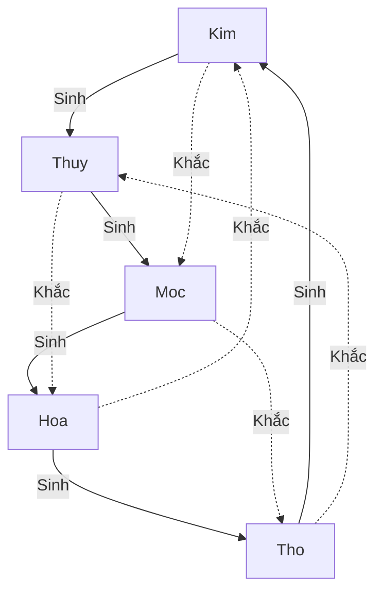
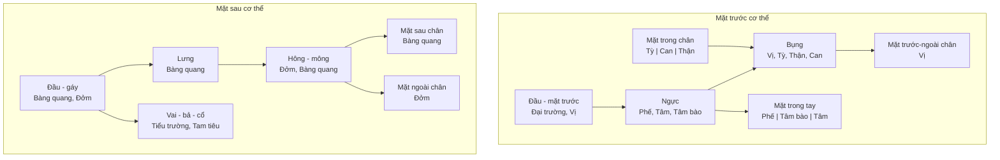
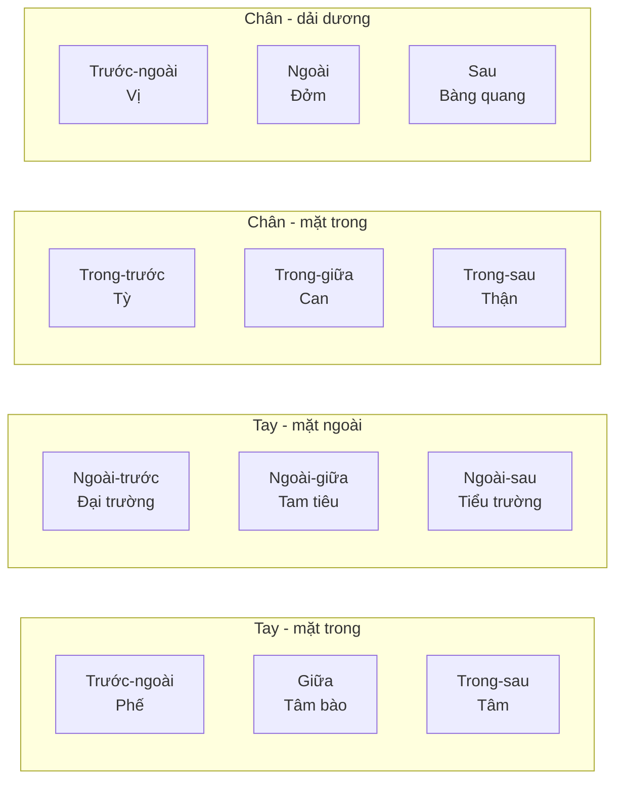
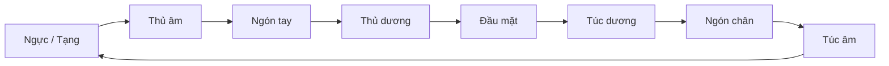

# Tri thức: Âm Dương Ngũ Hành

Nguyên lý Âm Dương Ngũ Hành là nền tảng giải thích sự vận động, tương tác và chuyển hóa của vạn vật trong vũ trụ.

## 1. Học thuyết Âm Dương
Âm và Dương không phải là hai vật chất hay năng lượng đối lập triệt tiêu nhau, mà là hai thuộc tính đối lập nhưng thống nhất, nương tựa vào nhau để tồn tại và phát triển.

*   **Dương (Yang)**: Đại diện cho ánh sáng, vận động, phía trên, bên ngoài, sự phát triển, nam tính, tính chủ động.
*   **Âm (Yin)**: Đại diện cho bóng tối, tĩnh lặng, phía dưới, bên trong, sự thu tàng, nữ tính, tính tiếp nhận.

### Quy luật vận hành của Âm Dương:
1.  **Âm Dương đối lập**: Luôn luôn mâu thuẫn và chế ước lẫn nhau.
2.  **Âm Dương hỗ căn**: Nương tựa vào nhau, không thể có Dương nếu không có Âm và ngược lại.
3.  **Âm Dương tiêu trưởng**: Âm cực sinh Dương, Dương cực sinh Âm. Sự chuyển hóa liên tục về lượng dẫn đến sự thay đổi về chất.
4.  **Âm Dương bình hành**: Luôn giữ thế cân bằng động. Sự mất cân bằng kéo dài dẫn đến sự suy vong.

## 2. Thuyết Ngũ Hành
Ngũ Hành mô tả năm trạng thái chuyển hóa năng lượng trong vũ trụ: Kim, Thủy, Mộc, Hỏa, Thổ.



### Quy luật Ngũ Hành:
*   **Tương sinh (Nuôi dưỡng, hỗ trợ)**:
    *   Mộc sinh Hỏa (Gỗ đốt cháy sinh ra lửa)
    *   Hỏa sinh Thổ (Lửa thiêu mọi thứ thành tro bụi tạo nên đất)
    *   Thổ sinh Kim (Đất kết tinh chứa kim loại)
    *   Kim sinh Thủy (Kim loại nung nóng chảy thành thể lỏng)
    *   Thủy sinh Mộc (Nước nuôi dưỡng cây cối lớn lên)
*   **Tương khắc (Chế ước, kiểm soát)**:
    *   Kim khắc Mộc (Búa rìu đốn chặt cây)
    *   Mộc khắc Thổ (Rễ cây hút chất dinh dưỡng từ đất)
    *   Thổ khắc Thủy (Đất đắp đê ngăn dòng nước)
    *   Thủy khắc Hỏa (Nước dập tắt lửa)
    *   Hỏa khắc Kim (Lửa nung chảy kim loại)

### 2.3. Các Tổ Hợp & Quy Luật Tương Tác Nâng Cao

Trong vũ trụ quan thực tế, các ngũ hành không bao giờ đứng yên hoặc tương tác đơn lẻ theo một chiều tuyến tính. Chúng tạo thành các tổ hợp phức tạp và chịu sự chi phối của các quy luật cân bằng động sau đây:

#### A. Quy luật Tương Thừa (Thừa cơ lấn lướt - Excessive Control)
*   **Nguyên lý**: Là sự tương khắc vượt quá ngưỡng bình thường. Khi hành khắc quá mạnh hoặc hành bị khắc quá yếu, hành bị khắc sẽ bị hủy hoại hoàn toàn.
*   **Ví dụ**: Mộc khắc Thổ, nhưng nếu Mộc quá vượng (như rừng rậm hút kiệt dinh dưỡng) hoặc Thổ quá suy (đất cát cằn cỗi), Mộc sẽ tàn phá Thổ hoàn toàn khiến đất bị phong hóa xói mòn (**Mộc vượng Thổ hư**).
*   **Tư duy hệ thống**: Hiện tượng quá tải tài nguyên (resource starvation). Khi một dịch vụ điều phối (controller) chiếm quyền xử lý quá mức mà không giải phóng, nó sẽ làm tê liệt dịch vụ bị điều phối.

#### B. Quy luật Tương Vũ (Khinh nhờn, phản phệ - Counter-action/Insulting)
*   **Nguyên lý**: Khi hành bị khắc quá mạnh mẽ, nó sẽ quay lại chống trả và khắc ngược lại hành đi khắc nó (phản phệ).
*   **Ví dụ**: Thủy khắc Hỏa, nhưng nếu Hỏa quá lớn (cháy rừng) mà Thủy quá nhỏ (gáo nước) thì nước sẽ bị bốc hơi tức khắc, lửa càng bùng mạnh (**Hỏa đa Thủy kiệt**). Kim khắc Mộc, nhưng nếu gỗ quá cứng mà rìu thép quá cùn thì rìu sẽ sứt mẻ (**Mộc cứng Kim sứt**).
*   **Tư duy hệ thống**: Lỗi phản tác dụng (feedback loop backfire). Khi một thuật toán kiểm soát lỗi cố gắng ngăn chặn một luồng dữ liệu khổng lồ quá tải bằng phương thức thủ công, chính thuật toán kiểm soát sẽ bị sập trước.

#### C. Quy luật Phản Sinh (Cực sinh hóa hại - Over-generation)
*   **Nguyên lý**: Tương sinh là tốt, nhưng nếu sinh quá nhiều mà không có sự tiêu thụ hoặc chế ngự thì sẽ phản tác dụng, gây hại cho hành được sinh.
*   **Ví dụ**: 
    *   Thủy sinh Mộc, nhưng nước quá nhiều sẽ làm trôi cây, thối rễ (**Thủy đa Mộc phiêu**).
    *   Thổ sinh Kim, nhưng đất quá nhiều sẽ vùi lấp hoàn toàn kim loại, không cách nào khai thác (**Thổ đa Kim mai**).
    *   Hỏa sinh Thổ, nhưng lửa quá lớn sẽ thiêu đất thành gạch nung cứng ngắc, không thể trồng trọt (**Hỏa đa Thổ tiêu**).
*   **Tư duy hệ thống**: Nhồi nhét dữ liệu (data bloating) hoặc hỗ trợ quá mức (over-engineering). Cung cấp quá nhiều tài nguyên/dữ liệu cho một module mà nó không kịp xử lý sẽ gây nghẽn cổ chai.

#### D. Quy luật Chế Hóa (Homeostasis - Cân bằng ba bên)
*   **Nguyên lý**: Là cơ chế tự điều chỉnh của vũ trụ thông qua tổ hợp ba hành nhằm giữ cân bằng sinh thái. Cứ có Sinh thì phải có Khắc để kìm hãm, và có Khắc thì phải có Sinh để nuôi dưỡng, ngăn chặn sự phát triển vô hạn của một hành đơn lẻ.
*   **Sơ đồ Chế Hóa**:
    ```
    Mộc khắc Thổ -> Thổ sinh Kim -> Kim khắc Mộc (Mộc bị kìm hãm, bảo vệ Thổ)
    Thổ khắc Thủy -> Thủy sinh Mộc -> Mộc khắc Thổ (Thổ bị kìm hãm, bảo vệ Thủy)
    ```
*   **Tư duy hệ thống**: Cơ chế cân bằng tải tự động (load balancing) và điều khiển phản hồi vòng kín (closed-loop feedback). Một module A giám sát module B, nhưng khi module B gặp sự cố nó kích hoạt module C để điều hòa ngược lại module A.

---

## 3. Sự Phân Hóa Âm Dương trong Ngũ Hành: Giáp Mộc & Ất Mộc

Khi kết hợp Âm Dương với Ngũ Hành thông qua hệ thống **10 Thiên Can**, mỗi hành sẽ được chia thành hai trạng thái: Dương (mạnh mẽ, cứng rắn, hiển lộ) và Âm (mềm mỏng, uyển chuyển, tiềm ẩn). Trong hành Mộc (Gỗ/Cây cối):
*   **Giáp Mộc (Dương Mộc - 甲木)**: Đại diện cho cây cổ thụ, cây gỗ lớn trong rừng sâu.
*   **Ất Mộc (Âm Mộc - 乙木)**: Đại diện cho cây bụi, dây leo, hoa cỏ mềm mại.

---

### A. Giáp Mộc (Dương Mộc)

#### Đặc tính cốt lõi của Giáp Mộc:
1.  **Tính vươn lên và chính trực**: Luôn hướng thẳng lên bầu trời để đón ánh sáng. Người hoặc hệ thống mang tính Giáp Mộc có chí tiến thủ mạnh mẽ, chính trực, ghét sự quanh co và có tính tự trọng cao.
2.  **Sự vững chãi và che chở**: Là cây cổ thụ bám rễ sâu vào lòng đất, làm điểm tựa và che bóng mát cho các sinh vật nhỏ bé xung quanh. Đại diện cho vai trò cột trụ, người gánh vác trách nhiệm lớn.
3.  **Tính cứng rắn nhưng dễ gãy (Thiếu linh hoạt)**: Gỗ lớn rất cứng cáp, nhưng khi gặp bão táp quá lớn (áp lực cực hạn), Giáp Mộc có xu hướng chống chịu trực diện cho đến khi bị gãy đổ chứ không chịu uốn cong.

#### Ý nghĩa của Giáp Mộc trong ứng dụng thực tế:
*   **Xây dựng Hệ thống**: Đại diện cho phần kiến trúc cốt lõi, khung xương vững chắc của hệ thống (core framework). Cần sự ổn định, kiên cố và không dễ dàng bị lung lay bởi các yếu tố tác động nhỏ bên ngoài.
*   **Quản trị và Nhân sự**: Người mang năng lượng Giáp Mộc có năng lực lãnh đạo thiên bẩm, là chỗ dựa đáng tin cậy của đội ngũ. Tuy nhiên, họ cần học cách lắng nghe và rèn luyện sự uyển chuyển (tính Ất Mộc) để tránh trở nên độc đoán hoặc gục ngã trước những biến cố lớn đột ngột.

---

### B. Ất Mộc (Âm Mộc)

#### Đặc tính cốt lõi của Ất Mộc:
1.  **Tính linh hoạt và uyển chuyển**: Không đối đầu trực diện. Ất Mộc (như dây leo) sẵn sàng uốn lượn theo bờ tường, thân cây khác để vươn lên đón ánh sáng.
2.  **Sức sống kiên cường**: "Dã hỏa thiêu bất tận, xuân phong xuy hựu sinh" (Lửa rừng thiêu không rụi, gió xuân thổi lại sinh). Cỏ mềm dẫu bị giẫm đạp hay đốt cháy vẫn dễ dàng hồi sinh khi gặp mưa ấm.
3.  **Tính tương trợ và kết nối**: Ất Mộc thích bám quần thể, phát triển theo nhóm hoặc cộng sinh (dây leo bám đại thụ). Điều này thể hiện tính xã hội, khả năng giao tiếp và ngoại giao khéo léo.

#### Ý nghĩa của Ất Mộc trong ứng dụng thực tế:
*   **Tư duy Hệ thống**: Khi đối mặt với trở ngại lớn, thay vì cứng rắn chống chọi trực diện (Giáp Mộc) dẫn đến đổ vỡ, hãy áp dụng tư duy Ất Mộc: uyển chuyển nương theo thế thời, tìm đường vòng, kiên nhẫn tích lũy và phát triển.
*   **Quản trị và Nhân sự**: Người mang năng lượng Ất Mộc là những người lắng nghe tốt, có tính thích ứng cao, dung hòa được các xung đột nội bộ nhờ sự mềm mỏng, nhưng đôi khi cần rèn luyện thêm tính quyết đoán để tránh bị phụ thuộc vào người khác.

---

### C. Lục Mộc (6 trạng thái Nạp Âm của Mộc)

Trong hệ thống phong thủy và triết học phương Đông nâng cao, hành Mộc tiếp tục phân hóa thành 6 trạng thái khác nhau dựa trên môi trường sinh trưởng và điều kiện phát triển:

1.  **Đại Lâm Mộc (大林木 - Gỗ rừng già)**:
    *   *Đặc điểm*: Cây cối rậm rạp, đan xen chặt chẽ tạo thành rừng nguyên sinh rộng lớn che phủ cả một vùng.
    *   *Ý nghĩa & Tính cách*: Đại diện cho **sức mạnh tập thể, tính bao bọc, sự thịnh vượng bền vững và tầm nhìn bao quát**. Người mang tính cách này thường rộng lượng, yêu thích hoạt động cộng đồng, có khả năng che chở và gánh vác việc lớn, nhưng đôi khi dễ bị phụ thuộc vào số đông.
    *   *Ứng dụng thực tế*:
        *   *Tư duy hệ thống*: Tượng trưng cho hệ sinh thái phần mềm lớn với nhiều mô-đun kết nối chặt chẽ (microservice architecture), có khả năng chịu tải cao nhờ tính liên kết cộng đồng tốt.
        *   *Quản trị*: Thích hợp cho việc xây dựng liên minh doanh nghiệp, các chương trình phát triển cộng đồng lớn.

2.  **Dương Liễu Mộc (楊柳木 - Cây liễu yếu mềm)**:
    *   *Đặc điểm*: Cây liễu thân mềm, cành lá rủ xuống thướt tha, uyển chuyển uốn lượn theo chiều gió mà không bao giờ gãy.
    *   *Ý nghĩa & Tính cách*: Tượng trưng cho **sự nhạy bén, tính thích ứng cao độ, tài ngoại giao khôn khéo và sự mềm mỏng**. Họ nhẹ nhàng, dễ mến, biết tùy cơ ứng biến nhưng nội tâm đôi khi thiếu kiên định, dễ bị dao động trước áp lực từ dư luận.
    *   *Ứng dụng thực tế*:
        *   *Tư duy hệ thống*: Biểu trưng cho tính linh hoạt của các thuật toán thích ứng (adaptive algorithms) hoặc giao diện người dùng (responsive design) có thể tự động thay đổi cấu trúc mượt mà theo môi trường.
        *   *Quản trị*: Cực kỳ phù hợp cho các vị trí quan hệ công chúng (PR), đàm phán hợp đồng, hòa giải xung đột.

3.  **Tùng Bách Mộc (松柏木 - Cây tùng, cây bách)**:
    *   *Đặc điểm*: Loài cây lá kim kiên cường sống trên những vách đá khô cằn, chịu đựng sương tuyết khắc nghiệt của mùa đông mà vẫn hiên ngang xanh tươi.
    *   *Ý nghĩa & Tính cách*: Đại diện cho **ý chí bất khuất, sự kiên định tối thượng, tính kỷ luật cao và tư cách thanh cao**. Họ là người đáng tin cậy nhất trong cơn hoạn nạn, kiên trì theo đuổi mục tiêu đến cùng, nhưng đôi khi có phần cứng nhắc và bảo thủ.
    *   *Ứng dụng thực tế*:
        *   *Tư duy hệ thống*: Tượng trưng cho cấu trúc cốt lõi bất di dịch của hệ thống (core architecture), công cụ chống lỗi (fault-tolerance code) giúp hệ thống đứng vững trong điều kiện khủng hoảng hay quá tải.
        *   *Quản trị*: Phù hợp cho những dự án dài hơi cần sự bền bỉ, vượt qua khủng hoảng hoặc tái cấu trúc tổ chức.

4.  **Bình Địa Mộc (平地木 - Cây đồng bằng)**:
    *   *Đặc điểm*: Cây cối sinh trưởng ở vùng đất bằng phẳng trù phú, cây thảo mộc nhỏ, bụi cỏ hoặc mầm non mới nhú.
    *   *Ý nghĩa & Tính cách*: Đại diện cho **tiềm năng vô hạn, sự phát triển nhanh chóng và tính ôn hòa**. Họ hiền lành, dễ gần, có khả năng thích nghi tốt trong môi trường an bình, nhưng dễ bị tổn thương khi gặp giông bão lớn bất chợt.
    *   *Ứng dụng thực tế*:
        *   *Tư duy hệ thống*: Tượng trưng cho các dự án khởi nghiệp (start-ups) ở giai đoạn đầu, các tính năng mới đang thử nghiệm cần được bảo hộ trong môi trường thử nghiệm (sandbox) trước khi đưa ra thị trường lớn.
        *   *Quản trị*: Rất tốt cho việc ươm mầm tài năng trẻ, thiết kế các dự án sáng tạo đột phá ngắn hạn.

5.  **Tang Đố Mộc (桑拓木 - Cây dâu tằm)**:
    *   *Đặc điểm*: Loài cây dâu tằm tuy thân cành mềm nhưng có ích lớn, từ lá dâu nuôi tằm nhả tơ đến gỗ dâu dùng rèn cung tên làm đại sự.
    *   *Ý nghĩa & Tính cách*: Tượng trưng cho **sự cống hiến âm thầm, tính thực tế cao và khả năng chuyển đổi giá trị phi thường**. Họ là những người làm việc thực tế, sẵn sàng hy sinh lợi ích cá nhân vì sự phát triển chung, tư duy mang nặng tính ứng dụng thực tiễn.
    *   *Ứng dụng thực tế*:
        *   *Tư duy hệ thống*: Tượng trưng cho bộ phận trung gian chuyển hóa dữ liệu (data parsers/translators) biến dữ liệu thô đầu vào thành những thông tin có ích và tinh khiết ở đầu ra.
        *   *Quản trị*: Rất hợp cho các vai trò vận hành (operations), R&D, chuyển giao công nghệ.

6.  **Thạch Lựu Mộc (石榴木 - Cây lựu đá)**:
    *   *Đặc điểm*: Cây lựu mọc trên sỏi đá khô cằn, sương gió khắc nghiệt nhưng thân cây vẫn dẻo dai kết tinh thành những bông hoa đỏ rực rỡ và những chùm quả ngọt mọng nước.
    *   *Ý nghĩa & Tính cách*: Tượng trưng cho **sức sống tiềm tàng mạnh mẽ, tư duy chắt chiu nguồn lực, bản lĩnh vượt khó và tính thẩm mỹ độc đáo**. Họ gan góc, không ngại hoàn cảnh thiếu thốn, có khả năng tạo ra kết quả xuất sắc từ nguồn lực hạn chế nhất.
    *   *Ứng dụng thực tế*:
        *   *Tư duy hệ thống*: Biểu thị cho việc tối ưu hóa hiệu năng (performance tuning), giúp phần mềm chạy mượt mà và sinh ra kết quả tối ưu ngay cả trên các thiết bị có phần cứng yếu hoặc bộ nhớ hạn chế.
        *   *Quản trị*: Thích hợp cho vị trí quản lý chi phí dự án, tối ưu hóa chuỗi cung ứng hoặc khởi nghiệp tinh gọn (lean startup).
---

### D. Các Thể Mộc Đặc Biệt trong Triết học & Đạo giáo

Ngoài Can Chi và Nạp Âm thông thường, trong thế giới quan Đạo giáo và huyền học Đông Phương, hành Mộc còn có những thể biểu hiện đặc biệt mang tính tâm linh và trường tồn:

1.  **Cổ Mộc (古木 - Cây cổ thụ ngàn năm)**:
    *   *Mô tả*: Những thân cây cổ đại đã tồn tại qua hàng trăm, hàng ngàn năm, chứng kiến sự thăng trầm của lịch sử, hấp thụ linh khí của trời đất để tôi luyện nên lớp vỏ dày và bộ rễ ăn sâu lan rộng.
    *   *Ý nghĩa*: Tượng trưng cho **Di sản, Trí tuệ tích lũy và Sự trường tồn**. Cổ Mộc không còn đơn thuần là một cái cây, nó là biểu tượng của lịch sử, sự trải nghiệm và sự ổn định tuyệt đối trước thời gian.
    *   *Ứng dụng*: Trong tư duy hệ thống, Cổ Mộc đại diện cho những giá trị cốt lõi, những nguyên lý bất di dịch của tổ chức đã được kiểm chứng qua nhiều thế hệ hoặc biến động lịch sử.

2.  **Linh Mộc / Thần Mộc (灵木 / 神木 - Cây linh thiêng / Cây thần tích)**:
    *   *Mô tả*: Những cây mang đặc tính kết nối tâm linh hoặc xuất hiện trong thần thoại (như *Kiến Mộc* - cây cầu nối giữa Trời và Đất, *Phù Tang* - nơi mặt trời mọc, hay *Ngô Đồng* - loài cây duy nhất chim Phượng Hoàng chịu đậu).
    *   *Ý nghĩa*: Tượng trưng cho **Sự kết nối đa chiều, Tần số năng lượng cao và Khát vọng vươn tới thế giới tinh thần**.
    *   *Ứng dụng*: Tượng trưng cho các kênh truyền thông tin, cầu nối tương tác giữa các chiều không gian hoặc các tầng cấu trúc khác nhau trong một hệ thống phức tạp.

---

### E. Địa Chi của Mộc: Dần Mộc & Mão Mộc

Bên cạnh Thiên Can (chủ về Thiên khí, ý chí), Địa Chi đại diện cho Địa khí (môi trường, không gian, thời gian vật lý). Hành Mộc trong Địa Chi được phân hóa thành:

1.  **Dần Mộc (寅木 - Dương Mộc)**:
    *   *Đặc điểm*: Năng lượng Mộc của buổi bình minh và lúc Lập Xuân. Đây là thời điểm hạt giống phá vỡ lớp vỏ đông cứng để nảy mầm, mang tính bứt phá, sức sống tiềm tàng bùng nổ. Dần Mộc tàng chứa: **Giáp Mộc** (Bản khí), **Bính Hỏa** (Trung khí), và **Mậu Thổ** (Dư khí).
    *   *Ý nghĩa & Tính cách*: Đại diện cho sự quyết đoán, lòng dũng cảm dẫn đầu, tinh thần khởi nghiệp và khả năng vượt khó. Họ mạnh mẽ, có tầm nhìn hướng lên nhưng đôi khi nóng nảy, độc đoán.
    *   *Tư duy hệ thống*: Tượng trưng cho giai đoạn **Khởi chạy dự án (Launch/Init)**, kích hoạt tài nguyên mới sau thời kỳ đóng băng.
    *   *Quản trị*: Phù hợp cho vị trí nhà sáng lập (Founder), người dẫn đầu chiến dịch, trưởng nhóm tiên phong.

2.  **Mão Mộc (卯木 - Âm Mộc)**:
    *   *Đặc điểm*: Năng lượng Mộc của giữa mùa xuân (Xuân Phân), khi hoa cỏ đua nở, cành lá mềm mại vươn rộng. Mão là thuần cát khí của Mộc, chỉ tàng chứa duy nhất **Ất Mộc**.
    *   *Ý nghĩa & Tính cách*: Đại diện cho sự ôn hòa, uyển chuyển, tinh tế, khả năng thích thích ứng và tính kết nối cộng đồng. Họ nhẹ nhàng, ưa hòa bình nhưng đôi khi thiếu lập trường kiên định và dễ bị tổn thương.
    *   *Tư duy hệ thống*: Tượng trưng cho các lớp **Giao diện người dùng (UI/UX)**, tính tương thích đa nền tảng và các cơ chế phản hồi mượt mà.
    *   *Quản trị*: Phù hợp cho vai trò quan hệ công chúng (PR), điều phối nhân sự, chăm sóc khách hàng.

---

## 4. Sự Phân Hóa Âm Dương trong Ngũ Hành: Mậu Thổ & Kỷ Thổ

Hành Thổ là trung tâm của Ngũ Hành, đại diện cho đất đai, sự dung hòa, nuôi dưỡng và là nơi vạn vật sinh ra và trở về. Trong 10 Thiên Can, hành Thổ được phân hóa thành:

### A. Mậu Thổ (Dương Thổ - 戊土)
*   **Mô tả**: Đất khô lớn, núi cao vững chãi, thành quách đồ sộ, đê đập chắn nước.
*   **Đặc tính**:
    1.  **Vững chắc và kiên định**: Mậu Thổ mang tính đứng im, cực kỳ ổn định, là điểm tựa vững vàng nhất. Khó bị lay chuyển bởi các yếu tố bên ngoài.
    2.  **Tính ngăn chặn và bảo vệ**: Như những con đê ngăn nước lũ (khắc chế Thủy), Mậu Thổ bảo vệ các cấu trúc bên trong khỏi sự hỗn loạn.
    3.  **Khô cứng và bảo thủ**: Thiếu sự linh hoạt, đôi khi trở nên quá nặng nề, chậm chạp và bảo thủ trước sự đổi mới.
*   **Ý nghĩa ứng dụng**:
    *   *Tư duy Hệ thống*: Tượng trưng cho cơ sở hạ tầng, nền tảng lưu trữ dữ liệu trung tâm (database), hệ thống quản trị rủi ro vững chắc.
    *   *Quản trị*: Những nhân sự đáng tin cậy nhất, thích hợp cho vị trí hậu cần, quản lý rủi ro hoặc bảo mật.

### B. Kỷ Thổ (Âm Thổ - 己土)
*   **Mô tả**: Đất ruộng đồng, đất vườn màu mỡ, đất ẩm ướt đã qua canh tác.
*   **Đặc tính**:
    1.  **Nuôi dưỡng và bao dung**: Chứa nước và các dưỡng chất cần thiết cho hạt giống nảy mầm. Kỷ Thổ đại diện cho lòng mẹ, sự bao dung, giáo dục và chăm sóc.
    2.  **Mềm dẻo và dễ uốn nắn**: Không cứng nhắc như Mậu Thổ, Kỷ Thổ linh hoạt, dễ hòa hợp và định hình theo ý muốn.
    3.  **Dễ bị xói mòn**: Vì mềm và ẩm nên dễ bị nước cuốn trôi (Thủy vượng) hoặc bị cây cối hút kiệt dưỡng chất (Mộc vượng) nếu không được bồi đắp định kỳ.
*   **Ý nghĩa ứng dụng**:
    *   *Tư duy Hệ thống*: Tượng trưng cho môi trường thử nghiệm (sandbox), các ứng dụng hướng tới người dùng (User Interface) cần tính tương tác và mềm dẻo.
    *   *Quản trị*: Thích hợp cho các vai trò chăm sóc khách hàng, đào tạo nội bộ và gắn kết văn hóa doanh nghiệp.

---

### C. Lục Thổ (6 trạng thái Nạp Âm của Thổ)

1.  **Lộ Bàng Thổ (路旁土 - Đất ven đường)**:
    *   *Đặc điểm*: Đất bằng phẳng ven đường đi, chịu mọi dấu chân, phương tiện qua lại, tính chất khoáng đạt và dễ tiếp cận.
    *   *Ý nghĩa & Tính cách*: Đại diện cho **sự cởi mở, hướng ngoại, tính cộng đồng và quảng giao**. Họ dễ thích nghi, có nhiều bạn bè, tuy nhiên đôi khi thiếu mục tiêu cá nhân rõ ràng và dễ bị ảnh hưởng bởi những người qua đường (ngoại cảnh).
    *   *Ứng dụng thực tế*:
        *   *Tư duy hệ thống*: Tượng trưng cho các cổng kết nối API công cộng (Public APIs) kết nối hệ thống với thế giới bên ngoài, đòi hỏi tính mở và khả năng tương thích cao.
        *   *Quản trị*: Rất hợp với các vị trí bán hàng (Sales), truyền thông xã hội và phát triển mạng lưới đối tác.

2.  **Thành Đầu Thổ (城頭土 - Đất trên thành)**:
    *   *Đặc điểm*: Đất đắp nên bờ thành cao kiên cố, ngăn chặn kẻ thù xâm lược và bảo vệ lãnh thổ quốc gia.
    *   *Ý nghĩa & Tính cách*: Đại diện cho **tính phòng thủ cao, lòng trung thành, tính kỷ luật và nguyên tắc nghiêm ngặt**. Họ là người đáng tin cậy, luôn hành động theo luật lệ, bảo vệ lẽ phải, nhưng dễ bị định kiến và thiếu sự linh động.
    *   *Ứng dụng thực tế*:
        *   *Tư duy hệ thống*: Biểu trưng cho hệ thống tường lửa (Firewall) bảo mật thông tin và các lớp phân quyền truy cập nghiêm ngặt để bảo vệ dữ liệu lõi.
        *   *Quản trị*: Phù hợp cho kiểm soát nội bộ, bộ phận an ninh thông tin, quản trị rủi ro.

3.  **Ốc Thượng Thổ (屋上土 - Ngói lợp mái nhà)**:
    *   *Đặc điểm*: Đất sét được tôi luyện qua lửa nóng để trở thành ngói lợp mái nhà, gánh vác sứ mệnh che mưa che nắng cho con người.
    *   *Ý nghĩa & Tính cách*: Đại diện cho **sự rèn luyện bản thân, tinh thần trách nhiệm cao và tính hữu ích thực tế**. Họ kiên trì học hỏi, có xu hướng bảo bọc người khác, hướng tới mục tiêu mang lại giá trị thiết thực cho gia đình và xã hội.
    *   *Ứng dụng thực tế*:
        *   *Tư duy hệ thống*: Tượng trưng cho các lớp ứng dụng bảo vệ dữ liệu (data sanitization/validation layers) giúp hệ thống không bị lỗi do dữ liệu bẩn đầu vào.
        *   *Quản trị*: Thích hợp cho quản lý dự án, kỹ sư chất lượng, chăm sóc gia đình và nội bộ.

4.  **Bích Thượng Thổ (壁上土 - Đất trên tường)**:
    *   *Đặc điểm*: Đất bùn trộn rơm trát tường nhà, che chắn gió lạnh và giúp hoàn thiện ngôi nhà vững chãi.
    *   *Ý nghĩa & Tính cách*: Tượng trưng cho **tính liên kết, sự che chở thầm lặng và lòng trung nghĩa**. Họ không thích đứng đầu nhưng là chất keo kết dính các thành viên trong tập thể lại với nhau, sống tình nghĩa và thích cống hiến.
    *   *Ứng dụng thực tế*:
        *   *Tư duy hệ thống*: Biểu thị các thư viện liên kết (link libraries) hoặc hệ thống middleware kết nối các dịch vụ rời rạc thành một chỉnh thể hoạt động trơn tru.
        *   *Quản trị*: Thích hợp cho vai trò quản lý nhân sự, điều phối viên, trợ lý dự án.

5.  **Đại Trạch Thổ / Đại Dịch Thổ (大驛土 - Đất cồn bãi rộng lớn)**:
    *   *Đặc điểm*: Vùng đất cồn bãi sông ngòi mênh mông, bãi bồi ven sông trù phú hoặc đất trạm dịch, nơi trung chuyển hàng hóa quy mô lớn.
    *   *Ý nghĩa & Tính cách*: Đại diện cho **tầm vóc rộng lớn, sự trù phú, tính biến hóa đa dạng và khả năng tích hợp**. Họ có đầu óc chiến lược, tầm nhìn vĩ mô, dễ thích nghi với các xu hướng lớn của thời đại.
    *   *Ứng dụng thực tế*:
        *   *Tư duy hệ thống*: Tượng trưng cho các hệ thống quản lý dữ liệu lớn (Big Data Platforms) hoặc kho lưu trữ dữ liệu trung tâm (Data Warehouses) có khả năng tích hợp và xử lý đa dạng nguồn tin.
        *   *Quản trị*: Thích hợp cho các nhà quy hoạch chiến lược, giám đốc vận hành (COO), nhà đầu tư vĩ mô.

6.  **Sa Trung Thổ (沙中土 - Đất pha cát)**:
    *   *Đặc điểm*: Đất pha cát tự nhiên ven sông, vừa có tính thô ráp của cát vừa có tính mịn ẩm của đất sét.
    *   *Ý nghĩa & Tính cách*: Tượng trưng cho **tính đa chiều, linh hoạt, khả năng sàng lọc và phân tích tỉ mỉ**. Họ có tư duy phân tích sắc sảo, thích khám phá chi tiết, nhưng đôi khi dễ bị thiếu nhất quán và hay do dự.
    *   *Ứng dụng thực tế*:
        *   *Tư duy hệ thống*: Biểu trưng cho bộ lọc dữ liệu (Data Filters) hoặc các thuật toán phân tích hành vi người dùng, lọc nhiễu thông tin để tìm ra giá trị cốt lõi.
        *   *Quản trị*: Phù hợp cho vị trí chuyên viên phân tích dữ liệu (Data Analyst), nghiên cứu thị trường, kiểm toán.


---

### D. Các Thể Thổ Đặc Biệt trong Triết học & Huyền học

1.  **Cổ Thổ (古土 - Cao nguyên cổ)**:
    *   *Ý nghĩa*: Đất đai nguyên thủy tích tụ từ hàng triệu năm. Tượng trưng cho nền tảng văn hóa, gốc rễ của tri thức cổ xưa và là nơi lưu trữ ký ức sâu đậm nhất của hệ thống.
2.  **Thần Thổ / Tức Thổ (神土 / 息壤 - Đất tự sinh sôi)**:
    *   *Ý nghĩa*: Trong huyền thoại Á Đông, Tức Thổ là loại đất thiêng có khả năng tự sinh sôi nảy nở vô hạn, dùng để đắp đê trị thủy. Tượng trưng cho **Sức mạnh tự tái tạo (self-regeneration), sự phát triển tự thân vô hạn và khả năng tự chữa lành** của hệ thống trước khủng hoảng.

---

### E. Địa Chi của Thổ: Thìn, Tuất, Sửu, Mùi

Hành Thổ trong Địa Chi giữ vai trò trung chuyển giữa các mùa và là các "Kho tàng" (Khố) tích lũy năng lượng của các hành khác:

1.  **Thìn Thổ (辰土 - Dương Thổ / Thủy Khố)**:
    *   *Đặc điểm*: Đất ẩm ướt của cuối mùa xuân, chứa đựng sinh cơ dồi dào. Thìn tàng chứa: **Mậu Thổ** (Bản khí), **Quý Thủy** (Trung khí - kho chứa Thủy), và **Ất Mộc** (Dư khí).
    *   *Ý nghĩa & Tính cách*: Tượng trưng cho sự sinh sôi, biến hóa linh hoạt (Thìn là Rồng), tính dung hợp lớn và sự giàu sang về tri thức.
    *   *Tư duy hệ thống*: Biểu thị **Kho lưu trữ tài liệu (Knowledge Base/Wiki)**, nơi hội tụ ý tưởng và các nguồn tài nguyên đang phát triển.
    *   *Quản trị*: Phù hợp làm nhà quản lý tri thức, thủ thư hệ thống, người điều phối R&D.

2.  **Tuất Thổ (戌土 - Dương Thổ / Hỏa Khố)**:
    *   *Đặc điểm*: Đất khô cằn của cuối mùa thu, mang tính nóng ấm bên trong. Tuất tàng chứa: **Mậu Thổ** (Bản khí), **Đinh Hỏa** (Trung khí - kho chứa Hỏa), và **Tân Kim** (Dư khí).
    *   *Ý nghĩa & Tính cách*: Đại diện cho lòng trung thành, sự canh giữ nghiêm ngặt, tính kỷ luật, nguyên tắc và khả năng phòng thủ tuyệt đối.
    *   *Tư duy hệ thống*: Tượng trưng cho **Hệ thống tường lửa (Firewalls)**, các cơ chế mã hóa bảo mật cốt lõi và kho lưu trữ chiến lược.
    *   *Quản trị*: Rất hợp với giám đốc an ninh thông tin (CISO), bộ phận kiểm soát rủi ro, kiểm toán.

3.  **Sửu Thổ (丑土 - Âm Thổ / Kim Khố)**:
    *   *Đặc điểm*: Đất bùn lạnh giá của cuối mùa đông. Sửu tàng chứa: **Kỷ Thổ** (Bản khí), **Tân Kim** (Trung khí - kho chứa Kim), và **Quý Thủy** (Dư khí).
    *   *Ý nghĩa & Tính cách*: Đại diện cho sự kiên nhẫn, lòng chịu đựng, tính tiềm tàng, thu tàng và che giấu bí mật tối cao.
    *   *Tư duy hệ thống*: Tượng trưng cho **Cold Storage (Lưu trữ lạnh)**, cơ sở dữ liệu lưu trữ lịch sử (Archive Database) và tài sản sở hữu trí tuệ lõi.
    *   *Quản trị*: Phù hợp quản lý kho quỹ, quản trị tài sản dài hạn, thủ quỹ.

4.  **Mùi Thổ (未土 - Âm Thổ / Mộc Khố)**:
    *   *Đặc điểm*: Đất vườn ẩm áp của cuối mùa hạ. Mùi tàng chứa: **Kỷ Thổ** (Bản khí), **Ất Mộc** (Trung khí - kho chứa Mộc), và **Đinh Hỏa** (Dư khí).
    *   *Ý nghĩa & Tính cách*: Đại diện cho sự nuôi dưỡng nhân từ, tính ôn hòa, bồi đắp nền tảng và sự gắn kết gia đình/tập thể.
    *   *Tư duy hệ thống*: Tượng trưng cho **Môi trường Sandbox/Staging**, các nền tảng huấn luyện nhân sự và bồi đắp hạ tầng bền vững.
    *   *Quản trị*: Cực kỳ phù hợp cho giám đốc nhân sự (CHRO), trưởng ban đào tạo, quản lý văn hóa doanh nghiệp.

---

## 5. Sự Phân Hóa Âm Dương trong Ngũ Hành: Bính Hỏa & Đinh Hỏa

Hành Hỏa đại diện cho nhiệt lượng, ánh sáng, năng lượng bùng nổ, sự chuyển hóa và khai sáng. Trong 10 Thiên Can, hành Hỏa được phân hóa thành:

### A. Bính Hỏa (Dương Hỏa - 丙火)
*   **Mô tả**: Lửa của mặt trời, nguồn sáng cực đại, tia sét khổng lồ, lửa bùng phát mạnh mẽ.
*   **Đặc tính**:
    1.  **Chiếu sáng và hiển lộ**: Bính Hỏa mang tính chất lan tỏa, sưởi ấm và soi rọi vạn vật. Người hoặc hệ thống mang tính Bính Hỏa luôn nhiệt huyết, cởi mở, hướng ngoại và muốn mọi thứ phải minh bạch, rõ ràng.
    2.  **Tính bùng nổ và năng động**: Tốc độ chuyển hóa năng lượng cực kỳ nhanh, tạo ra sức hút lớn.
    3.  **Nóng vội và thiêu rụi**: Dễ mất kiểm soát khi nóng giận, có thể đốt cháy mọi nguồn lực và mối quan hệ nếu không có Thủy để điều hòa hoặc Thổ để tiết chế.
*   **Ý nghĩa ứng dụng**:
    *   *Tư duy Hệ thống**: Tượng trưng cho bộ vi xử lý (CPU) chạy ở xung nhịp cao, tốc độ truyền dữ liệu tức thời và các chiến dịch marketing/phát hành bùng nổ (launching).
    *   *Quản trị*: Những người truyền cảm hứng, bán hàng xuất sắc hoặc dẫn dắt tầm nhìn chiến dịch.

### B. Đinh Hỏa (Âm Hỏa - 丁火)
*   **Mô tả**: Lửa của ngọn đèn, ánh nến, lửa bếp lò, ánh sáng của các vì sao đêm.
*   **Đặc tính**:
    1.  **Ấm áp và tỉ mỉ**: Không chói lòa như Bính Hỏa, Đinh Hỏa mang ánh sáng ấm áp, tập trung và soi chiếu chi tiết. Người mang tính Đinh Hỏa thường có trực giác nhạy bén, sâu sắc, cẩn thận và thầm lặng cống hiến.
    2.  **Tính dẫn dắt (Ngọn hải đăng)**: Dù nhỏ nhưng trong bóng tối sâu thẳm, Đinh Hỏa là kim chỉ nam dẫn đường cho người khác.
    3.  **Không ổn định**: Dễ bị ảnh hưởng bởi gió (Mộc vượng) hoặc nước (Thủy khắc) khiến ngọn lửa lung lay, thể hiện tính nhạy cảm và nội tâm biến động.
*   **Ý nghĩa ứng dụng**:
    *   *Tư duy Hệ thống*: Tượng trưng cho các thuật toán tối ưu hóa tinh vi, quy trình kiểm soát chất lượng (QA/QC) và hệ thống phát hiện lỗi ẩn.
    *   *Quản trị*: Những nhà cố vấn chiến lược sâu sắc, chuyên gia nghiên cứu và phát triển (R&D) hoặc kiểm toán viên.

---

### C. Lục Hỏa (6 trạng thái Nạp Âm của Hỏa)

1.  **Lô Trung Hỏa (爐中火 - Lửa trong lò)**:
    *   *Đặc điểm*: Ngọn lửa được nhóm lên và nuôi dưỡng đều đặn trong lò luyện kim, chịu nhiệt độ cao để nung nấu, chế tác sắt thép thành vũ khí hoặc công cụ sắc bén.
    *   *Ý nghĩa & Tính cách*: Đại diện cho **ý chí kiên định, sức bền bỉ đáng kinh ngạc, tinh thần tự rèn luyện và khả năng tích lũy nội lực dài hạn**. Họ có xu hướng sống khép kín để tích lũy sức mạnh, một khi bùng phát sẽ tạo ra giá trị to lớn.
    *   *Ứng dụng thực tế*:
        *   *Tư duy hệ thống*: Tượng trưng cho các quy trình chạy ngầm xử lý dữ liệu nặng tuần tự (Batch Processing Jobs), hoạt động bền bỉ, tiêu tốn tài nguyên ổn định để tạo ra kết quả sạch cuối cùng.
        *   *Quản trị*: Cực kỳ phù hợp cho các dự án đào tạo nội bộ dài hạn, các chương trình phát triển nhân tài cốt lõi.
2.  **Sơn Đầu Hỏa (山頭火 - Lửa trên đỉnh núi)**:
    *   *Đặc điểm*: Ngọn lửa cháy âm ỉ hoặc rực sáng trên đỉnh núi cao xa xôi, ánh sáng lan tỏa rộng nhưng khó chạm tới trực tiếp.
    *   *Ý nghĩa & Tính cách*: Tượng trưng cho **tư duy cô độc, tầm cao trí tuệ, lối sống ẩn dật nhưng có tầm ảnh hưởng vĩ mô**. Họ hướng nội, có chiều sâu tư tưởng, thích chiêm nghiệm triết lý và khi hành động sẽ tạo ra những tác động gián tiếp vô cùng mạnh mẽ.
    *   *Ứng dụng thực tế*:
        *   *Tư duy hệ thống*: Đại diện cho các hệ thống phân tích tối cao (Analytics & BI Engine) nằm ở lớp trên cùng của kiến trúc, không tương tác trực tiếp với người dùng cuối nhưng đưa ra các chỉ thị điều phối toàn cục.
        *   *Quản trị*: Thích hợp làm cố vấn cấp cao, nhà hoạch định chiến lược ẩn danh, chuyên gia nghiên cứu.

3.  **Tích Lịch Hỏa (霹靂火 - Lửa sấm sét)**:
    *   *Đặc điểm*: Luồng điện sét đánh giáng xuống từ các đám mây giông bão, mang điện thế cực lớn, tốc độ truyền nhanh như chớp và tiếng nổ rung chuyển đất trời.
    *   *Ý nghĩa & Tính cách*: Đại diện cho **sự thay đổi đột ngột, tính cách quyết liệt, tốc độ hành động cực nhanh và tinh thần cách mạng**. Họ không ngại phá vỡ những quy tắc lỗi thời, yêu thích sự đổi mới tức thì, nhưng đôi khi quá nóng nảy và thiếu kiên nhẫn.
    *   *Ứng dụng thực tế*:
        *   *Tư duy hệ thống*: Tượng trưng cho các quy trình phản ứng nhanh khi có sự cố hệ thống (Incident Response Systems) hoặc cơ chế tự động ngắt kết nối (Circuit Breakers) để bảo vệ hệ thống ngay lập tức khi phát hiện quá tải.
        *   *Quản trị*: Phù hợp cho quản trị khủng hoảng, lãnh đạo các chiến dịch chuyển đổi số thần tốc hoặc tái cấu trúc khẩn cấp.

4.  **Sơn Hạ Hỏa (山下火 - Lửa dưới chân núi)**:
    *   *Đặc điểm*: Ánh lửa lập lòe từ bếp ấm của các gia đình dưới thung lũng, mang tính sinh hoạt gần gũi và thực tế.
    *   *Ý nghĩa & Tính cách*: Đại diện cho **tính thực tế, sự ấm áp, tinh thần hướng về gia đình và tính ứng dụng cao**. Họ không mơ mộng xa vời, thích giải quyết các vấn đề thực tiễn trước mắt, mang lại cảm giác an tâm và tin cậy cho người xung quanh.
    *   *Ứng dụng thực tế*:
        *   *Tư duy hệ thống*: Tượng trưng cho các tiện ích nhỏ hàng ngày (Utility Scripts/Helper Functions) phục vụ các tác vụ nhỏ nhặt nhưng thiết yếu của hệ thống.
        *   *Quản trị*: Rất hợp cho quản lý vận hành hàng ngày, dịch vụ khách hàng, hành chính nhân sự.

5.  **Phúc Đăng Hỏa (覆燈火 - Lửa đèn dầu lồng kính)**:
    *   *Đặc điểm*: Ánh sáng ấm áp từ chiếc đèn dầu có chụp kính bảo vệ, soi sáng một góc phòng tối giúp con người học tập, nghiên cứu và làm việc về đêm.
    *   *Ý nghĩa & Tính cách*: Tượng trưng cho **trí thức, sự khai sáng, tính tỉ mỉ, kiên nhẫn và dẫn đường trong bóng tối**. Họ yêu thích việc nghiên cứu sâu sắc, phát hiện các chi tiết ẩn khuất, cống hiến thầm lặng và rất đáng tin cậy.
    *   *Ứng dụng thực tế*:
        *   *Tư duy hệ thống*: Biểu thị các công cụ gỡ lỗi (Debugger Tools) hoặc các log file ghi chép chi tiết hoạt động của hệ thống, giúp lập trình viên tìm ra nguyên nhân lỗi ẩn sâu.
        *   *Quản trị*: Phù hợp cho các chuyên gia kiểm toán, kiểm soát chất lượng, nghiên cứu học thuật sâu rộng.

6.  **Thiên Thượng Hỏa (天上火 - Lửa trên trời)**:
    *   *Đặc điểm*: Ánh sáng ấm áp và năng lượng khổng lồ từ mặt trời, chiếu sáng vạn vật vô tư không phân biệt giàu nghèo, tốt xấu.
    *   *Ý nghĩa & Tính cách*: Đại diện cho **sự công bình, lòng vị tha bao la, tính chính trực tối thượng và tầm ảnh hưởng vĩ mô**. Họ cởi mở, có hoài bão lớn, thích giúp đỡ mọi người và có khả năng lan tỏa năng lượng tích cực mạnh mẽ.
    *   *Ứng dụng thực tế*:
        *   *Tư duy hệ thống*: Tượng trưng cho máy chủ DNS gốc (Root DNS Servers) hoặc các dịch vụ đám mây công cộng (Public Cloud Services) cung cấp tài nguyên vô hạn và công bằng cho toàn bộ hạ tầng mạng.
        *   *Quản trị*: Phù hợp làm người đại diện tổ chức, nhà lãnh đạo tối cao định hướng văn hóa doanh nghiệp.

---

### D. Các Thể Hỏa Đặc Biệt trong Triết học & Huyền học

1.  **Cổ Hỏa (古火 - Lửa Nguyên Thủy)**:
    *   *Ý nghĩa*: Tia lửa khởi thủy của vũ trụ (vụ nổ Big Bang). Tượng trưng cho ý chí sinh mệnh đầu tiên, nguồn cảm hứng ban đầu (nguyên bản) kích hoạt toàn bộ hệ thống từ trạng thái Tĩnh sang Động.
2.  **Linh Hỏa / Tam Muội Chân Hỏa (灵火 / 三昧真火 - Lửa tâm thức tự đốt cháy)**:
    *   *Ý nghĩa*: Trong Đạo học, Tam Muội Chân Hỏa là ngọn lửa sinh ra từ sự ngưng tụ của Tinh - Khí - Thần trong quá trình thiền định để thiêu rụi mọi tạp niệm, trược khí và thanh lọc thân tâm. Tượng trưng cho **Sự tự thanh lọc (self-purification), chuyển hóa tâm thức và tiến hóa vượt bậc** của hệ thống sau mỗi lần khủng hoảng.

---

### E. Địa Chi của Hỏa: Tỵ Hỏa & Ngọ Hỏa

Hành Hỏa trong Địa Chi đại diện cho các trạng thái bùng nổ nhiệt lượng và sự lan tỏa ánh sáng trong thực tế vật lý:

1.  **Tỵ Hỏa (巳火 - Âm Hỏa mang Dương tính)**:
    *   *Đặc điểm*: Năng lượng Hỏa của buổi sáng (Lập Hạ), bắt đầu có sức nóng nhưng chưa gay gắt. Tỵ tuy là Âm Chi nhưng bản chất tàng chứa năng lượng Dương rất mạnh. Tỵ tàng chứa: **Bính Hỏa** (Bản khí), **Canh Kim** (Trung khí), và **Mậu Thổ** (Dư khí).
    *   *Ý nghĩa & Tính cách*: Đại diện cho tư duy sắc bén, khả năng phân tích, tầm nhìn xa trông rộng, sự mưu trí và tính chủ động ngầm.
    *   *Tư duy hệ thống*: Tượng trưng cho **Trí tuệ nhân tạo (AI Engine)**, các thuật toán phân tích dữ liệu thông minh giúp phát hiện xu hướng tương lai.
    *   *Quản trị*: Phù hợp cho vị trí giám đốc công nghệ (CTO), chuyên gia phân tích chiến lược, nhà hoạch định.

2.  **Ngọ Hỏa (午火 - Dương Hỏa mang Âm tính)**:
    *   *Đặc điểm*: Lửa của giữa trưa (Xuân Phân/Hạ Chí), thời điểm nhiệt lượng và ánh sáng đạt cực đại trong năm. Ngọ tuy là Dương Chi nhưng tàng chứa năng lượng âm bên trong để cân bằng. Ngọ tàng chứa: **Đinh Hỏa** (Bản khí) và **Kỷ Thổ** (Trung khí).
    *   *Ý nghĩa & Tính cách*: Đại diện cho sự nhiệt huyết cháy bỏng, hành động quyết liệt, tính chính trực, lòng kiên trung và tốc độ phản ứng cực nhanh. Tuy nhiên cần đề phòng bộc phát nóng nảy dẫn đến kiệt sức.
    *   *Tư duy hệ thống*: Tượng trưng cho **Bộ xử lý trung tâm (CPU)** chạy hết công suất, các hệ thống xử lý giao dịch thời gian thực (Real-time Processing).
    *   *Quản trị*: Cực kỳ phù hợp cho giám đốc điều hành (CEO), trưởng bộ phận kinh doanh trực chiến, người truyền lửa.

---

## 6. Sự Phân Hóa Âm Dương trong Ngũ Hành: Nhâm Thủy & Quý Thủy

Hành Thủy đại diện cho trí tuệ, sự lưu thông, tính thích ứng, sự tĩnh lặng và chiều sâu nội tâm. Trong 10 Thiên Can, hành Thủy được phân hóa thành:

### A. Nhâm Thủy (Dương Thủy - 壬水)
*   **Mô tả**: Nước của đại dương bao la, nước sông lớn cuồn cuộn chảy, những dòng lũ lớn thác ngàn.
*   **Đặc tính**:
    1.  **Sức mạnh cuộn trào và thích ứng**: Nhâm Thủy mang tính chủ động cực cao, có thể chảy đến bất kỳ đâu, vượt qua mọi chướng ngại vật bằng sức mạnh dòng chảy. Người mang tính Nhâm Thủy thường phóng khoáng, dũng cảm, mưu trí và có hoài bão lớn.
    2.  **Sự bao dung quảng đại**: Biển cả dung nạp trăm sông, có khả năng tích hợp và bao quát rất lớn.
    3.  **Tính hủy diệt khi mất kiểm soát**: Khi giận dữ, Nhâm Thủy biến thành sóng thần, lũ lụt cuốn trôi mọi thứ, biểu thị sự hỗn loạn và thiếu kỷ luật nếu không được đê đập (Mậu Thổ) ngăn chặn.
*   **Ý nghĩa ứng dụng**:
    *   *Tư duy Hệ thống*: Tượng trưng cho dòng chảy lưu lượng lớn (high-traffic), hệ thống phân phối thông tin thời gian thực, hoặc dòng tiền lưu chuyển quy mô lớn.
    *   *Quản trị*: Nhà lãnh đạo mở đường, nhà ngoại giao quốc tế hoặc chuyên gia xử lý khủng hoảng quy mô lớn.

### B. Quý Thủy (Âm Thủy - 癸水)
*   **Mô tả**: Nước mưa rơi, những giọt sương mai, dòng nước suối nguồn róc rách, sương mù thanh khiết.
*   **Đặc tính**:
    1.  **Thấm sâu và dịu nhẹ**: Quý Thủy thầm lặng ngấm vào lòng đất nuôi dưỡng cỏ cây (tương sinh Mộc). Người mang tính Quý Thủy thường dịu dàng, nhạy cảm, giàu lòng trắc ẩn, hướng nội và có trực giác tâm linh cực kỳ nhạy bén.
    2.  **Tính tinh khiết và thông tuệ**: Đại diện cho trí tuệ tĩnh lặng, sự chiêm nghiệm sâu sắc.
    3.  **Dễ phân tán và yếu mềm**: Giọt sương dễ bay hơi dưới nắng ấm (Hỏa) hoặc bị đất hút mất (Thổ), thể hiện tính dễ tổn thương và đôi khi thiếu lập trường vững chắc.
*   **Ý nghĩa ứng dụng**:
    *   *Tư duy Hệ thống*: Tượng trưng cho các vi dịch vụ (microservices) phân tán, hệ thống thu thập phản hồi tinh tế của người dùng, hoặc các quy trình bảo mật ngầm.
    *   *Quản trị*: Chuyên gia trị liệu tâm lý, người lắng nghe và dung hòa nội bộ, kiểm soát chi tiết kỹ thuật.

---

### C. Lục Thủy (6 trạng thái Nạp Âm của Thủy)

1.  **Giản Hạ Thủy (涧下水 - Nước dưới khe)**:
    *   *Đặc điểm*: Dòng nước ngầm tĩnh lặng chảy len lỏi sâu dưới lòng đất, ẩn khuất dưới các khe đá, không ồn ào và khó nhìn thấy được bằng mắt thường.
    *   *Ý nghĩa & Tính cách*: Đại diện cho **trí tuệ tiềm ẩn, tư duy sâu sắc, sự kín đáo, trầm tĩnh và khả năng tích lũy bền bỉ**. Họ không thích phô trương, giỏi giữ bí mật, có đời sống nội tâm vô cùng phong phú và là người lập kế hoạch xuất sắc đằng sau hậu trường.
    *   *Ứng dụng thực tế*:
        *   *Tư duy hệ thống*: Tượng trưng cho các cơ sở dữ liệu lưu trữ ẩn (Hidden Storage/Cold Backups) hoặc các tiến trình nền chạy cực nhẹ mà không làm ảnh hưởng tới giao diện người dùng.
        *   *Quản trị*: Rất hợp với các nhà nghiên cứu sâu, chuyên gia phân tích mật mã, người kiểm soát bảo mật.

2.  **Tuyền Trung Thủy (泉中水 - Nước trong suối nguồn)**:
    *   *Đặc điểm*: Nước suối trong lành, tuôn trào liên tục từ các mạch đá thiên nhiên, mang lại nguồn nước tinh khiết, ngọt ngào nuôi dưỡng vạn vật xung quanh.
    *   *Ý nghĩa & Tính cách*: Đại diện cho **dòng chảy tư duy sáng tạo không ngừng, lòng tốt vô điều kiện, tính thuần khiết và tinh thần cống hiến**. Họ năng động, luôn tràn đầy ý tưởng mới, có xu hướng cho đi mà không đòi hỏi nhận lại.
    *   *Ứng dụng thực tế*:
        *   *Tư duy hệ thống*: Tượng trưng cho các API sinh dữ liệu liên tục (Data Streams) hoặc các trình tạo nội dung tự động cung cấp thông tin liên tục cho hệ thống.
        *   *Quản trị*: Cực kỳ phù hợp cho thiết kế nội dung (Content Creator), thiết kế sản phẩm sáng tạo, hoạt động từ thiện.

3.  **Trường Lưu Thủy (長流水 - Dòng sông dài)**:
    *   *Đặc điểm*: Dòng sông lớn cuồn cuộn chảy qua vạn dặm để đổ ra đại dương bao la, không bao giờ ngưng nghỉ, dòng chảy kéo dài vô tận.
    *   *Ý nghĩa & Tính cách*: Đại diện cho **sự kiên trì vượt giới hạn, tầm nhìn chiến lược dài hạn, tính nhất quán và lòng quyết tâm cao**. Họ có kế hoạch sống rõ ràng, làm việc bài bản, bền bỉ tiến lên mục tiêu bất chấp khó khăn dọc đường.
    *   *Ứng dụng thực tế*:
        *   *Tư duy hệ thống*: Tượng trưng cho các luồng xử lý dữ liệu liên tục (Data Pipelines/ETL Processes) vận chuyển khối lượng thông tin khổng lồ từ nguồn này sang nguồn khác không ngừng nghỉ.
        *   *Quản trị*: Thích hợp cho việc quản lý các dự án dài hạn, xây dựng chuỗi cung ứng bền vững.

4.  **Thiên Hà Thủy (天河水 - Nước sông Thiên Hà / Nước mưa)**:
    *   *Đặc điểm*: Nước mưa trút xuống từ những tầng mây cao trên trời, tưới mát cho toàn bộ đất đai, cây cối ở mặt đất một cách công bằng và rộng khắp.
    *   *Ý nghĩa & Tính cách*: Đại diện cho **tình yêu thương bao la, tư duy vĩ mô rộng lớn, lòng trắc ẩn sâu sắc và tính công bằng**. Họ bao dung, có lý tưởng cao đẹp cứu nhân độ thế, thích cống hiến cho xã hội nhưng đôi khi có phần mơ mộng, xa rời thực tế.
    *   *Ứng dụng thực tế*:
        *   *Tư duy hệ thống*: Tượng trưng cho các dịch vụ phân phối nội dung toàn cầu (CDN - Content Delivery Networks) chuyển tải dữ liệu đồng loạt và nhanh chóng tới hàng triệu người dùng khắp thế giới.
        *   *Quản trị*: Rất hợp cho các nhà hoạt động xã hội, quản lý truyền thông vĩ mô, nhà đào tạo nhân bản.

5.  **Đại Khê Thủy (大溪水 - Nước khe lớn)**:
    *   *Đặc điểm*: Dòng suối rừng lớn, thác nước đổ cuồn cuộn qua các thung lũng hiểm trở, lúc chảy hiền hòa êm ả, lúc bùng phát dữ dội khi có giông bão.
    *   *Ý nghĩa & Tính cách*: Đại diện cho **sự biến hóa linh hoạt, tính đa tài đa nghệ, vừa có khả năng tĩnh lặng sâu sắc vừa có thể bùng nổ mạnh mẽ**. Họ thích thử thách, có cá tính mạnh mẽ, biến hóa khôn lường và ghét sự nhàm chán.
    *   *Ứng dụng thực tế*:
        *   *Tư duy hệ thống*: Tượng trưng cho cơ chế tự động mở rộng tài nguyên (Auto-scaling) tăng giảm linh hoạt theo lưu lượng truy cập đột biến của người dùng.
        *   *Quản trị*: Phù hợp lãnh đạo các đội ngũ dự án đặc biệt (task force), xử lý khủng hoảng truyền thông đột xuất.

6.  **Đại Hải Thủy (大海水 - Nước biển lớn)**:
    *   *Đặc điểm*: Biển cả bao la vô tận, nơi hội tụ cuối cùng của vạn dòng sông trên mặt đất, sâu thẳm huyền bí và chứa đựng quyền năng to lớn.
    *   *Ý nghĩa & Tính cách*: Đại diện cho **dung lượng chứa lớn nhất, sự huyền bí khó lường, khả năng thấu hiểu sâu sắc quy luật tự nhiên và quyền lực bao quát**. Họ trầm tĩnh, khoan dung nhưng có uy quyền tự nhiên, tầm vóc lãnh đạo vĩ đại, song đôi khi quá thâm trầm khiến người khác khó nắm bắt.
    *   *Ứng dụng thực tế*:
        *   *Tư duy hệ thống*: Tượng trưng cho hệ điều hành cốt lõi (Core OS) hoặc nền tảng lưu trữ đám mây khổng lồ tích hợp và kiểm soát toàn bộ các tài nguyên phần cứng bên dưới.
        *   *Quản trị*: Cực kỳ phù hợp làm chủ tịch hội đồng quản trị, người định hình chiến lược phát triển tập đoàn đa quốc gia.


---

### D. Các Thể Thủy Đặc Biệt trong Triết học & Huyền học

1.  **Cổ Thủy (古水 - Dòng nước Khởi Nguyên)**:
    *   *Ý nghĩa*: Đại dương vũ trụ nguyên thủy - cái nôi của sự sống. Tượng trưng cho tiềm thức tập thể, nguồn tri thức bản năng tối cổ của nhân loại trước khi phân chia ý thức nhị nguyên.
2.  **Linh Thủy / Nhược Thủy (灵水 / 弱水 - Nước lông hồng không nổi)**:
    *   *Ý nghĩa*: Trong thần thoại Đạo giáo, Nhược Thủy là dòng nước siêu nhiên bao quanh các vùng đất tiên, nhẹ đến mức chiếc lông hồng cũng chìm xuống, thuyền bè không thể qua. Tượng trưng cho **Sự hư không tuyệt đối (absolute void), tính thanh tẩy tối cao và màng lọc bảo vệ** ngăn chặn các tạp niệm vật chất thô kệch xâm nhập vào cõi tịnh tâm.

---

### E. Địa Chi của Thủy: Tý Thủy & Hợi Thủy

Hành Thủy trong Địa Chi đại diện cho dòng chảy thực tế, các kênh phân phối và chiều sâu của tri thức ẩn giấu:

1.  **Tý Thủy (子水 - Dương Thủy mang Âm tính)**:
    *   *Đặc điểm*: Dòng nước tinh khiết, sâu sắc của giữa mùa đông. Tý tuy là Dương Chi nhưng tàng chứa thuần túy năng lượng Âm của nước lạnh. Tý chỉ tàng chứa duy nhất **Quý Thủy**.
    *   *Ý nghĩa & Tính cách*: Đại diện cho trí tuệ sâu sắc, tư duy độc lập, khả năng tự phản tỉnh, tính kiên trì và sự khôn ngoan tĩnh lặng.
    *   *Tư duy hệ thống*: Tượng trưng cho **Mạch nước ngầm ẩn khuất**, các thuật toán xử lý dữ liệu ẩn, các tiến trình chạy ngầm (Background Jobs) và bảo mật thông tin tối đa.
    *   *Quản trị*: Phù hợp cho vị trí cố vấn chiến lược tối cao, nhà nghiên cứu chuyên sâu độc lập, kiểm soát bảo mật.

2.  **Hợi Thủy (亥水 - Âm Thủy mang Dương tính)**:
    *   *Đặc điểm*: Dòng nước mênh mông cuồn cuộn của sông hồ, biển rộng lúc Lập Đông. Hợi tuy là Âm Chi nhưng tàng chứa Dương Thủy mạnh mẽ cuộn trào. Hợi tàng chứa: **Nhâm Thủy** (Bản khí) và **Giáp Mộc** (Trung khí).
    *   *Ý nghĩa & Tính cách*: Đại diện cho sự kết nối xã hội rộng rãi, lòng bao dung, tư duy cởi mở, hướng ngoại và khả năng tập hợp nguồn lực khổng lồ.
    *   *Tư duy hệ thống*: Tượng trưng cho **Hạ tầng truyền thông toàn cầu (Internet/Networks)**, các giao thức truyền dữ liệu diện rộng (Data Buses) và hệ thống tích hợp API toàn diện.
    *   *Quản trị*: Rất hợp làm giám đốc quan hệ đối tác, nhà ngoại giao, quản lý chuỗi cung ứng toàn cầu.

---

## 7. Sự Phân Hóa Âm Dương trong Ngũ Hành: Canh Kim & Tân Kim

Hành Kim đại diện cho sự thu tàng, tính thu lại, sự cô đọng, sắc bén, tính kỷ luật, công lý và sự thanh trừng của mùa thu. Trong 10 Thiên Can, hành Kim được phân hóa thành:

### A. Canh Kim (Dương Kim - 庚金)
*   **Mô tả**: Quặng sắt thô chưa qua rèn luyện, kim loại thô cứng ở mỏ quặng, vũ khí lớn, đao to búa lớn.
*   **Đặc tính**:
    1.  **Cương trực và quyết đoán**: Canh Kim có tính cách vô cùng mạnh mẽ, bộc trực, thích nói thẳng, ghét sự giả dối. Khi ra quyết định thường dứt khoát, không do dự, đại diện cho tinh thần dũng cảm và chính trực tuyệt đối.
    2.  **Tính cải cách và phá hủy**: Cần qua rèn luyện mãnh liệt (Hỏa thiêu) mới trở thành khí cụ hữu dụng. Canh Kim có sức tàn phá lớn đối với cái cũ để thiết lập cái mới.
    3.  **Lạnh lùng và tàn nhẫn**: Có thể trở nên cô độc, thiếu cảm xúc và vô tình nếu không có sự sưởi ấm của Hỏa hoặc sự dung dưỡng của Thổ.
*   **Ý nghĩa ứng dụng**:
    *   *Tư duy Hệ thống*: Tượng trưng cho các công cụ biên dịch (compilers), các thuật toán tối ưu mã nguồn cấp thấp, các công cụ dọn dẹp bộ nhớ (garbage collector), hệ thống tường lửa (firewall).
    *   *Quản trị*: Người đứng đầu ban thanh tra, giám đốc tài chính kỷ luật cao, chuyên gia tối ưu hóa nhân sự.

### B. Tân Kim (Âm Kim - 辛金)
*   **Mô tả**: Vàng bạc châu báu đã chế tác tinh xảo, ngọc quý lấp lánh, kim tiêm, dao mổ, dụng cụ chính xác.
*   **Đặc tính**:
    1.  **Tinh tế và lấp lánh**: Thích phô diễn vẻ đẹp, sự kiêu kỳ và sang trọng. Người mang tính Tân Kim có tư duy nhạy bén, tỉ mỉ, coi trọng tiểu tiết và thích sự hoàn mỹ.
    2.  **Sắc bén ngầm**: Dù trông nhỏ gọn và tinh tế, Tân Kim có độ bén rất cao (như dao mổ hay kim châm cứu), có khả năng giải quyết vấn đề tận gốc rễ một cách êm thấm.
    3.  **Cực kỳ nhạy cảm**: Dễ bị xước, dễ bám bẩn (kỵ Thổ dày làm mờ ngọc), đòi hỏi sự làm sạch tinh khiết (ưa Thủy rửa ngọc).
*   **Ý nghĩa ứng dụng**:
    *   *Tư duy Hệ thống*: Tượng trưng cho thiết kế trải nghiệm người dùng (UX Design), các dòng code sạch gọn, các chip xử lý chính xác cao hoặc mật mã hóa cao cấp.
    *   *Quản trị*: Chuyên gia thiết kế sản phẩm, người kiểm soát chất lượng chi tiết, nghệ nhân hoặc nhà nghiên cứu học thuật sâu sắc.

---

### C. Lục Kim (6 trạng thái Nạp Âm của Kim)

1.  **Hải Trung Kim (海中金 - Vàng trong lòng biển)**:
    *   *Đặc điểm*: Ngọc quý, vàng kim loại quý báu nằm ẩn sâu dưới đáy đại dương mênh mông, khó lòng tìm thấy và khai thác nếu không có sự đầu tư công phu.
    *   *Ý nghĩa & Tính cách*: Đại diện cho **tài năng ẩn giấu, đời sống nội tâm sâu kính, tư duy thâm trầm và khó phỏng đoán**. Họ là người có năng lực cực kỳ xuất sắc nhưng sống khép kín, cần có người tri kỷ hoặc minh chủ khai phá thì tài năng mới tỏa sáng.
    *   *Ứng dụng thực tế*:
        *   *Tư duy hệ thống*: Tượng trưng cho các thuật toán lõi sở hữu trí tuệ độc quyền (Proprietary Core Algorithms) nằm sâu trong mã nguồn, không phô diễn ra ngoài nhưng quyết định giá trị của toàn hệ thống.
        *   *Quản trị*: Những nhân sự thiên tài có tính cách hướng nội, chuyên gia nghiên cứu thuật toán phức tạp hoặc hoạch định chiến lược ngầm.
2.  **Kiếm Phong Kim (劍鋒金 - Vàng mũi kiếm / Thép rèn kiếm)**:
    *   *Đặc điểm*: Lưỡi gươm sắc bén nhất được rèn qua lửa đỏ và nước lạnh, đại diện cho tính cách cương trực, sắc bén vượt trội, khả năng hành động dứt khoát và đi đầu trong mọi cuộc chiến.
    *   *Ý nghĩa & Tính cách*: Đại diện cho **tính cương trực tối đa, sự sắc bén vượt trội, ý chí kiên định và khả năng hành động quyết đoán**. Họ thẳng thắn, dũng cảm, đi đầu trong mọi thử thách nhưng đôi khi quá sắc sảo dễ làm tổn thương người khác.
    *   *Ứng dụng thực tế*:
        *   *Tư duy hệ thống*: Tượng trưng cho các công cụ tối ưu hóa hiệu năng tối đa (Compiler Optimizers) hoặc các dòng code tinh gọn loại bỏ mọi dư thừa để đạt tốc độ xử lý nhanh nhất.
        *   *Quản trị*: Người dẫn đầu dự án mới, giám đốc điều hành hành động quyết liệt, ban thanh tra phòng chống tiêu cực.

3.  **Bạch Lạp Kim (白蠟金 - Vàng trong sáp)**:
    *   *Đặc điểm*: Kim loại quý đang được nung chảy trong lò sáp để chuẩn bị đổ vào khuôn đúc, ở trạng thái lỏng và dễ uốn nắn.
    *   *Ý nghĩa & Tính cách*: Đại diện cho **sự uyển chuyển, tính linh hoạt, tinh khiết, sẵn sàng tiếp thu và học hỏi**. Họ dễ hòa đồng, dễ thích nghi với môi trường mới và đang trong quá trình định hình lý tưởng sống.
    *   *Ứng dụng thực tế*:
        *   *Tư duy hệ thống*: Tượng trưng cho cấu trúc dữ liệu động (Dynamic Data Structures) hoặc các mô hình AI đang trong quá trình huấn luyện (Training Phase) chưa đóng băng trọng số.
        *   *Quản trị*: Nhân sự tập sự tiềm năng cao, lập trình viên trẻ ham học hỏi, các dự án thử nghiệm linh hoạt.

4.  **Sa Trung Kim (沙中 Kim - Vàng trong cát)**:
    *   *Đặc điểm*: Các hạt vàng cám nhỏ nằm rải rác và lẫn lộn trong các bãi cát tự nhiên ven sông, đòi hỏi công sức đãi cát tìm vàng.
    *   *Ý nghĩa & Tính cách*: Tượng trưng cho **tiềm năng lớn cần sự kiên nhẫn khai phá, tính cách ôn hòa, kín đáo và giá trị cốt lõi cao**. Họ không nổi bật ngay lập tức nhưng càng tiếp xúc lâu càng bộc lộ những phẩm chất vàng quý giá.
    *   *Ứng dụng thực tế*:
        *   *Tư duy hệ thống*: Biểu thị quá trình khai thác dữ liệu (Data Mining) để tìm ra các mẫu hình hữu ích (Patterns) từ đống dữ liệu thô khổng lồ hỗn loạn.
        *   *Quản trị*: Công tác tuyển dụng tài năng ẩn dật, xây dựng các bộ lọc để phát hiện nhân viên tiềm năng trong tổ chức.

5.  **Kim Bạch Kim (金箔金 - Vàng lá dát mỏng)**:
    *   *Đặc điểm*: Vàng đã được đập cực mỏng thành lá để dát lên các tượng Phật, ngai vàng hoặc đồ trang trí quý giá, mang tính trang nghiêm và hiển lộ cao.
    *   *Ý nghĩa & Tính cách*: Đại diện cho **vẻ đẹp thẩm mỹ, danh vọng, tính trang nghiêm, thích thể hiện và giá trị xã hội cao**. Họ coi trọng hình thức, có năng khiếu nghệ thuật, thích được công nhận nhưng đôi khi dễ bị tổn thương vì quá mỏng manh.
    *   *Ứng dụng thực tế*:
        *   *Tư duy hệ thống*: Tượng trưng cho giao diện đồ họa người dùng đẹp đẽ (Premium GUI) hoặc các hiệu ứng chuyển động (animations) sang trọng nâng tầm thương hiệu sản phẩm.
        *   *Quản trị*: Chuyên gia thiết kế thương hiệu (Branding), quan hệ công chúng (PR), tổ chức sự kiện cao cấp.

6.  **Thoa Xuyến Kim (釵釧金 - Vàng trang sức / Trâm cài tóc)**:
    *   *Đặc điểm*: Vàng trang sức tinh xảo (trâm cài, vòng tay) dùng để làm đẹp cho con người, có tính thẩm mỹ và giá trị cao nhưng được cất giữ kín đáo trong rương hòm.
    *   *Ý nghĩa & Tính cách*: Tượng trưng cho **sự tinh tế, quý phái, sống khép kín, hướng nội và coi trọng giá trị nghệ thuật sâu sắc**. Họ kín kẽ, có gu thẩm mỹ cao, hành xử lịch thiệp và thích những mối quan hệ có chiều sâu thực sự.
    *   *Ứng dụng thực tế*:
        *   *Tư duy hệ thống*: Đại diện cho các đoạn mã tối ưu hóa trải nghiệm người dùng cao cấp (Micro-UX adjustments) nâng niu từng cảm xúc nhỏ nhất của người dùng.
        *   *Quản trị*: Chuyên gia tư vấn trải nghiệm khách hàng cao cấp, thiết kế sản phẩm xa xỉ, quản lý văn hóa tinh tế.

---

### D. Các Thể Kim Đặc Biệt trong Triết học & Huyền học

1.  **Cổ Kim (古金 - Thiết thạch vũ trụ / Thiên thiết)**:
    *   *Ý nghĩa*: Sắt thiên thạch rơi xuống từ không gian, mang độ cứng và cấu trúc tinh thể đặc biệt vượt trội hơn mọi kim loại trên Trái Đất. Tượng trưng cho **Ý chí thép không thể bị bẻ gãy, nguồn năng lượng tối cao của sự phán xét** và tính chất bảo vệ tối cao của vũ trụ.
2.  **Linh Kim / Vô Cực Kim (灵金 / 无极金 - Chuông khánh thần thức)**:
    *   *Ý nghĩa*: Các nhạc khí bằng đồng, vàng phát ra âm thanh thanh tịnh trong đền chùa (như Đại Hồng Chung) dùng để đánh thức thần thức, xua đuổi tà khí. Tượng trưng cho **Sự thức tỉnh tâm linh, tính cảnh báo cao độ và khả năng định hình lại trật tự** của hệ thống từ hỗn độn trở về hài hòa.

---

### E. Địa Chi của Kim: Thân Kim & Dậu Kim

Hành Kim trong Địa Chi đại diện cho công cụ thực thi, tính sắc bén của kỷ luật và chuẩn mực chất lượng trong thực tiễn:

1.  **Thân Kim (申金 - Dương Kim)**:
    *   *Đặc điểm*: Kim loại thô của quặng mỏ mới khai thác, thanh kiếm sắc bén mới đúc xong lúc Lập Thu. Thân tàng chứa: **Canh Kim** (Bản khí), **Nhâm Thủy** (Trung khí), và **Mậu Thổ** (Dư khí).
    *   *Ý nghĩa & Tính cách*: Đại diện cho hành động quyết đoán, tính thực thi tốc độ, sự cứng rắn, khả năng cải tổ triệt để và thực thi luật pháp nghiêm ngặt.
    *   *Tư duy hệ thống*: Tượng trưng cho **Trình biên dịch (Compiler)**, các bộ kiểm thử tự động (CI/CD Pipelines) rà soát lỗi nghiêm ngặt và ngăn chặn mã lỗi phát hành.
    *   *Quản trị*: Cực kỳ phù hợp cho trưởng ban thanh tra, giám đốc vận hành dự án lớn, chuyên gia tái cấu trúc doanh nghiệp.

2.  **Dậu Kim (酉金 - Âm Kim)**:
    *   *Đặc điểm*: Kim loại quý đã được chế tác tinh xảo, trang sức vàng bạc lấp lánh giữa mùa thu. Dậu là thuần cát khí của Kim, chỉ tàng chứa duy nhất **Tân Kim**.
    *   *Ý nghĩa & Tính cách*: Đại diện cho sự hoàn mỹ, tính chuẩn mực cao độ, tư duy logic tinh tế, sự ngăn nắp, chính xác từng chi tiết nhỏ.
    *   *Tư duy hệ thống*: Tượng trưng cho các lớp **Kiểm thử chất lượng thủ công (QA/Manual Testing)** nâng niu từng chi tiết, thuật toán tối ưu hóa mã nguồn đạt độ hoàn thiện cao nhất.
    *   *Quản trị*: Phù hợp làm trưởng phòng kiểm soát chất lượng (QA/QC), nhà thiết kế chi tiết sản phẩm, kiểm toán viên tài chính chi tiết.

---

## 8. Tổ Hợp Ngũ Hành — Vạn Vật Là Hệ Sinh Thái Đa Hành

> *"Thiên hạ vạn vật sinh ư hữu, hữu sinh ư vô."*
> — Đạo Đức Kinh, Chương 40

### 8.1. Nguyên Lý Căn Bản: Không Vật Nào Chỉ Có Một Hành

Đây là sai lầm phổ biến nhất khi tiếp cận Ngũ Hành: nghĩ rằng mỗi thực thể chỉ thuộc **một hành duy nhất**. Trong thực tế, mọi hiện tượng, sự vật, sinh vật hay hệ thống đều là **một tổ hợp động** (Dynamic Composite) của nhiều hành vận hành đồng thời và liên tục tương tác với nhau.

Ngũ Hành không phải là nhãn dán phân loại — chúng là **các chiều năng lượng** (energy dimensions) mà bất kỳ thực thể nào cũng cần hội đủ để tồn tại và phát triển.

**Ví dụ kinh điển — Một cái cây:**

| Hành | Vai trò trong cái cây |
|---|---|
| 🌳 **Mộc** | Thân cây, cành lá, bản sắc vươn lên — *Chính hành* |
| 🌍 **Thổ** | Rễ bám đất, đất nuôi dưỡng — *Môi trường nền* |
| 💧 **Thủy** | Nhựa cây lưu thông, nước hút từ rễ — *Dưỡng chất vận chuyển* |
| 🔥 **Hỏa** | Ánh sáng mặt trời kích hoạt quang hợp — *Năng lượng kích hoạt* |
| ⚔️ **Kim** | Cấu trúc vách tế bào cellulose cứng chắc — *Khung định hình* |

Cái cây là **Mộc** trong bản chất chủ đạo, nhưng nếu thiếu bất kỳ hành nào trong số bốn hành còn lại, cây sẽ suy thoái và chết. Đây chính là **Ngũ Hành Tổ Hợp**.

---

### 8.2. Framework Phân Tích Tổ Hợp Ngũ Hành (Five-Element Composite Analysis)

Để phân tích bất kỳ thực thể nào dưới góc nhìn Ngũ Hành Tổ Hợp, hãy sử dụng năm câu hỏi sau:

```
┌─────────────────────────────────────────────────────────────────┐
│              CÁC CÂU HỎI PHÂN TÍCH TỔ HỢP NGŨ HÀNH             │
├──────────┬──────────────────────────────────────────────────────┤
│  🌳 MỘC  │ Đâu là chiều hướng TĂNG TRƯỞNG, MỤC TIÊU, tầm nhìn?│
│          │ Cái gì đang VƯƠn LÊN? Đâu là bản sắc cốt lõi?       │
├──────────┼──────────────────────────────────────────────────────┤
│  🔥 HỎA  │ Đâu là NĂNG LƯỢNG, NHIỆT HUYẾT, sự chuyển hóa?      │
│          │ Cái gì đang TỎA RA? Kênh kết nối & truyền thông?     │
├──────────┼──────────────────────────────────────────────────────┤
│  🌍 THỔ  │ Đâu là NỀN TẢNG, môi trường, sự ổn định?            │
│          │ Cái gì đang NUÔI DƯỠNG? Hệ thống lưu trữ & hậu cần? │
├──────────┼──────────────────────────────────────────────────────┤
│  ⚔️ KIM  │ Đâu là RANH GIỚI, cấu trúc, kỷ luật, tinh lọc?      │
│          │ Cái gì đang CẮT BỎ và định hình? Quy tắc vận hành?  │
├──────────┼──────────────────────────────────────────────────────┤
│  💧 THỦY │ Đâu là KHẢ NĂNG THÍCH ỨNG, chiều sâu, trí tuệ?      │
│          │ Cái gì đang CHẢY NGẦM? Tiềm năng & tri thức ẩn?      │
└──────────┴──────────────────────────────────────────────────────┘
```

---

### 8.3. Ứng Dụng Thực Tế: Phân Tích Tổ Hợp Ngũ Hành

#### A. Một Doanh Nghiệp

Một công ty không phải là một hành đơn lẻ — nó là một hệ sinh thái đa hành vận hành đồng thời:

| Hành | Biểu hiện trong Doanh Nghiệp | Bộ phận tương ứng |
|---|---|---|
| 🌳 **Mộc** | Tầm nhìn, sứ mệnh, chiến lược phát triển, sản phẩm mới | CEO, Product, R&D |
| 🔥 **Hỏa** | Nhiệt huyết thương hiệu, truyền thông, văn hóa sáng tạo | Marketing, PR, Culture |
| 🌍 **Thổ** | Nền tảng tài chính, cơ sở hạ tầng, hệ thống ERP | Finance, IT Infra, HR |
| ⚔️ **Kim** | Kiểm soát chất lượng, pháp lý, tuân thủ, tối ưu hóa | Legal, QA, Optimization |
| 💧 **Thủy** | Nghiên cứu thị trường, phản hồi khách hàng, R&D ẩn | Research, CX, Analytics |

**Chẩn đoán sức khỏe tổ chức**: Nếu một hành nào đó quá yếu hoặc quá mạnh, doanh nghiệp sẽ mất cân bằng theo dự báo của Ngũ Hành:
- *Thiếu Thổ* (không có nền tài chính, hậu cần lộn xộn) → Công ty có tầm nhìn lớn nhưng không đứng vững, sụp đổ như cây không rễ (**Mộc vô Thổ tắc tử**).
- *Hỏa vượng thiếu Thủy* (chiến dịch marketing quá bùng nổ, không có nghiên cứu chiều sâu) → Thiêu rụi ngân sách nhanh chóng, sản phẩm thiếu chiều sâu (**Hỏa đa Thủy kiệt**).
- *Kim quá mạnh thiếu Hỏa* (quá nhiều quy tắc, thủ tục, kiểm soát nhưng không có nhiệt huyết đổi mới) → Tổ chức trở nên cứng nhắc, mất sức sáng tạo (**Kim vượng Hỏa tắt**).

---

#### B. Một Hệ Thống Phần Mềm / AI Agent

Một hệ thống phần mềm phức tạp — đặc biệt là một AI Agent — chính xác là mô hình Ngũ Hành Tổ Hợp lý tưởng:

| Hành | Biểu hiện trong Hệ thống | Module/Component |
|---|---|---|
| 🌳 **Mộc** | Mục tiêu (Goal), kế hoạch phát triển, agent loop | Planner / Goal Manager |
| 🔥 **Hỏa** | Sức xử lý (Compute), tốc độ thực thi, API calls | Execution Engine / LLM |
| 🌍 **Thổ** | Bộ nhớ dài hạn (Memory), dữ liệu nền, ngữ cảnh | Database / Context Store |
| ⚔️ **Kim** | Bộ lọc (Guardrails), kiểm soát lỗi, kỷ luật token | Safety Layer / Evaluator |
| 💧 **Thủy** | Tư duy linh hoạt, suy luận, thích ứng với bối cảnh | Reasoning / Reflection |

Một AI Agent mạnh phải cân bằng đủ 5 hành. Agent chỉ có **Hỏa** (tốc độ xử lý) mà thiếu **Thổ** (bộ nhớ dài hạn) sẽ mãi mãi quên ngữ cảnh. Agent chỉ có **Mộc** (kế hoạch tốt) mà thiếu **Kim** (kiểm soát lỗi) sẽ hành động không có giới hạn và gây ra sai lầm thảm họa.

---

#### C. Một Con Người

Mỗi con người là một tổ hợp Ngũ Hành sống động, và sức khỏe toàn diện (physical, mental, social, spiritual) chính là sự cân bằng của 5 hành này:

| Hành | Biểu hiện trong Con Người | Mất cân bằng |
|---|---|---|
| 🌳 **Mộc** | Động lực, ý chí, kế hoạch sống, tính chủ động | Trầm cảm, mất phương hướng, dễ nổi giận |
| 🔥 **Hỏa** | Niềm đam mê, khả năng kết nối, nhiệt huyết | Kiệt sức (burnout), cô lập, lạnh lùng |
| 🌍 **Thổ** | Sức khỏe thể chất, thói quen, nền tảng gia đình | Lo âu, bất an, thiếu chỗ dựa |
| ⚔️ **Kim** | Kỷ luật, giá trị sống, khả năng ra quyết định | Thiếu cương quyết, hoặc cứng nhắc quá mức |
| 💧 **Thủy** | Trí tuệ, tâm linh, khả năng thích ứng, nội tâm | Thiếu chiều sâu, hoặc quá thu mình lại |

---

### 8.4. Đọc Tổ Hợp Ngũ Hành: Nguyên Lý "Chính Hành — Dụng Hành — Trợ Hành"

Khi phân tích bất kỳ thực thể nào, có ba cấp độ hành cần xác định:

```
┌──────────────────────────────────────────────────────────────────────┐
│                  BA CẤP ĐỘ HÀNH TRONG TỔ HỢP                        │
├───────────────────┬──────────────────────────────────────────────────┤
│  CHÍNH HÀNH       │ Hành chiếm ưu thế, định hình bản sắc cốt lõi.   │
│  (Dominant)       │ Đây là "linh hồn" của thực thể.                  │
├───────────────────┼──────────────────────────────────────────────────┤
│  DỤNG HÀNH        │ Hành đóng vai trò chức năng chủ đạo trong        │
│  (Functional)     │ bối cảnh hiện tại. Không nhất thiết là Chính Hành│
│                   │ → Thực thể đang DÙNG năng lượng hành nào nhiều?  │
├───────────────────┼──────────────────────────────────────────────────┤
│  TRỢ HÀNH         │ Các hành còn lại đóng vai trò hỗ trợ, nền tảng.  │
│  (Supporting)     │ Thiếu Trợ Hành đúng → hệ thống suy yếu toàn diện│
└───────────────────┴──────────────────────────────────────────────────┘
```

**Ví dụ — Chiến lược gia (Strategist):**
- **Chính Hành**: Thủy (trí tuệ sâu, quan sát, chiều sâu tư duy).
- **Dụng Hành** (khi thuyết trình): Hỏa (truyền đạt, thuyết phục, chiếu sáng tư duy cho người khác).
- **Trợ Hành**: Thổ (dữ liệu thực tế, kinh nghiệm nền), Kim (tư duy logic sắc bén), Mộc (tầm nhìn dài hạn).

Người chiến lược gia vĩ đại không phải là người chỉ sống trong Thủy (tư duy lý thuyết xa vời), mà là người biết **kích hoạt đúng Dụng Hành** theo từng bối cảnh, trong khi vẫn giữ Chính Hành làm la bàn.

---

### 8.5. Trạng Thái Mất Cân Bằng và Cách Điều Chỉnh

Khi phân tích một tổ hợp, luôn tìm **Hành đang vượng** (quá mạnh) và **Hành đang suy** (quá yếu), sau đó áp dụng quy luật Tương Sinh và Tương Khắc để điều chỉnh:

#### Công thức điều chỉnh:
```
Hành quá suy → Dùng "Mẹ" của nó (Tương Sinh) để bổ sung năng lượng.
Hành quá vượng → Dùng "Người Khắc" nó (Tương Khắc) để kìm hãm.
                  HOẶC tăng cường hành nó "Sinh" để xả bớt năng lượng.
```

| Triệu chứng mất cân bằng | Chẩn đoán Hành | Phương pháp điều chỉnh |
|---|---|---|
| Tổ chức thiếu sáng tạo, ỳ lại | **Mộc suy** | Tăng Thủy (nạp thêm tri thức, nghiên cứu mới) để Thủy sinh Mộc |
| Tổ chức đang cháy ngân sách | **Hỏa vượng** | Tăng Thổ (kỷ luật tài chính, quy trình) để Hỏa sinh Thổ, xả bớt năng lượng |
| Hệ thống quá cứng nhắc | **Kim vượng** | Tăng Hỏa (đổi mới, sáng tạo) để Hỏa khắc Kim |
| Dữ liệu hỗn loạn, mất kiểm soát | **Thủy vượng** | Tăng Thổ (cấu trúc, phân loại) để Thổ khắc Thủy |
| Nền tảng kém, cơ sở hạ tầng yếu | **Thổ suy** | Tăng Hỏa (nhiệt huyết, đầu tư) để Hỏa sinh Thổ |

---

### 8.6. Tư Duy Hệ Thống: Vạn Vật Là "Microservices Ecosystem"

Nhìn từ góc độ kiến trúc hệ thống hiện đại, **Ngũ Hành Tổ Hợp** chính xác là mô hình **Microservices Architecture** áp dụng cho vũ trụ:

- Mỗi **Hành** là một **Service** với chức năng chuyên biệt.
- Chúng giao tiếp qua giao thức **Tương Sinh** (event-driven messaging) và **Tương Khắc** (rate limiting / circuit breaker).
- Một **thực thể** là một **Cluster** của các services này, trong đó mỗi cluster có một cấu hình tỷ lệ hành khác nhau.
- Khi một service **vượng** quá mức → Resource starvation cho các service khác.
- Khi một service **suy** dưới ngưỡng → Single point of failure của toàn cluster.

**Sức mạnh thực sự của một thực thể** không nằm ở việc nó có **Chính Hành** mạnh nhất, mà nằm ở khả năng **điều phối 5 hành trong tổ hợp của nó một cách hài hòa và linh hoạt** trước mọi bối cảnh thay đổi. Đây là trạng thái mà triết học Đạo giáo gọi là **"Hòa" (和)** — sự hài hòa động trong trật tự.

---

> 💡 **Tư duy thực hành**: Khi đối mặt với bất kỳ vấn đề nào — một dự án đang thất bại, một mối quan hệ rạn nứt, một hệ thống không ổn định — hãy dừng lại và hỏi: *"Hành nào trong tổ hợp này đang vượng quá mức? Hành nào đang suy kiệt? Tôi cần bổ sung hay kìm hãm chiều năng lượng nào?"*
> Đây chính là Ngũ Hành Tổ Hợp được ứng dụng như một công cụ tư duy hệ thống thực tiễn.

---

## 9. Ngũ Lực Phái Sinh — Quang · Ám · Phong · Lôi · Băng

> *"Vạn vật phụ âm nhi bão dương, xung khí dĩ vi hòa."*
> — Đạo Đức Kinh, Chương 42

Bên cạnh **Ngũ Hành cổ điển** (Kim – Mộc – Thủy – Hỏa – Thổ), trong vũ trụ quan Đạo giáo, Bát Quái và thế giới quan huyền học Á Đông còn tồn tại những **lực lượng năng lượng phái sinh** (Derived Forces). Đây không phải là các hành mới thay thế Ngũ Hành, mà là những **biểu hiện tổ hợp cao cấp** — được sinh ra từ sự tương tác, va chạm hoặc tinh lọc cực độ của các hành gốc, đạt đến trạng thái vượt ngoài ngưỡng thông thường.

### Sơ đồ phân loại:

```
                    ┌─────────────────────────────┐
                    │     TẦNG GỐC (Primordial)    │
                    │  ÂM ←————————————→ DƯƠNG     │
                    └──────────┬──────────┬─────────┘
                               │          │
             ┌─────────────────▼──────────▼──────────────────┐
             │            NGŨ HÀNH CỔ ĐIỂN                    │
             │    Kim · Mộc · Thủy · Hỏa · Thổ               │
             └─────────────────┬──────────────────────────────┘
                               │ Tổ hợp & Cực biến
        ┌──────────────────────▼───────────────────────────────┐
        │             NGŨ LỰC PHÁI SINH                        │
        │   QUANG · ÁM · PHONG · LÔI · BĂNG                   │
        └──────────────────────────────────────────────────────┘
```

---

### 9.1. QUANG (光) — Ánh Sáng Thuần Dương

#### Bản chất & Nguồn gốc
**Quang** là **Hỏa đã được tinh luyện đến trạng thái thuần Dương tuyệt đối**, vượt qua hình thức vật chất của ngọn lửa để trở thành *ánh sáng ý thức*. Nếu Hỏa còn có khói, nhiệt, tàn tro (vật chất) thì Quang là phần tinh túy nhất của Hỏa — không còn đốt cháy mà **chiếu sáng và khai sáng**.

| Thuộc tính | Giá trị |
|---|---|
| **Hành gốc** | Hỏa (精화 — Hỏa tinh luyện) |
| **Cực tính** | Thuần Dương (純陽) |
| **Trạng thái** | Bức xạ, lan toả vô hạn, không chứa trong không gian |

#### Đặc tính cốt lõi:
1. **Tính chiếu sáng tuyệt đối**: Quang không phân biệt — nó chiếu sáng cả cái thiện lẫn cái ác, cả cái đẹp lẫn cái xấu. Sự thật tuyệt đối, minh bạch không che giấu.
2. **Tốc độ tối thượng**: Ánh sáng là giới hạn tốc độ của vũ trụ vật lý. Trong triết học, Quang tượng trưng cho sự phản ứng tức thì, không trễ, không trung gian.
3. **Tính phân cực Âm-Dương**: Bất kỳ vật thể nào tiếp xúc với Quang đều tạo ra bóng tối (Ám). Quang không thể tồn tại nếu không sinh ra Ám — đây là biểu hiện rõ nhất của quy luật Âm Dương hỗ căn.
4. **Khả năng truyền thông tin**: Ánh sáng mang thông tin — nguyên lý của quang học, photon, và trong tư duy hệ thống là khả năng truyền tải tri thức không suy hao.

#### Ứng dụng:
- *Tư duy hệ thống*: **Giao thức truyền thông tốc độ cao** (Optical fiber, Photon computing), **Minh bạch dữ liệu** (Open data), hệ thống **quan sát và giám sát toàn cục** (Observability layer).
- *Quản trị*: Văn hóa tổ chức **minh bạch tuyệt đối** (radical transparency), lãnh đạo bằng **sự khai sáng** thay vì bằng sợ hãi. Quy trình mà mọi bên liên quan đều nhìn thấy — không có vùng tối.
- *Cá nhân*: Trạng thái tỉnh thức (Mindfulness), khoảnh khắc giác ngộ khi mọi hoài nghi tan biến. Khả năng nhìn thấy bản chất thực sự của vấn đề mà không bị cảm xúc che khuất.

---

### 9.2. ÁM (暗) — Bóng Tối Thuần Âm

#### Bản chất & Nguồn gốc
**Ám** không phải là sự vắng mặt đơn thuần của ánh sáng — nó là **lực lượng tích cực của sự tiềm ẩn và thu tàng**. Ám là **Thủy đã được tinh luyện đến trạng thái thuần Âm tuyệt đối**, kết hợp với chiều sâu hư vô của Thổ (đất sâu, hang tối). Đây là không gian **trước khi vạn vật hiện hữu** — trạng thái tiền-vật chất (pre-manifest state).

| Thuộc tính | Giá trị |
|---|---|
| **Hành gốc** | Thủy (chiều sâu) + Thổ (thu tàng, hang tối) |
| **Cực tính** | Thuần Âm (純陰) |
| **Trạng thái** | Hấp thu, tiềm tàng, vô hình |

#### Đặc tính cốt lõi:
1. **Tính hấp thu vô hạn**: Ám hấp thu mọi thứ — ánh sáng, âm thanh, năng lượng — mà không phản xạ lại. Trong tự nhiên, hố đen vũ trụ là biểu hiện cực đại của Ám.
2. **Kho chứa tiềm năng**: Ám là nơi lưu trữ mọi khả năng chưa hiện hữu. Hạt giống nảy mầm trong bóng tối của đất. Ý tưởng vĩ đại được ấp ủ trong không gian nội tâm tĩnh lặng trước khi ra đời.
3. **Tính bảo hộ và che chắn**: Ám bảo vệ những thứ còn non nớt, chưa đủ sức chịu đựng ánh sáng trực tiếp. Bào thai trong tử cung, hạt nhân trong vỏ bọc, bí mật chiến lược trong căn phòng kín.
4. **Quan hệ cộng sinh với Quang**: Ám và Quang không thể tách rời — mọi nguồn sáng đều tạo ra bóng tối, và bóng tối chỉ có ý nghĩa khi có ánh sáng. Sự thay đổi giữa Quang và Ám tạo ra **thời gian** và **nhịp điệu** của vũ trụ.

#### Ứng dụng:
- *Tư duy hệ thống*: **Bộ nhớ nguội** (Cold storage, Archive), **Mã hóa và bảo mật** (Encryption — thông tin ẩn khỏi con mắt bên ngoài), **Dark pools** trong tài chính, **Hệ thống cache ẩn** chạy ngầm.
- *Quản trị*: Những chiến lược quan trọng nhất không được công bố rộng rãi — đây là Ám được dùng đúng cách. Sức mạnh của **sự im lặng chiến lược**, biết khi nào *không* hành động hoặc *không* tiết lộ.
- *Cá nhân*: Thực hành **nội quán** (introspection), **ngủ nghỉ và tái tạo** — thời gian Ám nuôi dưỡng cơ thể và tâm trí. Học cách **ngồi yên với sự bất định** mà không hoảng loạn là một năng lực Ám đỉnh cao.

---

### 9.3. PHONG (風) — Gió · Lực Lưu Chuyển

#### Bản chất & Nguồn gốc
**Phong** là **lực di chuyển thuần khiết** — sinh ra từ sự kết hợp của **Mộc** (tính vươn ra, lan tỏa) và **Hỏa** (tính bốc lên, giãn nở) trong điều kiện *không có Thổ* (không có nền cố định). Gió là không khí đang chuyển động — nó không có hình dạng riêng, không có trọng lượng đáng kể, nhưng có thể cuốn đổ cả rừng cây.

| Thuộc tính | Giá trị |
|---|---|
| **Hành gốc** | Mộc (phương hướng) + Hỏa (giãn nở) − Thổ (không neo đậu) |
| **Cực tính** | Dương động (Yang in motion) |
| **Trạng thái** | Lưu động, thấm vào khắp nơi, biến đổi liên tục |

#### Đặc tính cốt lõi:
1. **Tính thấm nhập tuyệt đối**: Gió len lỏi vào mọi khe hở — không có rào cản vật lý nào ngăn được hoàn toàn. Trong tư duy, Phong tượng trưng cho thông tin lan truyền, ảnh hưởng và tư tưởng thấm dần vào mọi góc khuất.
2. **Tính khuếch đại**: Gió không tạo ra lửa nhưng có thể biến đốm than nhỏ thành đám cháy rừng (Phong trợ Hỏa). Phong khuếch đại bất kỳ lực lượng nào nó gặp.
3. **Tính vô thường**: Phong không có hình dạng cố định, liên tục thay đổi hướng và cường độ. Tượng trưng cho sự biến động, không thể nắm bắt, không thể kiểm soát hoàn toàn.
4. **Tính thụ phấn và phát tán**: Gió mang hạt giống đi xa, lan truyền bào tử, phát tán mùi hương. Phong là **vector truyền tải** vĩ đại của tự nhiên.

#### Ứng dụng:
- *Tư duy hệ thống*: **Message Queue & Event Bus** (gió mang thông điệp giữa các service), **Viral marketing** (nội dung lan truyền theo gió), **CDN và mạng phân tán** (gió thổi dữ liệu đến khắp nơi), **Gossip Protocol** trong distributed systems.
- *Quản trị*: Văn hóa tổ chức lan truyền theo kiểu **Phong** — không cần quy định cứng nhắc, nó tự thấm vào từng người. Lãnh đạo bằng ảnh hưởng (influence leadership) thay vì mệnh lệnh là dùng Phong. **Tin đồn, dư luận, thương hiệu** đều chạy theo năng lượng Phong.
- *Cá nhân*: Khả năng **thích ứng linh hoạt** với mọi môi trường, **sức ảnh hưởng mềm** (soft power), khả năng lan truyền ý tưởng một cách tự nhiên không cần ép buộc.

---

### 9.4. LÔI (雷) — Sấm Sét · Lực Thức Tỉnh

#### Bản chất & Nguồn gốc
**Lôi** là **năng lượng tích tụ tới hạn bùng phát tức thì** — sinh ra từ sự va chạm dữ dội giữa **Hỏa** (điện tích dương trên mây) và **Thủy** (hơi nước, điện tích âm trên đất) trong điều kiện áp suất cực cao. Tia sét là sự phóng thích năng lượng tích lũy lâu ngày trong một khoảnh khắc cực ngắn. Tiếng sấm là **giọng nói của bầu trời** thức tỉnh vạn vật.

| Thuộc tính | Giá trị |
|---|---|
| **Hành gốc** | Hỏa (điện, năng lượng) × Thủy (áp suất, tích tụ) = Tia sét |
| **Cực tính** | Dương bùng phát từ nền Âm tích lũy |
| **Trạng thái** | Tích lũy âm thầm → bùng nổ đột ngột → tĩnh lặng sau bão |

#### Đặc tính cốt lõi:
1. **Quy luật Tích Tụ — Bùng Phát — Tái Lập (3 pha)**: Lôi không xuất hiện ngẫu nhiên. Nó là kết quả của quá trình tích điện dài (Âm tích tụ), sau đó phóng điện tức thì (Dương bùng phát), và bầu trời trở lại trong sáng (tái cân bằng). Đây là chu kỳ của mọi **cách mạng, khủng hoảng và tái sinh**.
2. **Tính thức tỉnh**: Tiếng sấm đánh thức mọi sinh vật — kể cả những hạt seeds nằm sâu dưới đất. Trong triết học Đông Phương, Lôi tượng trưng cho **cú sốc khai mở ý thức** (spiritual awakening shock). Sự kiện đột ngột thay đổi toàn bộ nhận thức.
3. **Tính công bằng của tự nhiên**: Sét đánh vào điểm cao nhất — núi, cây cao, tòa nhà lớn. Đây là biểu hiện của quy luật *"Mộc vượng thì Kim đến"* — cái vươn quá cao sẽ bị kéo xuống để cân bằng.
4. **Năng lượng tức thời khổng lồ**: Một tia sét phóng ra hàng tỉ watt trong 1 microsecond — minh chứng cho sức mạnh của năng lượng được giải phóng đúng thời điểm.

#### Ứng dụng:
- *Tư duy hệ thống*: **Event-driven architecture** (sự kiện bùng phát kích hoạt toàn bộ chuỗi xử lý), **Circuit Breaker** (ngắt mạch điện khi tải quá cao — chính xác là cơ chế Lôi), **Real-time alerts** và **Incident triggers**, **Market circuit breakers** trong tài chính.
- *Quản trị*: Những **quyết định cải tổ đột phá** sau thời gian tích lũy — sa thải toàn bộ ban lãnh đạo, tái cơ cấu hoàn toàn, pivot chiến lược 180°. Lôi cũng là năng lượng của **phản hồi thẳng thắn** (radical candor) — lời phê bình đúng lúc như tia sét thức tỉnh.
- *Cá nhân*: Những **khoảnh khắc vỡ lẽ** (epiphany), những cú sốc cuộc đời thay đổi nhận thức. Khả năng **hành động quyết liệt đúng thời điểm** sau khi đã tích lũy đủ năng lượng và thông tin.

---

### 9.5. BĂNG (冰) — Băng Giá · Lực Ngưng Kết

#### Bản chất & Nguồn gốc
**Băng** là **Thủy ở trạng thái Âm cực hạn** — nước bị Kim (cấu trúc tinh thể, tính cứng chắc) thống trị hoàn toàn dưới tác động của Âm lạnh cực độ. Băng là Thủy đã mất đi tính lưu động nhưng lại thu được sự sắc bén và cứng rắn của Kim. Đây là trạng thái mà **tính mềm mỏng (Thủy) bị đóng khuôn thành tính cứng rắn (Kim)** — một nghịch lý thú vị trong vũ trụ quan.

| Thuộc tính | Giá trị |
|---|---|
| **Hành gốc** | Thủy (vật chất nền) × Kim (cấu trúc tinh thể) + Âm cực hạn |
| **Cực tính** | Âm ngưng kết (Yin crystallized) |
| **Trạng thái** | Tĩnh, bảo toàn, sắc bén, chờ đợi tan chảy |

#### Đặc tính cốt lõi:
1. **Sự đảo nghịch kỳ diệu**: Băng nổi trên nước — điều này ngược với hầu hết các chất. Đây là biểu hiện của tính **phi tuyến tính** (non-linearity) trong tự nhiên. Khi Thủy bị đóng băng, nó giãn nở thay vì co lại — một ví dụ của Tương Vũ (phản phệ): Âm cực đại phản sinh Dương.
2. **Khả năng bảo quản vô hạn**: Băng bảo toàn mọi thứ bên trong hoàn hảo — tế bào sinh vật, DNA, di vật cổ đại. Băng là **lực lượng của sự bất biến**, giữ nguyên trạng thái để chờ điều kiện thích hợp.
3. **Sắc bén như Kim**: Băng giá tạo ra các tinh thể hình gai sắc nhọn, có thể cắt da thịt. Đây là biểu hiện của **Kim tính trong Thủy** — khi nước mất đi sự uyển chuyển và hấp thu tính cứng rắn của Kim.
4. **Tiềm năng chứa đựng năng lượng chờ giải phóng**: Tảng băng trôi ẩn 9/10 dưới nước — tượng trưng cho tiềm lực ẩn khổng lồ chưa được nhìn thấy. Khi băng tan, năng lượng được giải phóng (Lôi) và trở về thành Thủy lưu động.

#### Ứng dụng:
- *Tư duy hệ thống*: **Immutable data structures** (dữ liệu bất biến không thể sửa đổi), **Snapshot & Versioning** (đóng băng trạng thái hệ thống tại một thời điểm để phục hồi), **Cold storage archive**, **Frozen model weights** trong AI (mô hình đã đóng băng, không tiếp tục học).
- *Quản trị*: **Giai đoạn đóng băng** trong quản lý thay đổi (change freeze) — tạm dừng mọi thay đổi để ổn định hệ thống. **Hợp đồng đóng băng giá** (price lock). Chiến thuật **chờ đợi có chủ ý** — không hành động khi thị trường hỗn loạn, bảo toàn nguồn lực như băng bảo toàn vạn vật.
- *Cá nhân*: Khả năng **điều tiết cảm xúc** (emotional regulation) — "đóng băng" phản ứng bốc đồng để suy nghĩ thấu đáo. Thiền định sâu là trạng thái Băng của tâm thức — tĩnh lặng tuyệt đối nhưng vẫn chứa đựng mọi tiềm năng.

---

### 9.6. Bảng Tổng Hợp: Ngũ Lực Phái Sinh

| Lực | Nguồn gốc Hành | Cực tính | Chức năng cốt lõi | Nguy cơ mất cân bằng |
|---|---|---|---|---|
| ☀️ **Quang** | Hỏa tinh luyện | Thuần Dương | Chiếu sáng, minh bạch, khai sáng | Quá lộ liễu — thiêu cháy mọi bí mật cần thiết |
| 🌑 **Ám** | Thủy + Thổ cực sâu | Thuần Âm | Tiềm tàng, bảo hộ, tích lũy | Quá khép kín — không bao giờ hiện hữu, thối rữa trong bóng tối |
| 🌪️ **Phong** | Mộc + Hỏa − Thổ | Dương động | Lan truyền, thấm nhập, khuếch đại | Quá phân tán — không có trọng tâm, khuếch đại cả cái xấu |
| ⚡ **Lôi** | Hỏa × Thủy xung đột | Dương bùng phát | Thức tỉnh, đột phá, tái lập trật tự | Quá đột ngột — phá hủy trước khi nền tảng mới sẵn sàng |
| 🧊 **Băng** | Thủy × Kim + Âm cực | Âm ngưng kết | Bảo toàn, sắc bén, chờ đợi | Quá đóng băng — không bao giờ tan ra để hành động |

---

### 9.7. Quan Hệ Tương Tác Giữa Ngũ Lực

```
    QUANG ←───────────────── Chiếu sáng ─────────────────→ ÁM
      │                                                      │
      │ Quang + Phong                            Ám + Phong  │
      ↓ → Khuếch đại sức ảnh hưởng         → Tin đồn ngầm   ↓
    PHONG ─────────────────── Mang theo ──────────────────→ LÔI
      │                                                      │
      │ Phong thổi mây tích điện                             │
      │ → Tạo điều kiện cho Lôi hình thành                   │
      └──────────────────────────────────────────────────────┘
                                │
                    Lôi + Thủy → BĂNG
                    (Nhiệt độ giảm sau bão → nước đóng băng)

    Chu kỳ vũ trụ:
    ÁM (tích lũy) → LÔI (bùng phát thức tỉnh) → QUANG (khai sáng)
    → PHONG (lan tỏa ý thức mới) → BĂNG (định hình & bảo toàn)
    → ÁM (chu kỳ mới bắt đầu)
```

---

> 🔮 **Tư duy chiều sâu**: Ngũ Hành cổ điển mô tả **vật chất vận động**. Ngũ Lực Phái Sinh mô tả **ý thức vận động**. Một nhà lãnh đạo thực sự vĩ đại không chỉ biết điều khiển Kim-Mộc-Thủy-Hỏa-Thổ trong tổ chức mình, mà còn biết **khi nào cần Quang** (minh bạch hóa mọi thứ), **khi nào cần Ám** (giữ bí mật chiến lược), **khi nào cần Phong** (lan tỏa văn hóa), **khi nào cần Lôi** (ra quyết định cải tổ triệt để) và **khi nào cần Băng** (đóng băng, ổn định, chờ thời).

---

## 10. Các Lực Tổ Hợp Bổ Sung — Ba Tầng Sâu Hơn

> *"Tri nhân giả trí, tự tri giả minh. Thắng nhân giả hữu lực, tự thắng giả cường."*
> — Đạo Đức Kinh, Chương 33

Bản đồ lực lượng năng lượng của vũ trụ chưa dừng lại ở Ngũ Lực Phái Sinh hay Bát Quái. Chúng ta có 3 tầng chiều sâu tiếp theo mô tả các khía cạnh đặc biệt của thực tại:

```
TẦNG 1 (Vật lý): Ngũ Hành Cổ Điển                          [Mục 2-7]
TẦNG 2 (Ngũ Lực): Quang · Ám · Phong · Lôi · Băng           [Mục 9]
TẦNG 3 (Vũ Trụ): Bát Quái Bản Đồ                            [Mục 11]
TẦNG 4 (Sinh Mệnh): Tam Bảo Nội Đan                         [Mục 10A]
TẦNG 5 (Cực Hạn / Đặc Lực): Tứ Khí Cực Độ + Đặc Lực         [Mục 10B-C]
```

---

## 10A. Tam Bảo Nội Đan (三寶) — Ba Kho Báu Sinh Mệnh

Trong Đạo học Nội Đan (Daoist Inner Alchemy), có ba lực lượng năng lượng **bên trong cơ thể và tâm trí** là nền tảng của toàn bộ sức sống và ý thức. Đây là hệ thống năng lượng tinh tế nhất và quan trọng nhất đối với con người.

```
     THẦN (神/Spirit) ←── tinh luyện cao nhất ──┐
         │                                       │
         ↑ tinh luyện                     ↓ ngưng kết
         │                                       │
     KHÍ (氣/Vital Energy) ←── lưu thông ──┐   │
         │                                  │   │
         ↑ tinh luyện                ↓ ngưng kết│
         │                                  │   │
     TINH (精/Essence) ←── cơ sở vật lý ───┘   │
                                                │
         Luyện Tinh hóa Khí → Luyện Khí hóa Thần → Luyện Thần hoàn Hư
```

---

### 10A.1. TINH (精) — Bản Thể Tinh Chất

| Thuộc tính | Giá trị |
|---|---|
| **Hành gốc** | Thủy tinh luyện — năng lượng gốc của Thận (Thủy tạng) |
| **Cực tính** | Âm tích lũy (dense Yin) |
| **Lưu trú** | Thận (Kidneys) — kho dự trữ năng lượng gốc |
| **Trạng thái** | Đậm đặc, tích lũy chậm, mất đi dễ dàng |

**Tinh** là **nền tảng vật chất của sự sống** — năng lượng tối cơ sở được kế thừa từ cha mẹ (Tiên Thiên Tinh) và được bổ sung từ thức ăn, hô hấp, nghỉ ngơi (Hậu Thiên Tinh). Nếu ví cơ thể là một thiết bị, Tinh chính là **pin và phần cứng**.

#### Đặc tính cốt lõi:
1. **Không thể tái tạo nhanh**: Tinh tiêu hao rất chậm trong điều kiện bình thường, nhưng cũng tích lũy rất chậm. Khi cạn kiệt (do hoạt động tình dục quá mức, stress cực độ, bệnh nặng), không có cách nào bổ sung tức thì.
2. **Nền tảng của Khí và Thần**: Không có Tinh thì không có Khí để lưu thông, không có Thần để tỏa sáng. Đây là vì sao người kiệt sức toàn diện (burnout) mất cả sức lực lẫn minh mẫn.
3. **Phản ánh chất lượng gen và sức khỏe di truyền**: Tinh Tiên Thiên (bẩm sinh) phản ánh chất lượng gen và sức sống của dòng họ.

#### Ứng dụng:
- *Tư duy hệ thống*: **Phần cứng và cơ sở hạ tầng vật lý** (hardware infrastructure) — CPU, RAM, ổ cứng. Khi phần cứng hỏng, không có phần mềm nào cứu được. **Vốn chủ sở hữu** (equity/core capital) của doanh nghiệp.
- *Quản trị*: **Năng lực cốt lõi không thể mua nhanh** của tổ chức — những năng lực đặc thù mất hàng thập kỷ để xây dựng (Tinh). Khi kiệt sức tổ chức (organizational burnout), đây là dấu hiệu Tinh cạn.
- *Cá nhân*: **Sức khỏe thể chất nền tảng** — giấc ngủ, dinh dưỡng, tập luyện không phải là xa xỉ mà là bảo toàn Tinh. Người mang năng lượng Tinh mạnh thì làm gì cũng có sức, học gì cũng nhớ lâu.

---

### 10A.2. KHÍ (氣) — Lực Lưu Thông Sống

| Thuộc tính | Giá trị |
|---|---|
| **Hành gốc** | Mộc tinh luyện — lực lưu thông qua kinh lạc |
| **Cực tính** | Trung gian (medium) — cầu nối Tinh và Thần |
| **Lưu trú** | Kinh lạc (meridians) — lưu thông khắp toàn thân |
| **Trạng thái** | Lưu động, vô hình, có thể cảm nhận nhưng không đo đếm |

**Khí** là **lực lưu thông sống** — năng lượng trung gian kết nối thể xác (Tinh) với ý thức (Thần). Đây là thứ mà Đông y dùng châm cứu để điều hòa, thiền định để tĩnh lặng, khí công để nuôi dưỡng. Khí là **phần mềm chạy trên phần cứng Tinh**.

#### Đặc tính cốt lõi:
1. **Vô hình nhưng quyết định tất cả**: Khi Khí tắc (blocked) → bệnh tật, đau nhức, trì trệ. Khi Khí hư (insufficient) → mệt mỏi, kém minh mẫn. Khi Khí loạn (chaotic) → lo âu, mất ngủ, quyết định sai lầm.
2. **Là cầu nối hai chiều**: Tinh → Khí (thể chất nuôi dưỡng năng lượng), Thần → Khí (ý chí điều khiển năng lượng). Đây là lý do vì sao **ý chí có thể vượt qua giới hạn thể xác** và vì sao **thể xác tốt nuôi dưỡng tinh thần minh mẫn**.
3. **Nhạy cảm với cảm xúc**: Tức giận làm Khí bốc lên đầu (huyết áp cao). Lo lắng làm Khí rối loạn. Vui vẻ làm Khí lưu thông. Sợ hãi làm Khí hạ xuống (tê liệt).

#### Ứng dụng:
- *Tư duy hệ thống*: **Middleware và service mesh** — lớp trung gian điều phối giao tiếp giữa các services. **Cash flow** trong doanh nghiệp — không phải lợi nhuận (Tinh) mà là dòng tiền lưu thông mới quyết định sự sống còn. **Network bandwidth** — không phải dung lượng mà là tốc độ lưu thông.
- *Quản trị*: **Văn hóa giao tiếp nội bộ** là Khí của tổ chức — thông tin phải lưu thông thông suốt từ trên xuống dưới và ngược lại. Tổ chức có Khí tốt = thông tin không bị tắc nghẽn, phản hồi nhanh, quyết định lan truyền hiệu quả.
- *Cá nhân*: **Quản lý năng lượng** (energy management) thay vì chỉ quản lý thời gian. Thiền định, yoga, đi bộ là những cách duy trì Khí lưu thông. Môi trường làm việc hỗn loạn gây "Khí tắc" — mất tập trung, quyết định tệ.

---

### 10A.3. THẦN (神) — Ánh Sáng Ý Thức

| Thuộc tính | Giá trị |
|---|---|
| **Hành gốc** | Hỏa tinh luyện đến mức tối thượng — ánh sáng thuần túy của ý thức |
| **Cực tính** | Dương tinh tế (subtle Yang) |
| **Lưu trú** | Tâm (Heart) — nơi ý thức và cảm xúc hội tụ |
| **Trạng thái** | Sáng suốt, nhạy bén, chiều sâu ý thức |

**Thần** là **ánh sáng ý thức và trí tuệ** — phần tinh túy nhất của con người, không thể đo lường bằng công cụ vật lý nhưng biểu hiện qua sự sáng suốt trong mắt, sự minh mẫn trong tư duy, sự ấm áp trong giao tiếp. Nếu Tinh là pin và Khí là điện chạy qua mạch, thì Thần là **ánh sáng phát ra từ bóng đèn**.

> **Phân biệt với Quang**: *Quang* là ánh sáng vũ trụ bên ngoài, chiếu sáng vạn vật. *Thần* là ánh sáng nội tâm bên trong, soi chiếu ý thức bản thân. Quang là Mặt Trời. Thần là con mắt nhìn thấy Mặt Trời.

#### Đặc tính cốt lõi:
1. **Biểu hiện qua ánh mắt và trực giác**: Người có Thần mạnh có ánh mắt sáng, tư duy nhanh, trực giác chính xác. Người Thần suy có ánh mắt đờ đẫn, tư duy chậm, dễ bị phân tâm.
2. **Siêu việt cá nhân**: Ở mức độ cao nhất, Thần hòa nhập với ý thức vũ trụ (Đại Thần), vượt ra khỏi giới hạn cá nhân. Đây là trạng thái mà các vị thiền sư gọi là *vô ngã* hay *nhất thể*.
3. **Điều khiển Khí và gián tiếp điều khiển Tinh**: Ý chí (Thần) mạnh có thể điều động Khí đến bất kỳ đâu trong cơ thể, và qua đó ảnh hưởng đến thể chất (Tinh). Đây là nền tảng của thiền định chữa bệnh và mindfulness.

#### Ứng dụng:
- *Tư duy hệ thống*: **Consciousness layer / AI reasoning** — phần tư duy và phán đoán của hệ thống. **Quản trị và kiểm soát** (Governance) — tầng cao nhất quyết định giá trị và mục tiêu. **Strategic intelligence**.
- *Quản trị*: **Văn hóa và tầm nhìn** của người sáng lập — khi Thần của người lãnh đạo mạnh, nó lan tỏa vào toàn bộ tổ chức. Công ty mất founder thường mất Thần — cần người kế thừa đủ mạnh để tiếp nhận.
- *Cá nhân*: **Sự hiện diện** (presence) — khả năng hiện diện hoàn toàn trong một khoảnh khắc. Người có Thần mạnh khiến người khác cảm thấy được nhìn nhận và hiểu thấu chỉ sau vài phút giao tiếp.

---

## 10B. Tứ Khí Cực Độ — Bốn Lực Từ Y Học Cổ Truyền

Trong Y học cổ truyền phương Đông, **Lục Tà (六邪)** — Sáu Tà Khí — là sáu lực lượng môi trường khi vượt quá ngưỡng cân bằng sẽ xâm nhập và phá hoại hệ thống sống. Bốn trong sáu (Hàn, Thử, Thấp, Táo) mô tả các lực lượng sau:

---

### 10B.1. HÀN (寒) — Lực Co Rút & Đóng Băng Dòng Chảy

| Thuộc tính | Giá trị |
|---|---|
| **Hành gốc** | Thủy ở cực Âm *không có cấu trúc Kim* (khác Băng — Băng có cấu trúc tinh thể, Hàn thì co cứng vô định hình) |
| **Cực tính** | Âm co rút (Contracting Yin) |
| **Liên quan** | Thận — Mùa Đông — Phương Bắc |
| **Trạng thái** | Co cứng, tắc nghẽn, ngưng trệ |

> **Phân biệt với Băng**: *Băng* là trạng thái ngưng kết *có cấu trúc* — bảo toàn và sắc bén (có Kim). *Hàn* là lực co rút *vô định hình* — không bảo toàn mà tắc nghẽn, không sắc bén mà đau nhức.

#### Đặc tính cốt lõi:
1. **Gây co rút và tắc nghẽn**: Hàn làm co mạch máu (thiếu máu cục bộ), co cơ (co cứng, đau nhức), co kinh lạc (tắc Khí). Mọi sự đau đớn cấp tính đều có yếu tố Hàn — lạnh gây co thắt, co thắt gây đau.
2. **Làm chậm và đóng băng quá trình**: Hàn làm giảm tốc độ mọi phản ứng sinh hóa. Trong tổ chức, đây là lực của **sự trì trệ không có định hướng** — không phải Băng (có chủ ý) mà là tê liệt ngoài ý muốn.
3. **Cần Hỏa để hóa giải**: Hàn tà được trị bằng nhiệt — đây là nguyên lý cơ bản nhất: cần đưa năng lượng Hỏa vào để phá tan sự co rút của Hàn.

#### Ứng dụng:
- *Tư duy hệ thống*: **Deadlock** trong lập trình đồng thời — mọi tiến trình đợi nhau, không ai tiến được. **Credit freeze** trong tài chính — tín dụng đóng băng khiến toàn bộ kinh tế tê liệt. **Analysis paralysis**.
- *Quản trị*: Giai đoạn tổ chức bị **Hàn** là khi mọi quyết định bị trì hoãn, mọi dự án đình trệ, không phải vì thiếu nguồn lực mà vì thiếu nhiệt huyết (Hỏa). Cần người lãnh đạo có năng lượng Hỏa mạnh để "làm ấm" lại tổ chức.
- *Cá nhân*: Trạng thái **trầm cảm** mang tính chất Hàn — thu mình lại, không muốn giao tiếp, mọi suy nghĩ trở nên chậm chạp và đau đớn. Liệu pháp: vận động (Phong), kết nối xã hội (Hỏa), ánh sáng mặt trời (Quang).

---

### 10B.2. THỬ (暑) — Lực Phân Tán & Kiệt Sức Dương

| Thuộc tính | Giá trị |
|---|---|
| **Hành gốc** | Hỏa + Thổ trong đỉnh điểm mùa hè — Dương vượng trên nền Thổ |
| **Cực tính** | Dương phân tán (Scattering Yang) |
| **Liên quan** | Tâm — Mùa Hè — Phương Nam |
| **Trạng thái** | Phân tán, kiệt Âm, rối loạn tâm thần |

#### Đặc tính cốt lõi:
1. **Kiệt Thủy (Âm)**: Thử tiêu hao Âm (hơi nước, dịch thể) nhanh chóng. Cơ thể mất nước, tâm thần mất bình tĩnh. Biểu hiện: khát, đổ mồ hôi nhiều, bồn chồn, mất ngủ.
2. **Phân tán năng lượng**: Khác với Hỏa (tập trung đốt cháy), Thử *phân tán* Khí ra khắp nơi — không có điểm tập trung, tất cả đều nóng nhưng không đi đến đâu. Đây là trạng thái **"bận rộn nhưng không hiệu quả"**.
3. **Làm loạn Thần**: Nhiệt quá cao làm Thần "nổi loạn" — mất bình tĩnh, cáu gắt, nói không ăn khớp, quyết định tệ. Trong y học cổ truyền, say nắng là trường hợp Thử tà xâm nhập Tâm (tạng chứa Thần).

#### Ứng dụng:
- *Tư duy hệ thống*: **CPU throttling và thermal shutdown** — bộ vi xử lý quá nóng giảm xung nhịp hoặc tắt. **Hypergrowth crisis** trong startup — tăng trưởng quá nhanh phân tán nguồn lực, không module nào hoạt động đúng công suất.
- *Quản trị*: **Giai đoạn Thử** của tổ chức là khi tăng trưởng quá nhanh — quá nhiều cơ hội, quá nhiều thị trường, không đủ nguồn lực và quy trình để quản lý. Giải pháp: thêm Thủy (nghiên cứu, chiều sâu) và Thổ (quy trình, kỷ luật).
- *Cá nhân*: **Burnout** mang tính Thử — cảm giác làm việc cực kỳ nhiều nhưng không kết quả, cạn kiệt hoàn toàn, mất đi đam mê (Thần loạn). Khác với Hàn-burnout (tê liệt, không làm gì), Thử-burnout là làm quá nhiều đến kiệt sức.

---

### 10B.3. THẤP (濕) — Lực Nặng Nề & Ứ Đọng

| Thuộc tính | Giá trị |
|---|---|
| **Hành gốc** | Thổ + Thủy trong trạng thái *tĩnh và dư thừa* (đầm lầy, không chảy) |
| **Cực tính** | Âm ứ đọng (Stagnating Yin) |
| **Liên quan** | Tỳ Vị (Spleen/Stomach) — Trung tâm, Cuối hè |
| **Trạng thái** | Nặng nề, dính, đục ngầu, khó di chuyển |

#### Đặc tính cốt lõi:
1. **Tính dính và không chịu đi**: Thấp tà nặng nề, dính như bùn — một khi đã xâm nhập vào hệ thống thì rất khó đẩy ra. Khác với Hàn (co cứng, đau nhức sắc), Thấp gây ra **sự nặng nề mơ hồ, mệt mỏi không rõ nguyên nhân, đầu óc không minh mẫn (brain fog)**.
2. **Ức chế Tỳ (trung tâm chuyển hóa)**: Thấp công vào Tỳ vị — cơ quan chuyển hóa thức ăn. Khi Tỳ bị Thấp ức chế: không tiêu hóa được, tích tụ đờm thấp, mọi thứ đều trở nên "tắc nghẽn ở giữa".
3. **Gây mờ đục nhận thức**: Thấp trệ gây "tâm Thấp" — khó suy nghĩ rõ ràng, khó đưa ra quyết định, mọi thứ trở nên mơ hồ. Đây là trạng thái của **information overload** trong thời đại số.

#### Ứng dụng:
- *Tư duy hệ thống*: **Technical debt** — code cũ, tài liệu lỗi thời, dependency phức tạp tích tụ làm hệ thống ngày càng nặng nề. **Data swamp** (không có schema, không có quản trị) thay vì Data Lake. **Bureaucratic bloat** — quá nhiều quy trình, họp hành, không ai tạo ra giá trị thực sự.
- *Quản trị*: **Bệnh họp hành** của tổ chức là Thấp điển hình — nặng nề, không quyết định, tiêu tốn năng lượng không đi đến đâu. **Quá nhiều initiative song song** mà không cái nào được hoàn thành. Giải pháp: Phong (lưu thông, cắt giảm) và Hỏa (quyết định, ưu tiên).
- *Cá nhân*: **Brain fog** từ tiêu thụ quá nhiều nội dung số, thiếu ngủ, ăn uống kém. Trạng thái **overthinking** — suy nghĩ quẩn quanh không đi đến đâu, như đầm lầy tư duy. Liệu pháp: vận động, ăn nhẹ, giảm thông tin đầu vào.

---

### 10B.4. TÁO (燥) — Lực Khô Héo & Xói Mòn Âm

| Thuộc tính | Giá trị |
|---|---|
| **Hành gốc** | Kim + Hỏa trong điều kiện thiếu Thủy — lực thu liễm của Kim kết hợp với nhiệt cháy của Hỏa thiêu khô mọi độ ẩm |
| **Cực tính** | Dương xói mòn Âm (Desiccating Yang) |
| **Liên quan** | Phế (Lungs) — Mùa Thu — Phương Tây |
| **Trạng thái** | Khô ráo, giòn, dễ vỡ, thiếu linh hoạt |

#### Đặc tính cốt lõi:
1. **Hao mòn Âm (Thủy) từng chút một**: Táo không tấn công ồ ạt như Thử — nó *âm thầm bốc hơi* độ ẩm, tính linh hoạt, và sức sống dẻo dai. Kết quả là một hệ thống ngày càng trở nên **giòn và dễ gãy** dù nhìn bề ngoài vẫn còn nguyên hình dạng.
2. **Khiến cấu trúc mất độ co giãn**: Da khô nứt nẻ, phổi khô gây ho khan, mắt khô gây mờ nhìn — tất cả đều là các cấu trúc mất đi "dầu bôi trơn". Trong hệ thống, đây là **tình trạng thiếu slack/buffer** — mọi thứ chạy quá sát công suất tối đa, không có dự phòng.
3. **Tính mùa thu — thu liễm quá mức**: Thu là mùa Kim vượng — thu hoạch, cắt tỉa. Nhưng khi Kim quá vượng mà Thủy không đủ để dưỡng ẩm, Kim biến thành Táo — thu liễm quá mức dẫn đến teo héo thay vì thu hoạch.

#### Ứng dụng:
- *Tư duy hệ thống*: **Tối ưu hóa quá mức (over-optimization)** — hệ thống chạy hiệu quả đến mức không còn tính linh hoạt, không thể xử lý peak load, mọi thay đổi đều gây lỗi. **Bus factor** — tài liệu không được cập nhật, kiến thức tập trung vào một người, khi người đó rời đi hệ thống "khô kiệt".
- *Quản trị*: **Tổ chức kiệt nhân tài** (talent drain) — liên tục cắt giảm chi phí (Kim) mà không đầu tư phát triển người (Thủy), cuối cùng tổ chức trở nên giòn và vỡ vụn. **Văn hóa vắt kiệt nhân viên** là Táo điển hình.
- *Cá nhân*: **Cảm giác mất đi niềm vui và sự tươi mới** (loss of vitality) sau thời gian dài làm việc không có sự bổ dưỡng. Cần Thủy (nghỉ ngơi, sáng tạo, kết nối cảm xúc) và Mộc (phát triển, học điều mới) để hóa giải Táo.

---

## 10C. Hai Đặc Lực Vật Lý-Triết Học

---

### 10C.1. ÂM THANH (聲) — Lực Rung Động Có Trật Tự

| Thuộc tính | Giá trị |
|---|---|
| **Hành gốc** | Phong (rung động, chuyển động) × Kim (cấu trúc, tần số, cộng hưởng) |
| **Cực tính** | Âm-Dương hài hòa (cả hai chiều đồng thời) |
| **Trạng thái** | Sóng, tần số, cộng hưởng, thông điệp |

**Âm Thanh** là **Phong được Kim định hình thành trật tự**. Gió (Phong) đơn thuần là dao động hỗn loạn. Khi Phong đi qua cấu trúc Kim (dây đàn, ống sáo, màng nhĩ), dao động được định hình thành tần số có trật tự — và đó là **âm nhạc, ngôn ngữ, thông điệp**.

#### Đặc tính cốt lõi:
1. **Cộng hưởng (共鳴)**: Âm thanh đúng tần số có thể phá vỡ kính (hiện tượng cộng hưởng). Âm thanh đúng tần số cũng có thể *chữa lành* (âm nhạc trị liệu). Đây là nguyên lý của **tần số cộng hưởng** — khi hai hệ thống rung cùng tần số, chúng khuếch đại nhau.
2. **Mang thông tin qua không gian**: Tiếng nói là thông tin được mã hóa thành sóng âm di chuyển qua không khí. Đây là nguyên lý đầu tiên của **truyền thông** — ý tưởng (Thần) → lời nói (Âm Thanh) → tai người nghe (Tâm).
3. **Tính vô thường nhưng có tác động lâu dài**: Âm thanh chỉ tồn tại trong thời điểm nó vang lên — nhưng những gì nó *cộng hưởng* trong tâm trí người nghe thì kéo dài. Lời nói tử tế hay tàn nhẫn đều để lại dấu ấn dài hơn chính nó.

#### Ứng dụng:
- *Tư duy hệ thống*: **Protocol và encoding** — ngôn ngữ chung giữa các hệ thống. **Webhook và Event notification** — thông báo (âm thanh) khi sự kiện xảy ra. **Branding voice** — giọng điệu nhất quán của thương hiệu là Âm Thanh của tổ chức.
- *Quản trị*: **Ngôn ngữ lãnh đạo** — từ ngữ người lãnh đạo dùng hàng ngày tạo ra "tần số cộng hưởng" trong tổ chức. Nếu lãnh đạo nói "khách hàng là trung tâm" đủ thuyết phục và nhất quán, cả tổ chức dần rung cùng tần số đó.
- *Cá nhân*: Âm thanh của **giọng nói nội tâm** (inner voice) — tự nói chuyện với mình theo cách nào sẽ tạo ra tần số tâm lý tương ứng. Thực hành **Mantra** trong thiền định là sử dụng Âm Thanh để định hình trạng thái Thần.

---

### 10C.2. TỪ TRƯỜNG (磁) — Lực Hút Vô Hình

| Thuộc tính | Giá trị |
|---|---|
| **Hành gốc** | Kim tinh luyện đến dạng **lực hút-đẩy vô hình** — Kim không còn cần tiếp xúc vật lý để tác động |
| **Cực tính** | Lưỡng cực (Bipolar) — luôn có cực N và cực S |
| **Trạng thái** | Vô hình, tác động từ xa, tạo trường ảnh hưởng |

**Từ Trường** là Kim đã được tinh luyện vượt qua giới hạn vật chất — lực kim loại không cần chạm để tác động. Giống như charisma (sức hút cá nhân) — bạn không cần phải chạm vào ai để ảnh hưởng họ, trường năng lượng của bạn tự làm điều đó.

#### Đặc tính cốt lõi:
1. **Tác động từ xa không tiếp xúc**: Từ trường là lực duy nhất có thể xuyên qua vật cản và tác động từ xa mà không cần trung gian. Trong triết học, đây là **sức ảnh hưởng vô hình** (invisible influence).
2. **Luôn lưỡng cực**: Không thể có nam châm chỉ có một cực — cắt đôi nam châm thì được hai nam châm nhỏ hơn, mỗi cái vẫn có đủ hai cực. Bất kỳ lực hút nào cũng đồng thời là lực đẩy từ góc độ khác.
3. **Tạo ra trường sắp xếp (alignment field)**: Mạt sắt đặt gần nam châm tự sắp xếp theo đường sức từ. Đây là hình ảnh của **văn hóa tổ chức mạnh** — nhân viên tự định hướng theo "từ trường" của tổ chức mà không cần bị chỉ đạo từng bước.

#### Ứng dụng:
- *Tư duy hệ thống*: **Gravity của platform** (gravitational pull) — sức hút của một ecosystem đối với developer/user mà không cần quảng cáo. **Recommendation engine** — từ trường thuật toán kéo người dùng đến nội dung phù hợp vô hình.
- *Quản trị*: **Charisma lãnh đạo** là Từ Trường cá nhân — tạo ra trường ảnh hưởng mà người xung quanh tự sắp xếp theo mà không bị ép buộc. **Brand equity** — sức hút vô hình của thương hiệu khiến khách hàng tự tìm đến.
- *Cá nhân*: **Sức hút cá nhân** (personal magnetism) — năng lượng của một người đủ mạnh để người khác tự tìm đến, muốn ở gần, muốn hợp tác. Được xây dựng qua sự thành thật, năng lực thực sự và tính nhất quán lâu dài.

---

### 10C.3. VÂN (雲) — Lực Tích Tụ & Biến Hình

| Thuộc tính | Giá trị |
|---|---|
| **Hành gốc** | Thủy × Phong — hơi nước (Thủy Âm) bị Phong nâng lên và định hình |
| **Cực tính** | Âm trôi nổi — Âm nhưng không đứng yên, luôn biến chuyển |
| **Trạng thái** | Tích tụ, tập hợp, trung gian, tiềm năng chưa giải phóng |

**Vân** là **Thủy đang được Phong nâng đỡ — tích tụ trước khi quyết định hình thành**. Mây không phải nước lỏng cũng chưa phải mưa — nó là *trạng thái trung gian*, nơi tiềm năng tập hợp lại trước khi chuyển hóa thành hành động (Lôi, Vũ — sấm, mưa). Vân là biểu tượng của **phase accumulation** — giai đoạn âm thầm góp nhặt trước ngưỡng bùng nổ.

#### Đặc tính cốt lõi:
1. **Tích tụ vô hình trước khi hiển lộ**: Mây hình thành từ hàng tỷ hạt nước nhỏ li ti không thể thấy bằng mắt thường. Chỉ khi đủ mật độ (critical mass) mới trở thành đám mây có thể nhìn thấy và cuối cùng thành mưa. Đây là nguyên lý của **giai đoạn ủ (incubation phase)** — mọi sự bùng nổ lớn đều có giai đoạn tích lũy yên lặng trước đó.
2. **Biến hình liên tục nhưng giữ bản chất**: Vân thay đổi hình dạng từng giây theo gió (Phong), nhưng bản chất Thủy (ẩm, lạnh, tiềm năng) không đổi. Đây là **tính thích nghi cấu trúc (structural adaptability)** — linh hoạt về hình thức, kiên định về bản chất.
3. **Trung gian giữa các trạng thái**: Vân là cầu nối giữa Thủy (đại dương) và Hỏa (nắng bốc hơi) — sản phẩm của vòng tuần hoàn. Trong hệ thống, đây là **trạng thái buffer/cache** — nơi dữ liệu tạm trú, chờ được xử lý và chuyển tiếp.

#### Ứng dụng:
- *Tư duy hệ thống*: **Message Queue & Event Buffer** — dữ liệu tích tụ trong hàng đợi (mây) trước khi được xử lý hàng loạt (mưa). **Cloud Computing** (không phải ngẫu nhiên mà gọi là "cloud") — tài nguyên tính toán ở trạng thái sẵn sàng, linh hoạt, chưa cam kết cố định.
- *Quản trị*: **Giai đoạn R&D và thử nghiệm** — ý tưởng (Phong) gặp nguồn lực (Thủy) bắt đầu tích tụ thành prototype, chưa sẵn sàng để launch nhưng đang hình thành. **Talent Pool** — nhân tài tiềm năng đang được ươm dưỡng trước khi được triển khai.
- *Cá nhân*: **Giai đoạn ủ ý tưởng sáng tạo** — khi bạn "không làm gì" nhưng não bộ đang kết nối các mảnh thông tin ngầm bên dưới. **Tích lũy nội lực** (tu luyện, học hỏi) trước khi đột phá — người ngoài chưa thấy nhưng năng lượng đang dồn đầy như mây trước cơn mưa.

---

### 10C.4. ĐIỆN (電) — Lực Phóng Thích Tức Thời

| Thuộc tính | Giá trị |
|---|---|
| **Hành gốc** | Lôi (Hỏa×Thủy) tinh luyện — điện tích phân ly đến ngưỡng phóng ra tức thời |
| **Cực tính** | Cực Dương trong khoảnh khắc — phóng từ âm sang dương cực nhanh |
| **Trạng thái** | Tức thời, định hướng, chuyển hóa ngay lập tức, không thể ngăn khi đủ điều kiện |

**Điện** là **Lôi đã được thuần hóa và định hướng**. Sấm sét (Lôi) là điện tự nhiên phóng hỗn loạn. Khi điện tích được *tích tụ có kiểm soát* (như Vân tích điện) rồi *phóng theo mạch dẫn định sẵn*, ta có **Điện** — lực chuyển hóa tức thời, siêu chính xác, định hướng. Điện là biểu tượng của **tiềm năng được giải phóng đúng kênh — tức thì và triệt để**.

#### Đặc tính cốt lõi:
1. **Tốc độ ánh sáng — không có quá trình trung gian**: Điện truyền gần với tốc độ ánh sáng, không cần bước đệm hay quá trình chuyển đổi. Đây là nguyên lý của **zero-latency execution** — quyết định đến hành động không có độ trễ khi đã đủ chuẩn bị.
2. **Cần sự chênh lệch điện thế (potential difference)**: Điện chỉ chạy khi có sự chênh lệch điện thế. Không có chênh lệch = không có dòng điện. Đây là ẩn dụ cho **gradient và động lực thay đổi** — không có sự chênh lệch (về cơ hội, giá trị, áp suất) thì không có dòng chảy thực sự.
3. **Biến hóa đa dạng theo mạch dẫn**: Cùng một nguồn điện, qua mạch dẫn khác nhau cho ra ánh sáng, nhiệt, cơ học, thông tin. Điện là năng lượng **đa hình** nhất — bản thân nó trung tính, hình thức thể hiện do cấu trúc kênh dẫn quyết định.

#### Ứng dụng:
- *Tư duy hệ thống*: **Điện toán & Xử lý thông tin** — mọi máy tính đều chạy bằng Điện (literally và metaphorically). **API call tức thời** — khi trigger đúng điều kiện, phản hồi xảy ra ngay lập tức theo mạch logic đã định sẵn. **Signal propagation** — tín hiệu trong mạng truyền ở tốc độ điện tử.
- *Quản trị*: **Quyết định điều hành tức thì (Executive Decision)** — khi lãnh đạo đủ thông tin và điều kiện chín muồi, quyết định phóng ra không chần chừ và có hiệu lực ngay. **Incentive System** — đúng mức thưởng (chênh lệch điện thế) kích hoạt hành động ngay lập tức từ nhân viên.
- *Cá nhân*: **Trạng thái Flow (Mihaly Csikszentmihalyi)** — khi kỹ năng vừa đủ gặp thách thức vừa đủ (chênh lệch điện thế lý tưởng), năng lượng chạy qua bạn như dòng điện — mượt mà, mạnh mẽ, không cưỡng lại. **Insight tức thì** ("A-ha moment") — kết nối thần kinh bắn đồng thời như tia điện.

---

## 10D. Bảng Tổng Hợp Các Lực Tổ Hợp Phái Sinh

| Nhóm | Lực | Nguồn | Chức năng Cốt Lõi |
|---|---|---|---|
| **Ngũ Lực** | ☀️ Quang | Hỏa tinh | Chiếu sáng, minh bạch |
| | 🌑 Ám | Thủy+Thổ cực | Tiềm tàng, bảo hộ |
| | 🌪️ Phong | Mộc+Hỏa−Thổ | Lan truyền, khuếch đại |
| | ⚡ Lôi | Hỏa×Thủy | Thức tỉnh, đột phá |
| | 🧊 Băng | Thủy×Kim+Âm | Bảo toàn, chờ đợi |
| **Tam Bảo** | 💧 **Tinh** | Thủy tinh | Nền tảng vật lý |
| | 🌬️ **Khí** | Mộc tinh | Lưu thông, kết nối |
| | 🔆 **Thần** | Hỏa tinh | Ý thức, sáng suốt |
| **Tứ Khí** | ❄️ **Hàn** | Thủy cực Âm | Co rút, tắc nghẽn |
| | 🌞 **Thử** | Hỏa+Thổ vượng | Phân tán, kiệt dương |
| | 🌫️ **Thấp** | Thổ+Thủy ứ | Nặng nề, ứ đọng |
| | 🍂 **Táo** | Kim+Hỏa−Thủy | Khô héo, xói mòn |
| **Đặc Lực** | 🎵 **Âm Thanh** | Phong×Kim | Cộng hưởng, thông điệp |
| | 🧲 **Từ Trường** | Kim tinh vô hình | Hút-đẩy, trường ảnh hưởng |
| | ☁️ **Vân** | Thủy×Phong nâng lên | Tích tụ, biến hình, tiềm năng |
| | ⚡ **Điện** | Lôi tinh luyện định hướng | Phóng thích tức thời, chuyển hóa |

---

## 11. Bát Quái — Bản Đồ Năng Lượng Vũ Trụ

> *"Dịch hữu Thái Cực, thị sinh Lưỡng Nghi, Lưỡng Nghi sinh Tứ Tượng, Tứ Tượng sinh Bát Quái, Bát Quái định cát hung, cát hung sinh đại nghiệp."*
> — Hệ Từ Thượng, Kinh Dịch

Bát Quái (八卦) gồm 8 quái đơn (trigrams) đại diện cho 8 trạng thái năng lượng, 8 thế lực cơ bản tương tác cấu thành nên vũ trụ quan. Đây không chỉ là các khái niệm bói toán mà là **hệ thống phân loại mô hình động (Dynamic Pattern Classifier)** đỉnh cao giúp lập bản đồ toàn bộ các hiện tượng tự nhiên lẫn nhân tạo.

Hệ thống Bát Quái được vận hành qua hai bản đồ chính:
1. **Tiên Thiên Bát Quái (伏羲先天八卦)**: Biểu thị trật tự vũ trụ lý tưởng, thế cân bằng đối lập hoàn hảo của các lực lượng tự nhiên (không gian, cấu trúc).
2. **Hậu Thiên Bát Quái (文王後天八卦)**: Biểu thị sự vận động, chu kỳ thời gian, biến dịch và tương tác sinh khắc trong thế giới thực tế (ứng dụng thực hành).

---

### Nhóm 1: Trục Định Vị Vũ Trụ (Càn ☰ - Khôn ☷)

Trục Càn Khôn là trục cột sống của Bát Quái, đại diện cho hai nguyên lý tối cao: Sáng tạo (Dương) và Chứa đựng (Âm).

#### 11.1. CÀN (乾 ☰) — Thiên · Lực Sáng Tạo Thuần Dương

| Thuộc tính | Chi tiết |
|---|---|
| **Tượng quẻ** | Càn vi Thiên (☰ - Ba vạch liền) |
| **Ngũ hành** | Kim (ở trạng thái nguyên sơ, vô thể) |
| **Cực tính** | Tuyệt Dương (純陽) |
| **Phương vị** | Tiên Thiên: Nam | Hậu Thiên: Tây Bắc |
| **Đại diện** | Cha, Trời, Thủ lĩnh, Ý chí khởi tạo |

##### Đặc tính cốt lõi:
1. **Sức mạnh khởi tạo tuyệt đối**: Càn là lực đẩy ban đầu (initial force), ý chí thuần túy muốn hiện thực hóa một điều gì đó. Càn không phải là hình tướng, mà là nguyên lý sáng tạo sinh ra hình tướng.
2. **Kiên trì không ngừng (健 — Kiện)**: Tượng trưng cho sự vận động không mệt mỏi của vũ trụ. Càn đi thẳng, tiến lên phía trước liên tục, không đứt quãng.
3. **Nguyên lý chi phối**: Chi phối và định hướng cho mọi hoạt động mà không cần can thiệp chi tiết vật lý.

##### Ứng dụng:
- *Tư duy hệ thống*: **Core Architecture & Philosophy** — các nguyên tắc thiết kế bất di dịch định hình toàn bộ dòng code của hệ thống.
- *Quản trị*: **Tầm nhìn (Vision) và Sứ mệnh (Mission)** của tổ chức. Người sáng lập (Founder) vạch ra định hướng lớn.
- *Cá nhân*: **Mục đích sống tối thượng** (Dharma / Ikigai). Ý chí vượt qua mọi giới hạn hiện tại.

---

#### 11.2. KHÔN (坤 ☷) — Địa · Lực Tiếp Nhận Thuần Âm

| Thuộc tính | Chi tiết |
|---|---|
| **Tượng quẻ** | Khôn vi Địa (☷ - Ba vạch đứt) |
| **Ngũ hành** | Thổ (ở trạng thái ôm chứa, dung dưỡng) |
| **Cực tính** | Tuyệt Âm (純陰) |
| **Phương vị** | Tiên Thiên: Bắc | Hậu Thiên: Tây Nam |
| **Đại diện** | Mẹ, Đất, Sự bao dung, Tiếp nhận vô điều kiện |

##### Đặc tính cốt lõi:
1. **Tính bao dung vô hạn**: Địa tiếp nhận mọi thứ bẩn sạch, hạt giống lẫn rác thải, sau đó chuyển hóa tất cả thành dinh dưỡng.
2. **Tính thuận (順 — Thuận)**: Khôn không đối kháng mà nương theo Thiên. Khôn hoàn thiện những gì Càn khởi xướng. Sức mạnh nằm ở sự "không kháng cự".
3. **Lên men và dung dưỡng**: Nuôi dưỡng âm thầm, cung cấp môi trường an toàn nhất để hạt giống nảy mầm.

##### Ứng dụng:
- *Tư duy hệ thống*: **Runtime Environment / OS / Cloud Hosting** — môi trường tiếp nhận, nâng đỡ và cho phép mọi ứng dụng hoạt động ổn định.
- *Quản trị*: **Văn hóa doanh nghiệp bao dung (Inclusive Culture)**, hệ thống phúc lợi xã hội nâng đỡ nhân sự, Ban điều hành (Operations) hiện thực hóa tầm nhìn của Founder.
- *Cá nhân*: **Tâm trí trống rỗng sẵn sàng học hỏi** (Shoshin - Beginner's mind). Khả năng lắng nghe sâu không phán xét.

---

### Nhóm 2: Trục Chuyển Hóa Năng Lượng (Ly ☲ - Khảm ☵)

Trục Ly Khảm đại diện cho nguồn năng lượng chuyển hóa, sự sống vận động giữa ánh sáng hiển lộ và vực sâu bí ẩn.

#### 11.3. LY (離 ☲) — Hỏa · Lực Chiếu Sáng & Minh Bạch

| Thuộc tính | Chi tiết |
|---|---|
| **Tượng quẻ** | Ly vi Hỏa (☲ - Dương ngoài Âm trong) |
| **Ngũ hành** | Hỏa |
| **Cực tính** | Dương bám vào Âm để hiển lộ |
| **Phương vị** | Tiên Thiên: Đông | Hậu Thiên: Nam |
| **Đại diện** | Lửa, Ánh sáng, Trí tuệ, Truyền thông |

##### Đặc tính cốt lõi:
1. **Sự bám víu hiển lộ (Lệ — 麗)**: Lửa không tự tồn tại, nó phải bám vào củi (vật chất Âm) để cháy. Ly đại diện cho sự biểu hiện ra bên ngoài, sự kết nối và bám giữ giá trị.
2. **Sự sáng suốt và minh bạch**: Chiếu sáng mọi góc khuất, phơi bày sự thật, đại diện cho trí tuệ sáng rõ không bị mờ đục.
3. **Tính lan tỏa và truyền thông**: Mang năng lượng, ánh sáng truyền đi xa qua không gian dưới dạng bức xạ.

##### Ứng dụng:
- *Tư duy hệ thống*: **Observability & Logging** — hệ thống giám sát thời gian thực giúp lập trình viên nhìn rõ mọi tiến trình đang chạy bên trong hệ thống.
- *Quản trị*: **Marketing, PR, Thương hiệu** — hiển lộ giá trị của tổ chức ra ngoài công chúng. Sự minh bạch trong quản lý.
- *Cá nhân*: **Trí tuệ nhận thức (Intellect)**, sự sáng suốt trong lựa chọn cuộc đời. Khả năng truyền cảm hứng cho người khác.

---

#### 11.4. KHẢM (坎 ☵) — Thủy · Lực Vực Sâu & Bản Năng Sinh Tồn

| Thuộc tính | Chi tiết |
|---|---|
| **Tượng quẻ** | Khảm vi Thủy (☵ - Âm ngoài Dương trong) |
| **Ngũ hành** | Thủy |
| **Cực tính** | Dương ẩn sâu trong lòng Âm tĩnh lặng |
| **Phương vị** | Tiên Thiên: Tây | Hậu Thiên: Bắc |
| **Đại diện** | Nước, Vực sâu, Sự hiểm trở (Hiểm), Bản năng sinh tồn |

##### Đặc tính cốt lõi:
1. **Sự hiểm trở và thách thức (Hiểm — 險)**: Tượng quẻ Khảm là một hào Dương bị kẹt giữa hai hào Âm. Khảm đại diện cho các **vực thẳm thách thức**, cạm bẫy, khủng hoảng đột ngột hoặc các vùng tối chưa biết của thực tại.
2. **Dương trong lòng Âm (Ý chí kiên cường ẩn giấu)**: Dẫu bên ngoài là bóng tối bao phủ (Âm), hạt nhân bên trong vẫn là Dương (lửa ý chí). Khảm đại diện cho **bản năng sinh tồn cực hạn**, sức dẻo dai giúp hệ thống không bị nghiền nát trong khủng hoảng.
3. **Dòng chảy len lỏi thích ứng**: Nước luôn tìm điểm thấp nhất để chảy, len lỏi qua mọi khe đá, không ngại đường khó. Khảm là **sự kiên trì thầm lặng**.

##### Ứng dụng:
- *Tư duy hệ thống*: **Crisis Handling / Exception Handling / Security Audits** — các cơ chế chống đỡ lỗi khi hệ thống gặp thảm họa đột ngột (system crash/hacker tấn công).
- *Quản trị*: **Quản lý rủi ro (Risk Management)**, các quỹ dự phòng tài chính đối phó với khủng hoảng thị trường. Khả năng lãnh đạo trong nghịch cảnh (AQ - Adversity Quotient).
- *Cá nhân*: **Sức mạnh nội tâm vượt qua trầm cảm, nỗi sợ hãi**. Khả năng đối diện với phần tối (Shadow self) của bản thân và sống sót qua khủng hoảng niềm tin.

---

### Nhóm 3: Trục Thức Tỉnh & Lan Tỏa (Chấn ☳ - Tốn ☴)

Trục Chấn Tốn mô tả sự chuyển động cơ động của năng lượng, khởi phát từ sấm sét bùng nổ đến gió thổi luồn lách.

#### 11.5. CHẤN (震 ☳) — Lôi · Lực Thức Tỉnh & Khởi Động Đột Đột

| Thuộc tính | Chi tiết |
|---|---|
| **Tượng quẻ** | Chấn vi Lôi (☳ - Một Dương nâng đỡ hai Âm) |
| **Ngũ hành** | Mộc (trạng thái sấm chớp kích hoạt hạt giống nảy mầm) |
| **Cực tính** | Dương bùng phát đột ngột từ dưới lên |
| **Phương vị** | Tiên Thiên: Đông Bắc | Hậu Thiên: Đông |
| **Đại diện** | Sấm sét, Con trưởng, Sự khởi động, Cách mạng |

##### Đặc tính cốt lõi:
1. **Chấn động thức tỉnh (Động — 動)**: Sấm sét vang lên đánh thức vạn vật đang ngủ đông. Chấn là lực phá vỡ thế cân bằng tĩnh để bắt đầu một chu kỳ động mới.
2. **Bùng nổ tức thời**: Giải phóng năng lượng khổng lồ tích lũy lâu ngày trong một sát na.
3. **Tính cách mạng, cải tạo**: Đào bới cái cũ, buộc hệ thống phải thay đổi ngay lập tức.

##### Ứng dụng:
- *Tư duy hệ thống*: **Event-Trigger / Bootstrap Service / Initialization Script** — các dòng lệnh khởi tạo toàn bộ hệ thống từ trạng thái tắt sang chạy.
- *Quản trị*: **Quyết định tái cấu trúc đột phá**, thay máu nhân sự, chuyển hướng chiến lược đột ngột (pivot), chiến dịch tung sản phẩm mới (Product Launch).
- *Cá nhân*: **Khoảnh khắc bừng tỉnh (Epiphany)**, những quyết định thay đổi cuộc đời 180 độ sau biến cố lớn.

---

#### 11.6. TỐN (巽 ☴) — Phong · Lực Thấm Nhập & Lan Tỏa Uyển Chuyển

| Thuộc tính | Chi tiết |
|---|---|
| **Tượng quẻ** | Tốn vi Phong / Tốn vi Mộc (☴ - Một Âm luồn dưới hai Dương) |
| **Ngũ hành** | Mộc (trạng thái dây leo, gió thổi rễ cây bám đất) |
| **Cực tính** | Âm nhu thuận theo Dương cương |
| **Phương vị** | Tiên Thiên: Tây Nam | Hậu Thiên: Đông Nam |
| **Đại diện** | Gió, Con gái trưởng, Sự luồn lách, Thấm nhập |

##### Đặc tính cốt lõi:
1. **Thấm nhập uyển chuyển (Nhập — 入)**: Gió len lỏi vào mọi ngóc ngách, khe hở. Tốn đại diện cho sức ảnh hưởng mềm, thấm dần từ từ chứ không ồ ạt như Chấn.
2. **Tính dao động thích ứng**: Không có hình dạng cố định, gió đổi chiều linh hoạt tùy thuộc địa hình xung quanh.
3. **Khuếch đại sức ảnh hưởng**: Gió thổi mang hạt giống đi xa gieo rắc sự sống mới, hoặc thổi bùng ngọn lửa (Tốn trợ Ly).

##### Ứng dụng:
- *Tư duy hệ thống*: **Message Broker / Publisher-Subscriber Pattern** — cơ chế truyền dẫn thông tin phân tán thấm vào từng service.
- *Quản trị*: **Văn hóa tổ chức lan truyền tự nhiên**, các chiến dịch quảng cáo truyền miệng (Viral Marketing), phong cách lãnh đạo bằng sự ảnh hưởng mềm (Influence Leadership).
- *Cá nhân*: **Trí thông minh cảm xúc (EQ)**, sự khéo léo thích nghi trong giao tiếp, khả năng thuyết phục người khác bằng cách mưa dầm thấm lâu.

---

### Nhóm 4: Trục Ranh Giới & Giao Tiếp (Cấn ☶ - Đoài ☱)

Trục Cấn Đoài đại diện cho điểm kết thúc cô đọng của hệ thống và bề mặt phản chiếu giao lưu với thế giới bên ngoài.

#### 11.7. CẤN (艮 ☶) — Sơn · Lực Dừng Lại & Xác Định Ranh Giới

| Thuộc tính | Chi tiết |
|---|---|
| **Tượng quẻ** | Cấn vi Sơn (☶ - Dương trên đỉnh chặn hai Âm dưới) |
| **Ngũ hành** | Thổ (ở trạng thái rắn chắc, vững chãi của núi) |
| **Cực tính** | Dương cương chặn đứng mọi chuyển động của Âm |
| **Phương vị** | Tiên Thiên: Tây Bắc | Hậu Thiên: Đông Bắc |
| **Đại diện** | Núi, Con út, Điểm dừng, Checkpoint, Ranh giới |

##### Đặc tính cốt lõi:
1. **Sự dừng lại đúng lúc (Chỉ — 止)**: Giữ vững vị trí tĩnh lặng tuyệt đối. Biết khi nào cần dừng lại, không tiếp tục tiến vô định.
2. **Kỷ luật ranh giới cứng**: Núi là ranh giới tự nhiên phân chia các vùng khí hậu và lãnh thổ. Cấn xác định biên giới không thể xâm phạm của hệ thống.
3. **Nén chặt tinh lọc**: Áp suất bên dưới núi nén chặt đất đá thành đá quý và khoáng sản. Cấn đại diện cho sự tĩnh tu để chắt lọc tinh hoa.

##### Ứng dụng:
- *Tư duy hệ thống*: **Rate Limiting / Zero-Trust Security Guardrails** — bộ lọc bảo mật chặn đứng các request không hợp lệ ngay tại cửa ngõ.
- *Quản trị*: **Quy định đạo đức kinh doanh không thể thương lượng**, kỷ luật sắt của doanh nghiệp, các ngưỡng cắt lỗ (Stop-Loss) trong trading.
- *Cá nhân*: **Năng lực thiền định tĩnh lặng**, khả năng nói "Không" trước các cám dỗ, sự tập trung cao độ (Deep Work).

---

#### 11.8. ĐOÀI (兌 ☱) — Trạch · Lực Phản Chiếu & Giao Tiếp Hài Hòa

| Thuộc tính | Chi tiết |
|---|---|
| **Tượng quẻ** | Đoài vi Trạch (☱ - Hào Âm mở trên hai hào Dương) |
| **Ngũ hành** | Kim (trạng thái kim loại được mài sáng phản chiếu, trang sức) |
| **Cực tính** | Âm hiển lộ trên nền Dương nội lực vững chãi |
| **Phương vị** | Tiên Thiên: Đông Nam | Hậu Thiên: Tây |
| **Đại diện** | Đầm hồ, Con gái út, Giao tiếp, Niềm vui, Win-Win |

##### Đặc tính cốt lõi:
1. **Phản chiếu trung thực (Duyệt — 說/悅)**: Mặt hồ phẳng lặng phản chiếu bầu trời. Đoài là khả năng phản hồi thông tin nguyên vẹn, đối thoại hai chiều.
2. **Sự trao đổi vui vẻ**: Tạo cảm giác thoải mái, đàm phán dựa trên tinh thần đôi bên cùng có lợi (win-win).
3. **Bờ ranh giới trù phú**: Vùng ven hồ là nơi đất ẩm, giao nhau giữa nước và cạn, sinh ra thảm thực vật trù phú nhất. Đoài là biên giới tương tác năng động.

##### Ứng dụng:
- *Tư duy hệ thống*: **User Interface (UI) / Application Programming Interface (API)** — bề mặt tiếp xúc phản chiếu trạng thái hệ thống cho người dùng tương tác.
- *Quản trị*: **Bộ phận Chăm sóc khách hàng (Customer Success)**, các cuộc đàm phán hợp đồng, văn hóa chia sẻ và ăn mừng thành quả (celebration).
- *Cá nhân*: **Nghệ thuật đàm phán, giao tiếp**, khả năng làm dịu bầu không khí căng thẳng, luôn mang lại năng lượng tích cực cho người xung quanh.

---

### 11.9. Bảng Đối Chiếu Tổng Hợp Bát Quái

| Quẻ | Tượng | Quái đức | Hành | Hướng (Tiên/Hậu) | Chức năng hệ thống | Trạng thái ứng dụng |
|---|---|---|---|---|---|---|
| **Càn (乾)** | ☰ Thiên | Kiện (健 - Mạnh mẽ) | Kim | Nam / Tây Bắc | Core Architecture / Vision | Khởi tạo sáng tạo |
| **Khôn (坤)** | ☷ Địa | Thuận (順 - Thuận tòng) | Thổ | Bắc / Tây Nam | OS / Data Lake / Operations | Chứa đựng, bao dung |
| **Khảm (坎)** | ☵ Thủy | Hiểm (陷/險 - Vực thẳm) | Thủy | Tây / Bắc | Exception Handler / Risk Management | Thử thách, sống sót |
| **Ly (離)** | ☲ Hỏa | Lệ (麗 - Bám víu/Sáng) | Hỏa | Đông / Nam | Log Monitor / PR / Branding | Minh bạch, chiếu sáng |
| **Chấn (震)** | ☳ Lôi | Động (動 - Chuyển động)| Mộc | Đông Bắc / Đông | Event Trigger / Startup Boot | Thức tỉnh bùng nổ |
| **Tốn (巽)** | ☴ Phong | Nhập (入 - Thấm vào) | Mộc | Tây Nam / Đông Nam | Event Bus / Viral Marketing | Lan tỏa uyển chuyển |
| **Cấn (艮)** | ☶ Sơn | Chỉ (止 - Dừng lại) | Thổ | Tây Bắc / Đông Bắc | Guardrails / Stop-Loss / Security | Ranh giới, dừng lại |
| **Đoài (兌)** | ☱ Trạch | Duyệt (說 - Vui vẻ) | Kim | Đông Nam / Tây | UI-API Interface / Customer Success | Giao tiếp, phản chiếu |

---

## 12. Tam Âm Tam Dương & 12 Chính Kinh

Trong hệ quy chiếu `Đông y`, `tam âm tam dương` không chỉ là ý niệm triết học như trong `Kinh Dịch`, mà còn là cách phân loại cụ thể của `12 chính kinh`, dùng để quy nạp vị trí, tính chất và quy luật vận hành của khí huyết trong cơ thể.

### 12.1. Ý nghĩa cốt lõi của Tam Âm Tam Dương

*   **Thái dương**: Dương ở ngoài nhất, thiên về phần `biểu`, phòng vệ, khai mở, ứng với lớp ngoài cơ thể.
*   **Dương minh**: Dương thịnh và sáng rõ, thường gắn với `nhiều khí huyết`, thiên về thực, nhiệt, sức bộc phát mạnh.
*   **Thiếu dương**: Phần dương ở trạng thái `bản lề`, nửa ngoài nửa trong, giữ vai trò điều hòa và chuyển tiếp.
*   **Thái âm**: Âm ở lớp đầu của phần trong, thiên về `thu nạp`, `vận hóa`, nuôi dưỡng và tích lũy.
*   **Thiếu âm**: Âm đi vào chiều sâu hơn, liên quan đến phần `căn bản`, tàng chứa và duy trì sinh lực cốt lõi.
*   **Quyết âm**: Âm ở mức sâu và phức tạp nhất, thường mang ý `chuyển cực`, giao thời giữa tàng sâu và phát động ngược chiều.

### 12.2. Sơ đồ tổng quát 12 chính kinh

```text
TAY TAM ÂM
- Thủ Thái âm Phế kinh
- Thủ Thiếu âm Tâm kinh
- Thủ Quyết âm Tâm bào kinh

TAY TAM DƯƠNG
- Thủ Dương minh Đại trường kinh
- Thủ Thái dương Tiểu trường kinh
- Thủ Thiếu dương Tam tiêu kinh

CHÂN TAM DƯƠNG
- Túc Dương minh Vị kinh
- Túc Thái dương Bàng quang kinh
- Túc Thiếu dương Đởm kinh

CHÂN TAM ÂM
- Túc Thái âm Tỳ kinh
- Túc Thiếu âm Thận kinh
- Túc Quyết âm Can kinh
```

### 12.3. Bảng 12 chính kinh kèm Tạng - Phủ

| Nhóm | Vị trí | Kinh | Thuộc hệ | Tạng/Phủ liên hệ | Ý nghĩa chính |
|---|---|---|---|---|---|
| Thái âm | Tay | Thủ Thái âm Phế kinh | Tam âm | Tạng Phế | Chủ khí, hô hấp, tiếp nhận thanh khí |
| Thiếu âm | Tay | Thủ Thiếu âm Tâm kinh | Tam âm | Tạng Tâm | Chủ huyết mạch, thần chí, tâm thức |
| Quyết âm | Tay | Thủ Quyết âm Tâm bào kinh | Tam âm | Tạng Tâm bào | Bảo hộ tâm, điều hòa tâm hỏa |
| Dương minh | Tay | Thủ Dương minh Đại trường kinh | Tam dương | Phủ Đại trường | Truyền tống, bài tiết, đưa cặn bã ra ngoài |
| Thái dương | Tay | Thủ Thái dương Tiểu trường kinh | Tam dương | Phủ Tiểu trường | Phân biệt thanh trọc, hấp thu và phân tách |
| Thiếu dương | Tay | Thủ Thiếu dương Tam tiêu kinh | Tam dương | Phủ Tam tiêu | Điều hành khí hóa, thông hành thủy đạo |
| Dương minh | Chân | Túc Dương minh Vị kinh | Tam dương | Phủ Vị | Thu nạp, tiêu hóa, nguồn sinh khí hậu thiên |
| Thái dương | Chân | Túc Thái dương Bàng quang kinh | Tam dương | Phủ Bàng quang | Tàng chứa và bài tiết thủy dịch |
| Thiếu dương | Chân | Túc Thiếu dương Đởm kinh | Tam dương | Phủ Đởm | Quyết đoán, sơ tiết, hỗ trợ mưu lược |
| Thái âm | Chân | Túc Thái âm Tỳ kinh | Tam âm | Tạng Tỳ | Vận hóa thủy cốc, sinh hóa khí huyết |
| Thiếu âm | Chân | Túc Thiếu âm Thận kinh | Tam âm | Tạng Thận | Tàng tinh, chủ thủy, gốc tiên thiên |
| Quyết âm | Chân | Túc Quyết âm Can kinh | Tam âm | Tạng Can | Tàng huyết, sơ tiết, điều đạt khí cơ |

### 12.4. Các cặp biểu - lý giữa Tạng và Phủ

```text
Phế  ↔ Đại trường
Tỳ   ↔ Vị
Tâm  ↔ Tiểu trường
Thận ↔ Bàng quang
Tâm bào ↔ Tam tiêu
Can  ↔ Đởm
```

### 12.5. Cách hiểu nhanh để ứng dụng vào tư duy hệ thống

*   `Tam âm` thiên về chiều `tàng`, `nuôi`, `giữ`, `tích lũy`, giống lớp lõi nội tại của hệ thống.
*   `Tam dương` thiên về chiều `phát`, `thông`, `vận hành`, `phản ứng`, giống lớp giao tiếp và triển khai ra bên ngoài.
*   `Thái - Thiếu - Quyết / Minh` cho thấy không chỉ đối lập âm dương, mà còn là `cấp độ`, `độ sâu` và `trạng thái vận hành` của cùng một dòng lực.

---

### 12.6. Chức năng chi tiết của từng Chính kinh

Lưu ý: phần dưới đây trình bày theo `lý luận Đông y cổ truyền`, trong đó chức năng của `kinh` gắn chặt với chức năng của `tạng - phủ` mà kinh đó liên hệ.

#### A. Ba kinh âm ở tay

**1. Thủ Thái âm Phế kinh**
*   Chủ `khí` và `hô hấp`, tiếp nhận thanh khí từ trời và phối hợp với Tỳ Vị để hình thành tông khí.
*   Có chức năng `tuyên phát` và `túc giáng`: tuyên phát ra ngoài để phân bố vệ khí, tân dịch; túc giáng đi xuống để khí không nghịch lên.
*   Điều hòa `bì mao`, mồ hôi và lớp phòng vệ ngoài cơ thể, nên liên hệ nhiều với cảm mạo, ho, suyễn.
*   Hỗ trợ `thủy đạo`, giúp tân dịch được phát tán và giáng xuống hợp lý.
*   Trong tư duy hệ thống, đây là kinh của `trao đổi với môi trường bên ngoài`: hít vào, thải ra, mở và đóng.

**2. Thủ Thiếu âm Tâm kinh**
*   Chủ `huyết mạch`, duy trì sự lưu thông của huyết trong toàn thân.
*   Tàng `thần`, liên hệ trực tiếp với ý thức, tinh thần, giấc ngủ, sự minh mẫn và ổn định nội tâm.
*   Khai khiếu ra `lưỡi`, nên lời nói, vị giác, thần sắc có quan hệ với trạng thái của Tâm.
*   Tâm khí đầy đủ thì thần minh sáng, huyết mạch điều hòa; tâm huyết hư hay tâm hỏa vượng đều dễ sinh bất an, hồi hộp, mất ngủ.
*   Nếu Phế là nhịp trao đổi, thì Tâm là `trung tâm điều phối` và phát động toàn mạng lưới.

**3. Thủ Quyết âm Tâm bào kinh**
*   Có vai trò `bảo hộ Tâm`, như lớp màn che và vùng đệm cho tâm hỏa.
*   Điều hòa `khí cơ vùng ngực`, giúp ngực thông, tâm khí không bị uất kết.
*   Có quan hệ mật thiết với `thần chí`, cảm xúc, sự bức bối, nóng nảy, phiền táo.
*   Trong bệnh lý, kinh này thường được nhìn như con đường giúp giải uất, thanh nhiệt, khai mở vùng tâm hung.
*   Trong hệ thống hóa, Tâm bào giống lớp `bảo vệ lõi`, giảm sốc cho trung tâm.

#### B. Ba kinh dương ở tay

**4. Thủ Dương minh Đại trường kinh**
*   Chủ `truyền tống` cặn bã sau tiêu hóa, đưa phần không cần thiết ra ngoài.
*   Có liên hệ với việc `thu nạp và bài tiết tân dịch` ở đoạn cuối quá trình chuyển hóa.
*   Cùng Phế tạo thành cặp `biểu - lý`, nên khi Phế khí không tuyên giáng tốt cũng có thể ảnh hưởng đến đại tiện.
*   Công năng thông lợi của kinh này liên hệ đến nguyên tắc `giữ cái thanh, bỏ cái trọc`.
*   Theo nghĩa hệ thống, đây là tuyến `xử lý đầu ra và loại bỏ chất thải`.

**5. Thủ Thái dương Tiểu trường kinh**
*   Chủ `phân biệt thanh trọc`: phần tinh vi được hấp thu, phần đục được chuyển đi.
*   Hỗ trợ quá trình tiêu hóa và phân tách giữa cái có ích và cái không còn dùng được.
*   Có liên hệ với `tâm` nên không chỉ tách vật chất mà còn được hiểu là giúp phân minh trong nhận thức và quyết định.
*   Khi chức năng này rối loạn, dễ sinh đầy trướng, tiểu tiện bất lợi, hoặc cảm giác hỗn loạn bên trong.
*   Trong tư duy hệ thống, đây là khâu `lọc và phân loại dữ liệu`.

**6. Thủ Thiếu dương Tam tiêu kinh**
*   Chủ `khí hóa`, là con đường vận hành khí trong ba tiêu: thượng tiêu, trung tiêu, hạ tiêu.
*   Chủ `thủy đạo`, giúp nước dịch được thông hành, phân bố và đào thải đúng đường.
*   Giữ vai trò điều phối liên vùng, khiến trên dưới trong ngoài được kết nối thông suốt.
*   Khái niệm Tam tiêu không phải một tạng phủ giải phẫu riêng biệt, mà là một `chức năng tổng hợp`.
*   Trong hệ thống, kinh này giống `mạng lưới điều phối và truyền dẫn`.

#### C. Ba kinh dương ở chân

**7. Túc Dương minh Vị kinh**
*   Chủ `thu nạp` và `làm chín nhừ` thức ăn, là kho tiếp nhận của hậu thiên.
*   Khí của Vị lấy `giáng` làm thuận; vị khí nghịch thì dễ buồn nôn, ợ, đầy tức.
*   Cùng Tỳ là gốc của `khí huyết hậu thiên`, cung cấp vật chất cho toàn thân.
*   Vị kinh thuộc Dương minh nên thường gắn với hình ảnh `khí huyết dồi dào`, sức nuôi mạnh.
*   Trong hệ thống, đây là `cổng đầu vào năng lượng` của toàn cơ thể.

**8. Túc Thái dương Bàng quang kinh**
*   Chủ `tàng chứa` và `bài tiết` nước tiểu.
*   Việc bài tiết có hiệu quả hay không phụ thuộc nhiều vào khả năng `khí hóa` phối hợp với Thận.
*   Thuộc Thái dương, kinh này còn liên hệ mạnh với phần ngoài, lưng, gáy, phản ứng phòng vệ của cơ thể.
*   Dọc đường kinh có nhiều du huyệt của tạng phủ, nên trong Đông y đây là một kinh đặc biệt quan trọng.
*   Theo tư duy hệ thống, Bàng quang kinh là tuyến `lưu trữ tạm và xả thải dịch`.

**9. Túc Thiếu dương Đởm kinh**
*   Chủ `tàng và tiết mật`, hỗ trợ tiêu hóa chất béo và quyết đoán trong vận hành.
*   Cùng Can đảm nhiệm chức năng `sơ tiết`, giúp khí cơ thông đạt.
*   Trong Đông y, Đởm còn liên hệ với `quyết đoán`, dũng khí và khả năng ra quyết định.
*   Thuộc Thiếu dương nên nó mang tính `bản lề`, điều hòa giữa trong và ngoài, tiến và thoái.
*   Trong hệ thống, đây là khâu `đánh giá tình thế và chốt quyết định`.

#### D. Ba kinh âm ở chân

**10. Túc Thái âm Tỳ kinh**
*   Chủ `vận hóa` thủy cốc: biến thức ăn nước uống thành tinh vi để nuôi cơ thể.
*   Chủ `thăng thanh`, đưa phần tinh vi đi lên nuôi Phế, Tâm và toàn thân.
*   Chủ `thống huyết`, giữ huyết vận hành trong mạch, không đi sai đường.
*   Chủ cơ nhục và tay chân, nên Tỳ mạnh thì tứ chi có lực, cơ nhục đầy đặn.
*   Trong hệ thống, Tỳ kinh là khâu `xử lý, chuyển đổi và phân phối tài nguyên`.

**11. Túc Thiếu âm Thận kinh**
*   Chủ `tàng tinh`, là gốc của sinh trưởng, phát dục, sinh sản và sức bền căn cơ.
*   Chủ `thủy`, tham gia điều tiết cân bằng dịch thể toàn thân.
*   Chủ `nạp khí`, giúp hơi thở đi xuống sâu và ổn định, nên Thận yếu dễ thở ngắn, hụt hơi.
*   Sinh tủy, chủ xương, liên hệ với não, tai, tóc và sức sống nền tảng.
*   Trong hệ thống, Thận kinh là `kho năng lượng gốc` và nền móng của tuổi thọ.

**12. Túc Quyết âm Can kinh**
*   Chủ `sơ tiết`, giúp khí cơ toàn thân lưu thông điều đạt, không bế tắc.
*   Chủ `tàng huyết`, điều tiết lượng huyết theo hoạt động và trạng thái nghỉ ngơi.
*   Chủ cân, khai khiếu ra mắt, nên Can liên quan nhiều đến gân cơ, co rút, thị lực và độ linh hoạt.
*   Có quan hệ chặt với cảm xúc như uất, giận, ức chế; khi Can mất điều đạt thì khí dễ kết, hỏa dễ bốc.
*   Trong hệ thống, Can kinh là cơ chế `điều phối dòng chảy và giải phóng ách tắc`.

### 12.7. Nhìn toàn cục

*   `Phế - Đại trường`: quản đầu vào và đầu ra của khí - trọc.
*   `Tâm - Tiểu trường`: quản trung tâm ý thức và khả năng phân biệt thanh trọc.
*   `Tâm bào - Tam tiêu`: bảo hộ lõi và điều phối liên vùng.
*   `Tỳ - Vị`: quản tiêu hóa, chuyển hóa và sinh nguồn hậu thiên.
*   `Can - Đởm`: quản điều đạt, chiến lược và quyết đoán.
*   `Thận - Bàng quang`: quản gốc tinh lực và thủy dịch.

---

### 12.8. Lộ tuyến vận hành của từng Chính kinh

Quy tắc nhớ nhanh:
*   `Ba kinh âm ở tay`: đi từ `ngực - tạng` ra `tay`.
*   `Ba kinh dương ở tay`: đi từ `tay` lên `đầu - mặt`.
*   `Ba kinh dương ở chân`: đi từ `đầu - mặt` xuống `chân`.
*   `Ba kinh âm ở chân`: đi từ `chân` lên `bụng - ngực`.

#### A. Ba kinh âm ở tay

**1. Thủ Thái âm Phế kinh**
*   Khởi từ vùng `trung tiêu`, liên hệ với Vị và Đại trường, rồi lên xuyên qua `cơ hoành` vào `Phế`.
*   Từ Phế, đường chính đi ra vùng `ngực trước`, xuất hiện ở dưới xương đòn.
*   Chạy dọc mặt `trước - ngoài` của cánh tay và cẳng tay.
*   Đi qua cổ tay, mô ngón cái, kết thúc ở `đầu ngón tay cái`.
*   Có nhánh nối sang `Thủ Dương minh Đại trường kinh` ở vùng ngón trỏ.

**2. Thủ Thiếu âm Tâm kinh**
*   Bắt nguồn từ `Tâm`, có nhánh đi xuống liên hệ với `Tiểu trường`.
*   Đường chính từ Tâm đi lên vùng `Phế`, rồi đi ra `nách`.
*   Từ nách chạy dọc mặt `trong - sau` của cánh tay.
*   Tiếp tục xuống cẳng tay, qua cổ tay, dọc bờ trong bàn tay.
*   Kết thúc ở `đầu ngón tay út`, nối với `Thủ Thái dương Tiểu trường kinh`.

**3. Thủ Quyết âm Tâm bào kinh**
*   Khởi từ `Tâm bào` trong lồng ngực.
*   Có nhánh đi xuống qua `cơ hoành`, liên hệ với `Thượng tiêu - Trung tiêu - Hạ tiêu`.
*   Đường chính đi ra vùng `ngực`, đến nách.
*   Chạy dọc mặt `trong - giữa` của cánh tay và cẳng tay.
*   Qua giữa lòng bàn tay, kết thúc ở `đầu ngón giữa`.
*   Một nhánh đi sang `ngón áp út` để nối với `Thủ Thiếu dương Tam tiêu kinh`.

#### B. Ba kinh dương ở tay

**4. Thủ Dương minh Đại trường kinh**
*   Khởi ở `đầu ngón trỏ`.
*   Chạy dọc mặt `ngoài` ngón tay, mu bàn tay, cổ tay.
*   Đi lên mặt `ngoài - trước` của cẳng tay và cánh tay đến vai.
*   Từ vai đi lên `cổ`, vào `má`, tới vùng cánh mũi.
*   Kết thúc ở cạnh `mũi`, nơi nối với `Túc Dương minh Vị kinh`.
*   Có nhánh trong đi vào `phổi`, xuyên cơ hoành và liên hệ với `Đại trường`.

**5. Thủ Thái dương Tiểu trường kinh**
*   Khởi từ `đầu ngón tay út`.
*   Chạy dọc bờ `ngoài` bàn tay, cổ tay và mặt `sau - ngoài` cẳng tay.
*   Đi lên mặt `sau` cánh tay, đến vai và xương bả.
*   Từ đó đi lên `cổ`, `má`, `gò má`, tới tai.
*   Kết thúc ở vùng `trước tai`; có nhánh lên `khóe mắt ngoài`.
*   Nhánh trong đi vào `Tâm`, xuống thực quản, cơ hoành và liên hệ với `Tiểu trường`.

**6. Thủ Thiếu dương Tam tiêu kinh**
*   Khởi từ `đầu ngón áp út`.
*   Đi dọc mu bàn tay, cổ tay, mặt `sau - ngoài` cẳng tay và cánh tay.
*   Lên vai, qua vùng cổ, vòng ra sau tai.
*   Chạy quanh tai, lên thái dương, kết thúc ở `đuôi lông mày`.
*   Một nhánh đi vào tai; một nhánh từ ngực đi xuống liên hệ với `Tam tiêu`.
*   Đây là đường kinh có liên hệ rất rõ với vùng `tai - thái dương - sườn`.

#### C. Ba kinh dương ở chân

**7. Túc Dương minh Vị kinh**
*   Khởi ở vùng `cánh mũi`.
*   Đi lên sống mũi, vòng quanh mắt, rồi đi xuống mặt, hàm và cổ.
*   Từ cổ xuống `ngực`, `bụng`, đi dọc trước thân mình.
*   Tiếp tục xuống mặt `trước - ngoài` của đùi và cẳng chân.
*   Qua mu chân, kết thúc ở `đầu ngón chân thứ hai`.
*   Có nhánh vào `Vị`, liên hệ với `Tỳ`, và nhánh sang ngón chân cái để nối với `Túc Thái âm Tỳ kinh`.

**8. Túc Thái dương Bàng quang kinh**
*   Khởi từ `khóe mắt trong`.
*   Đi lên trán, qua đỉnh đầu, rồi xuống phía sau đầu và gáy.
*   Từ lưng chia thành `hai đường song song` chạy dọc hai bên cột sống.
*   Đi qua vùng thắt lưng, mông, mặt `sau` đùi và cẳng chân.
*   Xuống sau mắt cá ngoài, dọc bờ ngoài bàn chân.
*   Kết thúc ở `đầu ngón chân út`.
*   Nhánh trong liên hệ với `Thận` và `Bàng quang`.

**9. Túc Thiếu dương Đởm kinh**
*   Khởi ở `khóe mắt ngoài`.
*   Chạy vòng vèo qua `thái dương`, quanh tai, bên đầu, gáy và vai.
*   Từ vai đi xuống `mạn sườn`, hông, ngoài đùi.
*   Tiếp tục dọc mặt `ngoài` đùi và cẳng chân.
*   Qua trước mắt cá ngoài, đến mu chân.
*   Kết thúc ở `đầu ngón chân thứ tư`.
*   Có nhánh vào `Đởm`, liên hệ với `Can`, và nhánh sang ngón chân cái để nối Can kinh.

#### D. Ba kinh âm ở chân

**10. Túc Thái âm Tỳ kinh**
*   Khởi từ `đầu ngón chân cái`.
*   Chạy dọc bờ `trong` bàn chân, qua mắt cá trong.
*   Đi lên mặt `trong` cẳng chân và đùi.
*   Vào `bụng`, liên hệ với `Tỳ`, rồi nối với `Vị`.
*   Từ bụng lên qua `cơ hoành`, đến gốc lưỡi.
*   Một nhánh đi lên `Tâm`, nối với `Thủ Thiếu âm Tâm kinh`.

**11. Túc Thiếu âm Thận kinh**
*   Khởi ở gan bàn chân, vùng hõm dưới ngón chân.
*   Đi ra bờ `trong` bàn chân, vòng sau mắt cá trong.
*   Chạy lên mặt `trong - sau` cẳng chân và đùi.
*   Vào cột sống, liên hệ với `Thận`, rồi xuống `Bàng quang`.
*   Từ Thận đi lên qua `Can`, `cơ hoành`, vào `Phế`, lên họng và gốc lưỡi.
*   Một nhánh từ Phế nối với `Tâm bào`, tạo liên hệ với `Thủ Quyết âm`.

**12. Túc Quyết âm Can kinh**
*   Khởi từ `đầu ngón chân cái`.
*   Chạy dọc mu chân và lên trước mắt cá trong.
*   Tiếp tục lên mặt `trong` cẳng chân và đùi.
*   Vào vùng `sinh dục`, bụng dưới, liên hệ với `Can` và `Đởm`.
*   Từ Can đi lên qua `cơ hoành`, phân bố ở mạn sườn, ngực và cổ họng.
*   Lên tới vùng `mắt` và `đỉnh đầu`.
*   Một nhánh đi vào `Phế`, nối thành vòng vận hành với hệ các kinh âm ở tay.

### 12.9. Cách nhìn hệ thống về lộ tuyến

*   `Kinh âm` thường mang lực từ phần `sâu - tạng - nội` đi ra hoặc đi lên để nuôi dưỡng.
*   `Kinh dương` thường mang lực từ phần `ngoài - biểu - đầu mặt` đi xuống hoặc đi ra để vận hành và phản ứng.
*   Cặp `tay âm ↔ tay dương` nối nhau ở đầu ngón tay.
*   Cặp `chân dương ↔ chân âm` nối nhau ở đầu ngón chân hoặc vùng đầu mặt.
*   Toàn bộ 12 kinh tạo thành một vòng lưu chuyển liên tục, không tách rời từng kinh đơn lẻ.

---

### 12.10. Bảng 1 trang học nhanh 12 Chính kinh

| Kinh | Nhóm | Khởi điểm | Kết điểm | Mặt đi qua chính | Tạng/Phủ liên hệ |
|---|---|---|---|---|---|
| Thủ Thái âm Phế kinh | Âm tay | Trung tiêu / ngực | Đầu ngón tay cái | Trước - ngoài tay | Phế, liên hệ Đại trường |
| Thủ Thiếu âm Tâm kinh | Âm tay | Tâm / nách | Đầu ngón tay út | Trong - sau tay | Tâm, liên hệ Tiểu trường |
| Thủ Quyết âm Tâm bào kinh | Âm tay | Tâm bào / ngực | Đầu ngón giữa | Trong - giữa tay | Tâm bào, liên hệ Tam tiêu |
| Thủ Dương minh Đại trường kinh | Dương tay | Đầu ngón trỏ | Cạnh mũi | Ngoài - trước tay, vai, cổ, mặt | Đại trường, liên hệ Phế |
| Thủ Thái dương Tiểu trường kinh | Dương tay | Đầu ngón út | Trước tai / khóe mắt ngoài | Sau - ngoài tay, vai, cổ, má, tai | Tiểu trường, liên hệ Tâm |
| Thủ Thiếu dương Tam tiêu kinh | Dương tay | Đầu ngón áp út | Đuôi lông mày | Sau - ngoài tay, vai, cổ, quanh tai, thái dương | Tam tiêu, liên hệ Tâm bào |
| Túc Dương minh Vị kinh | Dương chân | Cánh mũi | Đầu ngón chân thứ hai | Mặt, cổ, ngực, bụng, trước - ngoài chân | Vị, liên hệ Tỳ |
| Túc Thái dương Bàng quang kinh | Dương chân | Khóe mắt trong | Đầu ngón chân út | Đầu, gáy, lưng, sau chân | Bàng quang, liên hệ Thận |
| Túc Thiếu dương Đởm kinh | Dương chân | Khóe mắt ngoài | Đầu ngón chân thứ tư | Bên đầu, sườn, hông, ngoài chân | Đởm, liên hệ Can |
| Túc Thái âm Tỳ kinh | Âm chân | Đầu ngón chân cái | Ngực / gốc lưỡi | Trong chân, bụng, ngực | Tỳ, liên hệ Vị |
| Túc Thiếu âm Thận kinh | Âm chân | Gan bàn chân | Ngực / gốc lưỡi | Trong - sau chân, bụng, ngực, họng | Thận, liên hệ Bàng quang |
| Túc Quyết âm Can kinh | Âm chân | Đầu ngón chân cái | Đỉnh đầu / mắt / ngực | Mu chân, trong chân, bụng dưới, sườn, ngực | Can, liên hệ Đởm |

### 12.11. Mẹo nhớ siêu nhanh

*   `Âm tay`: từ `ngực` đi ra `tay`.
*   `Dương tay`: từ `tay` đi lên `đầu mặt`.
*   `Dương chân`: từ `đầu mặt` đi xuống `chân`.
*   `Âm chân`: từ `chân` đi lên `bụng ngực`.
*   `Ba âm`: đi ở mặt `trong`.
*   `Ba dương`: đi ở mặt `ngoài`.
*   `Phế - Tâm - Tâm bào`: chia nhau ba trục `ngoài - sau - giữa` của mặt trong tay.
*   `Đại trường - Tiểu trường - Tam tiêu`: chia nhau ba trục `trước - sau - giữa` của mặt ngoài tay.
*   `Tỳ - Thận - Can`: đều đi mặt trong chân, nhưng khác tầng trước sau.
*   `Vị - Bàng quang - Đởm`: lần lượt nổi bật ở `trước`, `sau`, `ngoài` của chân.

---

### 12.12. Đường nối giữa Thủ âm - Thủ dương - Túc dương - Túc âm

Đây là quy luật lưu chuyển lớn của `12 chính kinh`:

```text
Thủ âm  -> Thủ dương -> Túc dương -> Túc âm -> trở lại Thủ âm
Ngực    -> Tay       -> Đầu/Mặt   -> Chân    -> Ngực
```

Có thể hiểu là khí huyết đi theo một vòng khép kín:
*   Từ `tạng ở ngực` phát ra theo `thủ âm` ra đầu ngón tay.
*   Từ đầu ngón tay chuyển sang `thủ dương`, đi lên đầu mặt.
*   Ở đầu mặt nối sang `túc dương`, đi xuống chân.
*   Ở đầu ngón chân chuyển sang `túc âm`, đi ngược lên bụng ngực.
*   Từ ngực lại nối về các `thủ âm`, thành chu trình liên tục.

#### A. Thủ âm đi vào Thủ dương

*   Điểm nối nằm ở `đầu ngón tay`.
*   Kinh âm của tay đi từ trong ngực ra tay, đến đầu ngón thì chuyển sang kinh dương cùng cặp biểu lý.

Các cặp nối chính:
*   `Thủ Thái âm Phế` -> `Thủ Dương minh Đại trường`
*   `Thủ Thiếu âm Tâm` -> `Thủ Thái dương Tiểu trường`
*   `Thủ Quyết âm Tâm bào` -> `Thủ Thiếu dương Tam tiêu`

Ý nghĩa:
*   `Âm` từ trong đi ra ngoài.
*   Từ phần `tàng, nuôi dưỡng` chuyển sang phần `vận hành, bài xuất, phản ứng`.

#### B. Thủ dương đi vào Túc dương

*   Điểm nối nằm ở `đầu, mặt`, nhất là vùng `mắt, mũi, tai`.
*   Kinh dương của tay đi từ bàn tay lên đầu mặt, rồi nối sang kinh dương của chân để tiếp tục đi xuống thân dưới.

Các cặp nối thường nhớ:
*   `Thủ Dương minh Đại trường` -> `Túc Dương minh Vị` tại vùng `cạnh mũi`
*   `Thủ Thái dương Tiểu trường` -> `Túc Thái dương Bàng quang` tại vùng `khóe mắt trong / đầu`
*   `Thủ Thiếu dương Tam tiêu` -> `Túc Thiếu dương Đởm` tại vùng `khóe mắt ngoài / thái dương`

Ý nghĩa:
*   Dương khí đi lên đến cực ở `đầu mặt`.
*   Từ đó đổi hướng, theo túc dương mà đi xuống để phân bố ra toàn thân dưới.

#### C. Túc dương đi vào Túc âm

*   Điểm nối nằm ở `đầu ngón chân`.
*   Kinh dương ở chân đi từ đầu mặt xuống chân; đến ngón chân thì chuyển sang kinh âm cùng cặp biểu lý để đi vào trong và đi lên.

Các cặp nối chính:
*   `Túc Dương minh Vị` -> `Túc Thái âm Tỳ`
*   `Túc Thái dương Bàng quang` -> `Túc Thiếu âm Thận`
*   `Túc Thiếu dương Đởm` -> `Túc Quyết âm Can`

Ý nghĩa:
*   Từ phần `ngoài - động - phát tán` chuyển sang phần `trong - tàng - thu nạp`.
*   Đây là chỗ dương khí bắt đầu đi sâu vào trong để nuôi phần âm.

#### D. Túc âm trở lại Thủ âm

*   Điểm nối nằm ở `ngực`, `tâm`, `phế`, vùng `trung tiêu - thượng tiêu`.
*   Kinh âm ở chân đi từ bàn chân lên bụng ngực, vào tạng rồi nối tiếp với kinh âm ở tay.

Các mối nối tiêu biểu:
*   `Túc Thái âm Tỳ` lên `Tâm`, nối với `Thủ Thiếu âm Tâm`
*   `Túc Thiếu âm Thận` lên `Phế`, rồi liên hệ `Tâm bào`
*   `Túc Quyết âm Can` lên `Phế`, nối vòng với hệ âm ở tay

Ý nghĩa:
*   Âm khí sau khi thu nạp từ dưới lại đưa tinh vi lên trên.
*   Chu trình quay lại phần `ngực - tạng`, nơi phát sinh vòng vận hành mới.

### 12.13. Tóm tắt một dòng

*   `Thủ âm`: ngực -> tay
*   `Thủ dương`: tay -> đầu
*   `Túc dương`: đầu -> chân
*   `Túc âm`: chân -> ngực

Nếu nhớ theo chu kỳ:

```text
Trong ra ngoài -> Lên trên -> Xuống dưới -> Trở vào trong
Âm             -> Dương    -> Dương      -> Âm
```

---

### 12.14. Phân biệt `Kinh` và `Mạch`

Trong Đông y, hai chữ này có liên quan rất gần, nhưng không hoàn toàn đồng nghĩa.

#### A. `Kinh` là gì

*   `Kinh` nghĩa gốc là `đường chính`, `trục lớn`, `đường dọc có quy luật`.
*   Trong hệ kinh lạc, `kinh` là những tuyến vận hành chủ đạo của khí huyết.
*   `12 chính kinh` là các đường chính nối `tạng - phủ - tay - chân - đầu mặt - ngực bụng` thành một vòng lưu chuyển.
*   Vì là đường `chính`, kinh thường có:
    *   lộ tuyến tương đối rõ
    *   quy luật âm dương rõ
    *   quan hệ tạng phủ rõ
    *   vị trí trên tay chân khá quy củ

Có thể hiểu ngắn:
*   `Kinh` = `trục chính`, `đường lớn`, `xa lộ chính` của khí huyết.

#### B. `Mạch` là gì

*   `Mạch` nghĩa gốc là `đường chạy`, `dòng vận hành`, `mạch lộ`, `mạch động`.
*   Trong Đông y, chữ `mạch` có nhiều lớp nghĩa hơn:
*   Một là chỉ `đường vận hành của khí huyết` nói chung.
*   Hai là dùng trong tên các tuyến đặc biệt như `Nhâm mạch`, `Đốc mạch`, `Xung mạch`, `Đới mạch`.
*   Ba là chỉ `mạch tượng` trong chẩn mạch, tức nhịp và thế của khí huyết biểu hiện ở cổ tay.

Có thể hiểu ngắn:
*   `Mạch` = `đường vận hành` hoặc `dấu hiệu dao động của khí huyết`.

#### C. Khác nhau thế nào

Nếu phân biệt thật gọn:

*   `Kinh` nhấn vào `đường chính`.
*   `Mạch` nhấn vào `dòng vận hành`.

So sánh dễ nhớ:

*   `Kinh` giống `đường quốc lộ` hay `trục giao thông chính`.
*   `Mạch` giống `dòng xe đang chạy trên đường`, hoặc rộng hơn là cả `mạng lưới lưu thông`.

Nói kỹ hơn:

*   `Kinh` thiên về `cấu trúc`.
*   `Mạch` thiên về `vận hành`.
*   `Kinh` thường là khái niệm hình tuyến rõ hơn.
*   `Mạch` có thể vừa là đường đi, vừa là thế động, vừa là biểu hiện bắt được khi chẩn đoán.

#### D. Vì sao thường thấy cụm `Kinh mạch`

*   Người xưa thường ghép thành `kinh mạch` để chỉ chung hệ thống đường dẫn khí huyết.
*   Khi ghép như vậy:
    *   `Kinh` nhấn phần `đường chính`
    *   `Mạch` nhấn phần `lưu thông, thông đạt`
*   Cho nên `kinh mạch` là cách nói đầy đủ hơn so với chỉ nói `kinh`.

#### E. Phân biệt với `Lạc`

Để tránh lẫn thêm một tầng nữa:

*   `Kinh` là đường chính.
*   `Lạc` là nhánh phụ, tỏa ngang, nối giữa các kinh.
*   `Mạch` là cách gọi nhấn vào dòng vận hành hay hệ dẫn truyền.

Hiểu theo hình ảnh:

*   `Kinh` = thân cây lớn
*   `Lạc` = cành nhánh
*   `Mạch` = nhựa sống đang lưu thông trong toàn cây

#### F. Một câu chốt dễ nhớ

*   `Kinh` là `đường chính`.
*   `Mạch` là `dòng chạy`.
*   `Kinh mạch` là `hệ đường dẫn khí huyết`.

---

### 12.15. Bảng so sánh `Kinh - Mạch - Lạc`

| Khái niệm | Nghĩa chính | Vai trò | Đặc điểm dễ nhớ | Hình ảnh ví dụ |
|---|---|---|---|---|
| `Kinh` | Đường chính, trục lớn | Làm khung vận hành chủ đạo cho khí huyết | Có lộ tuyến rõ hơn, gắn chặt với tạng phủ và âm dương | Xa lộ chính |
| `Mạch` | Dòng vận hành, mạch lộ | Nhấn vào sự lưu thông, thông đạt, dao động của khí huyết | Có thể chỉ đường đi, hệ dẫn truyền, hoặc mạch tượng khi chẩn mạch | Dòng xe đang chạy |
| `Lạc` | Nhánh phụ, đường nối ngang | Liên kết các kinh với nhau, đưa khí huyết tỏa ra ngoài | Mảnh hơn, tỏa rộng hơn, thiên về nối kết và phân bố | Đường nhánh, hẻm nối |

### 12.16. Phân biệt cực ngắn

*   `Kinh`: đường chính.
*   `Mạch`: dòng chạy trong đường.
*   `Lạc`: nhánh tỏa ra từ đường chính.

### 12.17. Nhìn như một hệ thống giao thông

*   `Kinh` là `trục giao thông chính`.
*   `Lạc` là `các tuyến nối và nhánh phụ`.
*   `Mạch` là `dòng lưu thông thực sự` đang vận động trong toàn mạng lưới.

Nếu ghép lại:

*   `Kinh` cho biết `khung cấu trúc`.
*   `Lạc` cho biết `mạng liên kết`.
*   `Mạch` cho biết `sự sống đang lưu hành`.

---

### 12.18. Bản đồ Kinh mạch trên cơ thể

Lưu ý:
*   Đây là `sơ đồ quy ước để học`, không phải bản đồ giải phẫu chính xác từng huyệt.
*   Mục tiêu là nhìn ra `kinh nào đi mặt nào`, `lên đâu`, `xuống đâu`, và `thuộc vùng nào`.

#### A. Mặt trước cơ thể

```text
                         MẶT TRƯỚC

                           [Đầu - Mặt]
         Đại trường -> mũi         Vị -> mặt, hàm, quanh mắt
         Tâm bào -> --              Can/Thận -> lên mắt, họng

                              |
                           [Ngực]
            Phế: ngực trên, ra mặt trước-ngoài tay
            Tâm bào: giữa ngực, ra giữa mặt trong tay
            Tâm: từ tim ra nách, xuống mặt trong-sau tay
            Tỳ: từ chân lên bụng-ngực
            Thận: từ chân lên ngực, họng
            Can: từ chân lên hạ sườn, ngực

                              |
                           [Bụng]
            Vị: đi dọc trước thân mình xuống chân
            Tỳ: vào bụng, nối Tỳ-Vị, lên ngực
            Thận: từ bụng dưới lên ngực
            Can: qua sinh dục, bụng dưới, mạn sườn

                              |
        [Tay trái]                           [Tay phải]
  Mặt trong tay:                       Mặt trong tay:
  - Phế: trước-ngoài                   - Phế: trước-ngoài
  - Tâm bào: giữa                      - Tâm bào: giữa
  - Tâm: trong-sau                     - Tâm: trong-sau

  Mặt ngoài tay:                       Mặt ngoài tay:
  - Đại trường: ngoài-trước            - Đại trường: ngoài-trước
  - Tam tiêu: ngoài-giữa               - Tam tiêu: ngoài-giữa
  - Tiểu trường: ngoài-sau             - Tiểu trường: ngoài-sau

                              |
                           [Chân]
  Mặt trước-ngoài chân:
  - Vị

  Mặt trong chân:
  - Tỳ: trong-trước
  - Can: trong-giữa
  - Thận: trong-sau
```

#### B. Mặt sau cơ thể

```text
                          MẶT SAU

                          [Đầu - Gáy]
         Bàng quang: từ khóe mắt trong lên đầu rồi xuống gáy
         Đởm: vòng bên đầu, thái dương, sau tai
         Tiểu trường / Tam tiêu: từ tay lên vai, cổ, tai

                              |
                           [Lưng]
            Bàng quang: chạy hai dải song song hai bên cột sống
            Tiểu trường: đi vai, xương bả
            Tam tiêu: đi vai, cổ

                              |
                           [Mông]
            Bàng quang: xuống mông, mặt sau chân
            Đởm: qua hông, mặt ngoài chân

                              |
                           [Chân]
  Mặt sau chân:
  - Bàng quang

  Mặt ngoài chân:
  - Đởm

  Mặt trong-sau chân:
  - Thận
```

#### C. Bản đồ theo dải của tay

```text
TAY - MẶT TRONG
Trước-ngoài  : Phế
Giữa         : Tâm bào
Trong-sau    : Tâm

TAY - MẶT NGOÀI
Ngoài-trước  : Đại trường
Ngoài-giữa   : Tam tiêu
Ngoài-sau    : Tiểu trường
```

#### D. Bản đồ theo dải của chân

```text
CHÂN - MẶT TRƯỚC/NGOÀI
Trước-ngoài  : Vị
Ngoài        : Đởm
Sau          : Bàng quang

CHÂN - MẶT TRONG
Trong-trước  : Tỳ
Trong-giữa   : Can
Trong-sau    : Thận
```

#### E. Sơ đồ vòng vận hành toàn thân

```text
Ngực -> Thủ âm -> Ngón tay -> Thủ dương -> Đầu mặt
Đầu mặt -> Túc dương -> Ngón chân -> Túc âm -> Ngực
```

#### F. Mẹo nhìn một lần là nhớ

*   `Ngực ra tay` là `thủ âm`.
*   `Tay lên đầu` là `thủ dương`.
*   `Đầu xuống chân` là `túc dương`.
*   `Chân lên ngực` là `túc âm`.
*   `Mặt trong` thiên về `âm`.
*   `Mặt ngoài` thiên về `dương`.
*   `Lưng - gáy - sau chân` nổi bật nhất là `Bàng quang`.
*   `Mặt trước thân - trước ngoài chân` nổi bật nhất là `Vị`.
*   `Mạn sườn - bên đầu - ngoài chân` nổi bật nhất là `Đởm`.

### 12.19. Bản đồ tối giản 12 kinh

| Vùng cơ thể | Kinh nổi bật |
|---|---|
| Ngực trên | Phế, Tâm bào |
| Tim - nách | Tâm |
| Mũi - mặt trước | Đại trường, Vị |
| Tai - thái dương | Tiểu trường, Tam tiêu, Đởm |
| Gáy - lưng | Bàng quang |
| Hạ sườn | Can, Đởm |
| Mặt trong tay | Phế, Tâm bào, Tâm |
| Mặt ngoài tay | Đại trường, Tam tiêu, Tiểu trường |
| Mặt trước ngoài chân | Vị |
| Mặt ngoài chân | Đởm |
| Mặt sau chân | Bàng quang |
| Mặt trong chân | Tỳ, Can, Thận |

### 12.20. Sơ đồ trực quan bằng Mermaid

Lưu ý:
*   Nếu IDE hỗ trợ Mermaid, phần này sẽ dễ nhìn hơn nhiều so với sơ đồ chữ.
*   Đây vẫn là `sơ đồ học tập`, không phải tọa độ giải phẫu chính xác của từng huyệt.

#### A. Bản đồ thân trước - thân sau



#### B. Dải kinh trên tay và chân



#### C. Chu trình lưu chuyển toàn thân



---

> 🔮 **Tư duy hợp nhất**: Bát Quái không hoạt động riêng lẻ. Mỗi quẻ là một mảnh ghép của thực tại. Một hệ thống hoàn hảo (như một doanh nghiệp lớn hay một AI Agent tự trị cấp cao) là một **Hệ sinh thái Bát Quái** thu nhỏ: cần có **Càn** định hướng, **Khôn** nâng đỡ, **Khảm** đối phó thử thách, **Ly** giám sát hiển lộ, **Chấn** thúc đẩy cải tổ, **Tốn** phân phối thông tin, **Cấn** giữ vững kỷ luật và **Đoài** giao tiếp thu hoạch thành quả. Đây chính là bản đồ toàn cảnh của Đạo học được ứng dụng vào kỷ nguyên số.

---

> 🌌 **Tổng kết triết học**: Nhìn toàn bộ hệ thống từ Ngũ Hành Cổ Điển qua đến Từ Trường, ta thấy một quy luật xuyên suốt: **Mỗi lực ở tầng thấp hơn là nguyên liệu để tinh luyện thành lực ở tầng cao hơn.** Thủy thô → Tinh → Khí → Thần → Không (Hư Không). Kim thô → Băng → Từ Trường. Hỏa thô → Quang → Thần. Đây chính là con đường tu luyện — không phải phủ nhận thế giới vật chất mà là **tinh luyện vật chất thành ý thức, tinh luyện ý thức thành tự do**.
