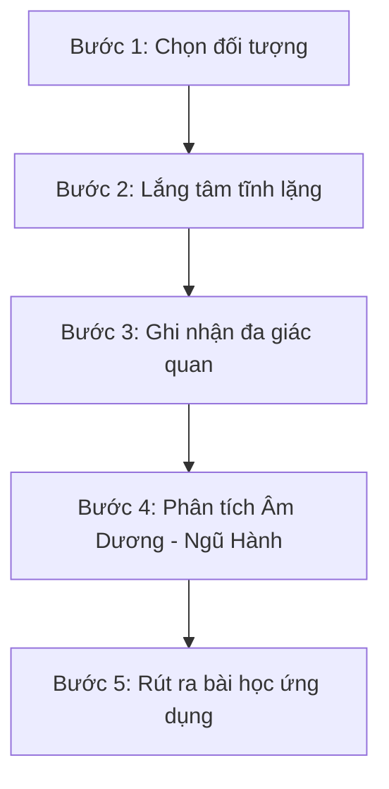

# Quy trình: Quan sát Tự nhiên

Quy trình giúp kết nối trực giác với các quy luật tự nhiên, nhận diện sự vận động của Âm Dương và Ngũ Hành thông qua thế giới xung quanh.

## 1. Các bước thực hiện

### Bước 1: Chọn đối tượng quan sát
*   Chọn một sinh thể hoặc hiện tượng tự nhiên: Dòng nước chảy, một ngọn cây, sự thay đổi của thời tiết trong ngày, chu kỳ mặt trăng.
*   **Thời gian khuyến nghị**: 15 - 30 phút.

### Bước 2: Lắng tâm tĩnh lặng
*   Ngồi hoặc đứng ở tư thế thoải mái.
*   Thực hiện thở sâu 3-5 nhịp để giải phóng suy nghĩ tạp niệm.
*   Đặt tâm thế là một người quan sát thuần túy, không phán xét, không định danh.

### Bước 3: Ghi nhận bằng đa giác quan
*   **Thị giác**: Quan sát chuyển động, hình dáng, màu sắc, sự tương phản sáng tối.
*   **Thính giác**: Lắng nghe âm thanh tự nhiên (tiếng lá xạc xào, tiếng nước chảy).
*   **Xúc giác**: Cảm nhận làn gió, nhiệt độ, độ ẩm.

### Bước 4: Phân tích theo lăng kính Âm Dương - Ngũ Hành
*   **Xác định tính Âm Dương**: Hiện tượng này đang ở trạng thái Tĩnh (Âm) hay Động (Dương)? Sáng hay Tối? Thu vào hay Phát ra?
*   **Xác định tính Ngũ Hành**: Đối tượng mang đặc tính của hành nào trội nhất? Nó đang tương tác tương sinh hay tương khắc với môi trường xung quanh?

### Bước 5: Rút ra bài học ứng dụng
*   Viết nhật ký chiêm nghiệm ngắn.
*   **Ví dụ**: Quan sát nước chảy đá mòn (Nước mềm mại - Thủy sinh Mộc, nhưng kiên trì có thể khắc chế đá cứng - Thổ/Kim). Bài học về sức mạnh của sự mềm mại và kiên trì (Nhu thắng Cương).
